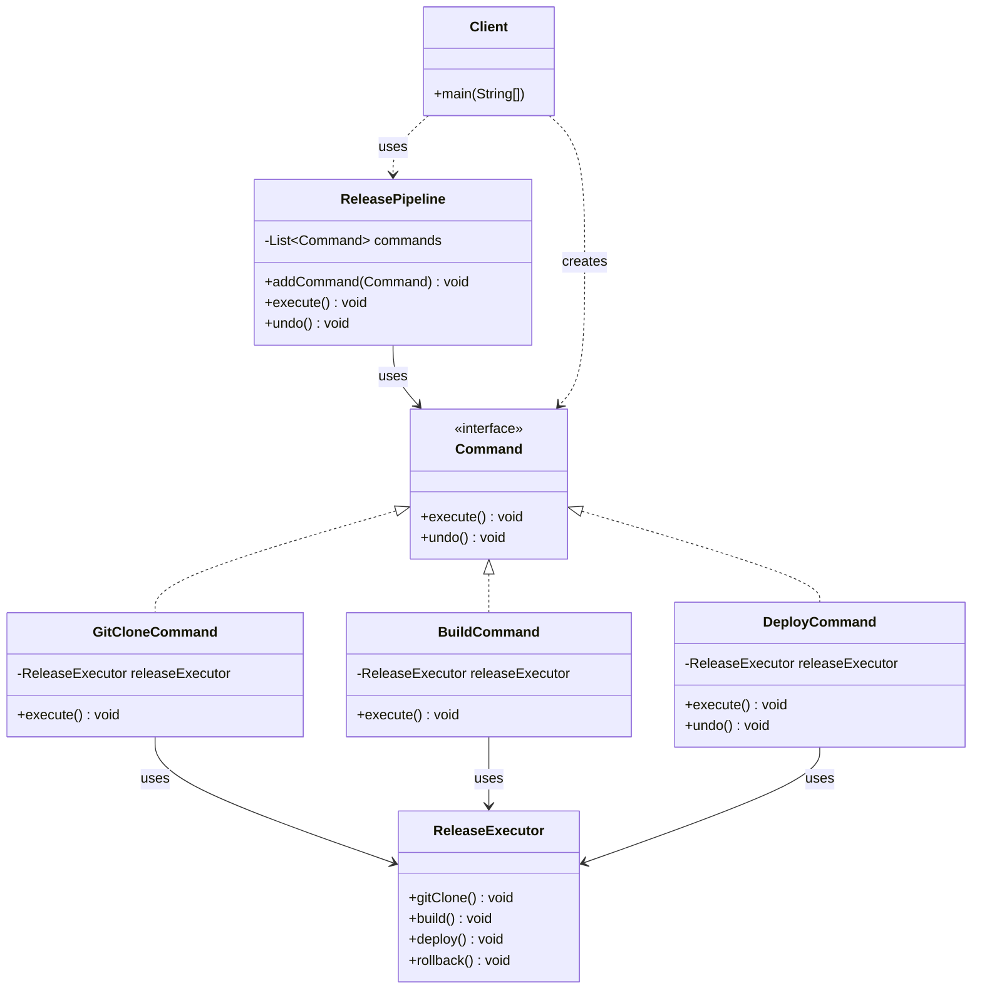
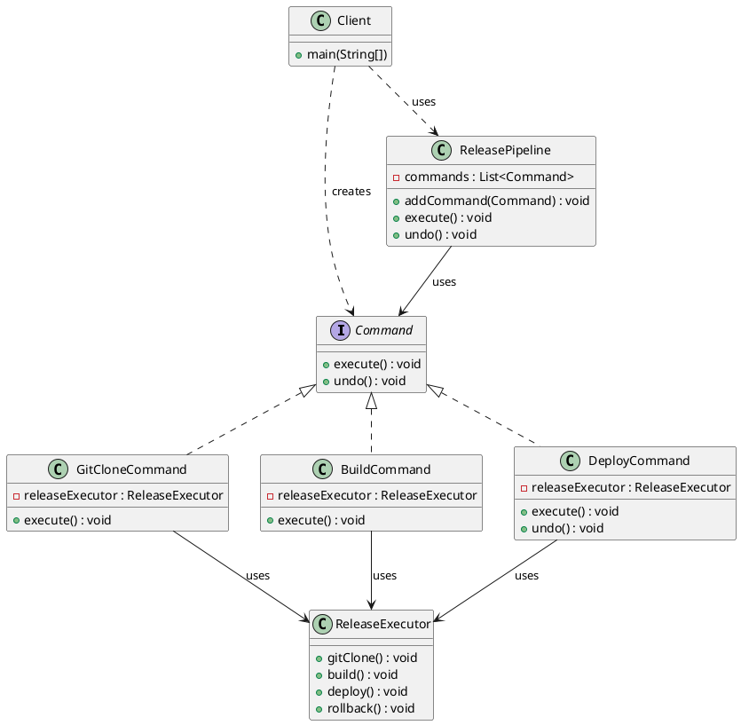

# 命令模式（Command Pattern）—— ReleasePipeline 示例完整整理

> 目标：将一个请求封装成一个对象，从而使您可以用不同的请求对客户进行参数化，对请求排队或记录请求日志，以及支持可撤销的操作。  
> 你会在：需要将请求封装为对象、支持撤销操作、需要将请求排队或记录日志、需要支持宏命令（命令组合）的场景中遇到它。

本文通过 ReleasePipeline（发布流水线）示例，讲解命令模式的实现：

**命令接口 → 具体命令 → 接收者 → 调用者**

重点回答两个问题：

1. 命令模式如何实现请求的封装和撤销
2. 它解决了什么问题，又引入了什么代价

---

## 1. 为什么需要命令模式

### 1.1 典型场景

- **请求封装**：需要将请求封装成对象，使请求参数化
- **撤销操作**：需要支持撤销操作，可以回退到之前的状态
- **请求排队**：需要将请求放入队列，延迟执行或批量执行
- **请求记录**：需要记录请求日志，支持审计和重放
- **宏命令**：需要将多个命令组合成一个命令
- **解耦请求**：需要将请求发送者和接收者解耦

### 1.2 命令模式的核心思想

```
客户端 → 调用者（Invoker） → 命令接口（Command）
                              ├─ 具体命令A
                              ├─ 具体命令B
                              └─ 具体命令C
                                  ↓
                              接收者（Receiver）- 执行实际业务逻辑
```

命令模式通过将请求封装成对象，使请求参数化，支持撤销、排队、记录等操作。

---

## 2. 命令模式结构总览

| 角色           | 说明                           | 示例                    |
| -------------- | ------------------------------ | ----------------------- |
| Command        | 命令接口，定义执行和撤销方法    | `Command`               |
| ConcreteCommand | 具体命令，实现命令接口          | `GitCloneCommand`、`BuildCommand`、`DeployCommand` |
| Receiver       | 接收者，执行实际业务逻辑        | `ReleaseExecutor`       |
| Invoker        | 调用者，持有命令并调用执行       | `ReleasePipeline`      |
| Client         | 客户端，创建命令并设置调用者     | `Client`                |

---

## 3. 核心组件

### 3.1 命令接口（Command）

**接口定义：**

```java
/**
 * 命令接口
 */
public interface Command {
    /**
     * 执行命令
     */
    void execute();

    /**
     * 撤销命令（可选）
     */
    default void undo() {}
}
```

**关键点：**
- 定义统一的命令接口
- `execute()` 方法用于执行命令
- `undo()` 方法用于撤销命令（可选，使用默认方法）

---

### 3.2 接收者（Receiver）

**接收者定义：**

```java
/**
 * 发布执行器（接收者）
 * 执行实际的业务逻辑
 */
public class ReleaseExecutor {
    
    public void gitClone() {
        System.out.println("拉取代码");
    }

    public void build() {
        System.out.println("编译代码");
    }

    public void deploy() {
        System.out.println("部署服务");
    }

    public void rollback() {
        System.out.println("回滚服务");
    }
}
```

**关键点：**
- 接收者执行实际的业务逻辑
- 命令类持有接收者的引用
- 命令类调用接收者的方法

---

### 3.3 具体命令（ConcreteCommand）

#### 3.3.1 克隆命令

```java
public class GitCloneCommand implements Command {
    
    private ReleaseExecutor releaseExecutor;

    public GitCloneCommand(ReleaseExecutor releaseExecutor) {
        this.releaseExecutor = releaseExecutor;
    }

    @Override
    public void execute() {
        releaseExecutor.gitClone();
    }
}
```

#### 3.3.2 构建命令

```java
/**
 * 构建命令
 */
public class BuildCommand implements Command {
    
    private ReleaseExecutor releaseExecutor;

    public BuildCommand(ReleaseExecutor releaseExecutor) {
        this.releaseExecutor = releaseExecutor;
    }

    @Override
    public void execute() {
        releaseExecutor.build();
    }
}
```

#### 3.3.3 部署命令

```java
/**
 * 部署命令
 * 执行部署命令，撤销部署命令
 */
public class DeployCommand implements Command {
    
    private ReleaseExecutor releaseExecutor;

    public DeployCommand(ReleaseExecutor releaseExecutor) {
        this.releaseExecutor = releaseExecutor;
    }

    @Override
    public void execute() {
        releaseExecutor.deploy();
    }

    @Override
    public void undo() {
        releaseExecutor.rollback();
    }
}
```

**关键点：**
- 具体命令持有接收者的引用（组合关系）
- `execute()` 方法调用接收者的方法
- `undo()` 方法调用接收者的撤销方法（如果支持）

---

### 3.4 调用者（Invoker）

**调用者定义：**

```java
/**
 * 发布流水线（调用者）
 * 持有命令列表，可以批量执行和撤销
 */
public class ReleasePipeline {
    
    private final List<Command> commands = new ArrayList<>();

    /**
     * 添加命令
     */
    public void addCommand(Command command) {
        commands.add(command);
    }

    /**
     * 执行所有命令
     */
    public void execute() {
        for (Command command : commands) {
            command.execute();
        }
    }

    /**
     * 撤销所有命令（逆序执行）
     */
    public void undo() {
        // 逆序执行撤销操作
        for (int i = commands.size() - 1; i >= 0; i--) {
            commands.get(i).undo();
        }
    }
}
```

**关键点：**
- 调用者持有命令列表
- `execute()` 方法遍历执行所有命令
- `undo()` 方法逆序执行撤销操作
- 支持宏命令（命令组合）

---

## 4. 使用示例

### 4.1 基本使用

```java
public class Client {

    public static void main(String[] args) {
        // 创建接收者
        ReleaseExecutor releaseExecutor = new ReleaseExecutor();
        
        // 创建命令对象
        Command gitCloneCommand = new GitCloneCommand(releaseExecutor);
        Command buildCommand = new BuildCommand(releaseExecutor);
        Command deployCommand = new DeployCommand(releaseExecutor);
        
        // 创建调用者
        ReleasePipeline releasePipeline = new ReleasePipeline();
        releasePipeline.addCommand(gitCloneCommand);
        releasePipeline.addCommand(buildCommand);
        releasePipeline.addCommand(deployCommand);
        
        // 执行命令
        try {
            releasePipeline.execute();
        } catch (Exception e) {
            // 如果执行失败，撤销所有操作
            releasePipeline.undo();
        }
    }
}
```

**输出：**

```
拉取代码
编译代码
部署服务
```

**关键点：**
- 客户端创建接收者和命令对象
- 命令对象持有接收者的引用
- 调用者持有命令列表，批量执行
- 支持异常处理和撤销操作

### 4.2 撤销操作

```java
// 执行命令
releasePipeline.execute();

// 如果需要撤销
releasePipeline.undo();  // 逆序执行撤销操作
```

**撤销输出：**

```
回滚服务  // DeployCommand.undo()
```

### 4.3 命令排队

```java
// 可以将命令放入队列，延迟执行
Queue<Command> commandQueue = new LinkedList<>();
commandQueue.offer(gitCloneCommand);
commandQueue.offer(buildCommand);
commandQueue.offer(deployCommand);

// 延迟执行
while (!commandQueue.isEmpty()) {
    Command command = commandQueue.poll();
    command.execute();
}
```

### 4.4 命令记录

```java
// 可以记录命令历史
List<Command> commandHistory = new ArrayList<>();

// 执行命令并记录
Command command = new GitCloneCommand(releaseExecutor);
command.execute();
commandHistory.add(command);

// 重放命令
for (Command cmd : commandHistory) {
    cmd.execute();
}
```

---

## 5. 代码结构

本示例包含以下目录结构：

```
command/
├── Command.java              # 命令接口
├── GitCloneCommand.java      # 具体命令（克隆）
├── BuildCommand.java         # 具体命令（构建）
├── DeployCommand.java        # 具体命令（部署）
├── ReleaseExecutor.java      # 接收者（执行器）
├── ReleasePipeline.java      # 调用者（流水线）
└── Client.java               # 客户端
```

---

## 6. UML 类图

### 6.1 Mermaid 类图



### 6.2 PlantUML 类图



---

## 7. 命令模式 vs 其他模式

### 7.1 命令模式 vs 策略模式

| 对比项 | 命令模式 | 策略模式 |
|--------|---------|---------|
| **目的** | 封装请求，支持撤销、排队、记录 | 封装算法，使算法可替换 |
| **关注点** | 请求的封装和处理 | 算法的选择和替换 |
| **撤销** | 支持撤销操作 | 不支持撤销 |
| **使用场景** | GUI 操作、事务处理、宏命令 | 支付方式、排序算法 |

**区别：**
- 命令模式：关注请求的封装和处理
- 策略模式：关注算法的选择和替换

### 7.2 命令模式 vs 模板方法模式

| 对比项 | 命令模式 | 模板方法模式 |
|--------|---------|-------------|
| **关系** | 组合关系 | 继承关系 |
| **关注点** | 请求的封装和处理 | 算法的骨架和步骤 |
| **撤销** | 支持撤销操作 | 不支持撤销 |
| **使用场景** | GUI 操作、事务处理 | 相似流程，不同步骤 |

**区别：**
- 命令模式：使用组合，关注请求封装
- 模板方法模式：使用继承，关注算法骨架

### 7.3 命令模式 vs 责任链模式

| 对比项 | 命令模式 | 责任链模式 |
|--------|---------|-----------|
| **目的** | 封装请求，支持撤销、排队 | 将请求沿着链传递，直到有对象处理 |
| **处理方式** | 命令对象处理请求 | 链中的对象依次尝试处理 |
| **撤销** | 支持撤销操作 | 不支持撤销 |

**区别：**
- 命令模式：命令对象直接处理请求
- 责任链模式：请求沿着链传递，由链中的对象处理

---

## 8. 命令模式的特点

### 8.1 优点

- ✅ **解耦请求**：将请求发送者和接收者解耦
- ✅ **支持撤销**：可以轻松实现撤销操作
- ✅ **支持排队**：可以将命令放入队列，延迟执行
- ✅ **支持记录**：可以记录命令历史，支持审计和重放
- ✅ **支持宏命令**：可以将多个命令组合成一个命令
- ✅ **符合开闭原则**：添加新命令无需修改现有代码

### 8.2 缺点

- ❌ **类数量增加**：每个命令都需要一个类，如果命令很多，类数量会急剧增加
- ❌ **复杂度增加**：引入了额外的抽象层，增加了系统复杂度
- ❌ **撤销实现复杂**：实现撤销操作可能需要保存大量状态信息

---

## 9. 使用场景

### 9.1 适用场景

- ✅ **GUI 操作**：菜单项、按钮点击等操作
- ✅ **事务处理**：数据库事务、分布式事务
- ✅ **宏命令**：需要将多个操作组合成一个操作
- ✅ **撤销操作**：需要支持撤销和重做功能
- ✅ **请求排队**：需要将请求放入队列，延迟执行
- ✅ **请求记录**：需要记录请求日志，支持审计和重放

### 9.2 常见应用

- **GUI 框架**：菜单项、按钮点击、快捷键等
- **事务处理**：数据库事务、分布式事务
- **发布系统**：CI/CD 流水线、部署脚本
- **游戏开发**：游戏操作、回放功能
- **文本编辑器**：撤销/重做功能
- **远程调用**：RPC 调用、消息队列

---

## 10. 实际应用示例

### 10.1 GUI 框架中的应用

```java
// 菜单项命令
public class MenuItem {
    private Command command;
    
    public void click() {
        command.execute();
    }
}

// 使用示例
MenuItem copyItem = new MenuItem();
copyItem.setCommand(new CopyCommand(editor));
```

### 10.2 事务处理中的应用

```java
// 事务命令
public class Transaction {
    private List<Command> commands = new ArrayList<>();
    
    public void addCommand(Command command) {
        commands.add(command);
    }
    
    public void commit() {
        for (Command cmd : commands) {
            cmd.execute();
        }
    }
    
    public void rollback() {
        for (int i = commands.size() - 1; i >= 0; i--) {
            commands.get(i).undo();
        }
    }
}
```

### 10.3 宏命令示例

```java
/**
 * 宏命令：将多个命令组合成一个命令
 */
public class MacroCommand implements Command {
    private List<Command> commands = new ArrayList<>();
    
    public void addCommand(Command command) {
        commands.add(command);
    }
    
    @Override
    public void execute() {
        for (Command cmd : commands) {
            cmd.execute();
        }
    }
    
    @Override
    public void undo() {
        for (int i = commands.size() - 1; i >= 0; i--) {
            commands.get(i).undo();
        }
    }
}
```

---

## 11. 命令模式的两种实现方式

### 11.1 方式1：命令类直接实现逻辑（不推荐）

```java
public class GitCloneCommand implements Command {
    @Override
    public void execute() {
        System.out.println("从远程仓库克隆代码");
    }
}
```

**特点：**
- ❌ 命令类包含业务逻辑，违反单一职责原则
- ❌ 业务逻辑无法复用
- ❌ 难以测试和维护

### 11.2 方式2：命令类持有接收者引用（推荐）

```java
public class GitCloneCommand implements Command {
    private ReleaseExecutor releaseExecutor;
    
    public GitCloneCommand(ReleaseExecutor releaseExecutor) {
        this.releaseExecutor = releaseExecutor;
    }
    
    @Override
    public void execute() {
        releaseExecutor.gitClone();
    }
}
```

**特点：**
- ✅ 职责分离：命令类只负责调用，业务逻辑在接收者
- ✅ 业务逻辑可以复用
- ✅ 易于测试和维护
- ✅ 符合标准命令模式

**本示例采用方式2（推荐方式）**

---

## 12. 面试要点

### 12.1 基础问题

- **命令模式解决什么问题？**
  - 要点：解决请求的封装和处理问题，支持撤销、排队、记录等操作

- **命令模式的核心是什么？**
  - 要点：将请求封装成对象，使请求参数化，支持撤销、排队、记录

- **命令模式如何实现？**
  - 要点：定义命令接口，实现具体命令类，命令类持有接收者引用，调用者持有命令列表

### 12.2 实现细节

- **命令模式和策略模式的区别？**
  - 要点：命令模式关注请求的封装和处理，策略模式关注算法的选择和替换

- **为什么命令模式要使用接收者？**
  - 要点：职责分离，命令类只负责调用，业务逻辑在接收者，便于测试和维护

- **命令模式如何实现撤销操作？**
  - 要点：命令接口定义 `undo()` 方法，具体命令实现撤销逻辑，调用者逆序执行撤销

### 12.3 实践问题

- **什么时候使用命令模式？**
  - 要点：需要支持撤销操作、需要将请求排队或记录、需要支持宏命令

- **命令模式在哪些框架中有应用？**
  - 要点：GUI 框架、事务处理、发布系统、游戏开发等

- **如何优化命令模式的性能？**
  - 要点：使用命令池、延迟执行、批量处理等

---

## 13. 总结

命令模式是一个**非常重要的行为型设计模式**，它解决了请求封装和处理的核心问题：

**核心价值：**

1. **解耦请求**：将请求发送者和接收者解耦
2. **支持撤销**：可以轻松实现撤销操作
3. **支持排队**：可以将命令放入队列，延迟执行
4. **支持记录**：可以记录命令历史，支持审计和重放
5. **支持宏命令**：可以将多个命令组合成一个命令

**模式特点：**

```
命令接口（Command）
  ├─ 具体命令A（GitCloneCommand）
  ├─ 具体命令B（BuildCommand）
  └─ 具体命令C（DeployCommand）
      ↓ 持有引用
接收者（ReleaseExecutor）- 执行实际业务逻辑
      ↓
调用者（ReleasePipeline）- 持有命令列表，批量执行
      ↓
客户端（Client）- 创建命令，设置调用者
```

**最佳实践：**

- 命令类持有接收者引用，调用接收者的方法
- 接收者执行实际的业务逻辑
- 调用者持有命令列表，支持批量执行和撤销
- 支持撤销操作，逆序执行撤销
- 可以使用宏命令组合多个命令

**一句话总结：**

> 当需要将请求封装成对象、支持撤销操作、需要将请求排队或记录时，用命令模式将请求封装成命令对象，通过调用者批量执行，实现请求的解耦和处理。

---

## 14. 参考资源

- [设计模式：可复用面向对象软件的基础](https://book.douban.com/subject/1052241/)
- [Head First 设计模式](https://book.douban.com/subject/2243615/)
- [Java 设计模式实战](https://book.douban.com/subject/30119749/)
