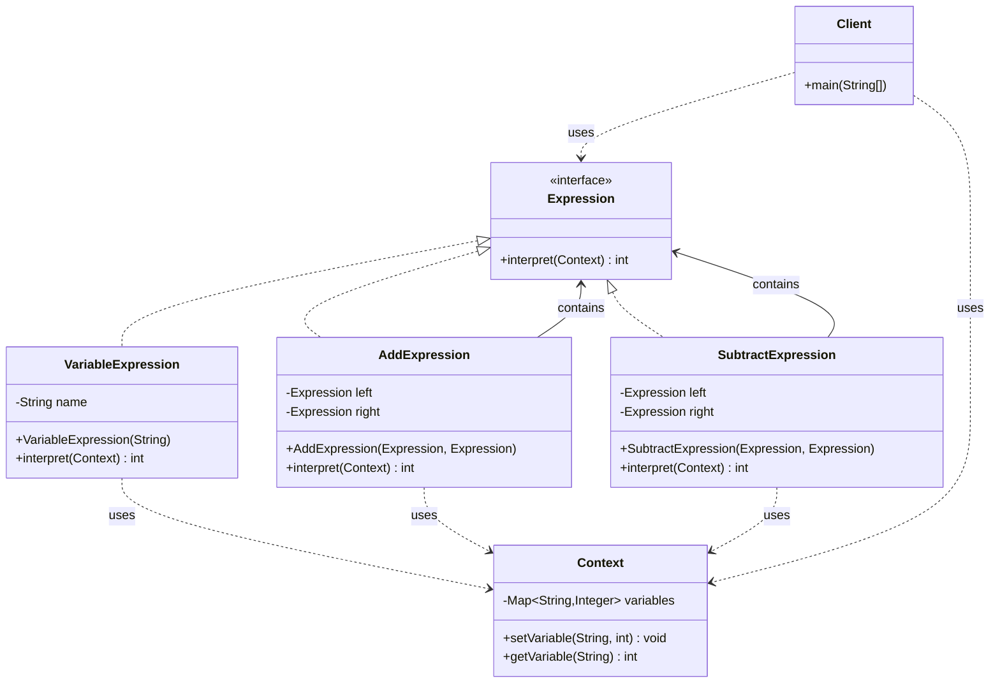
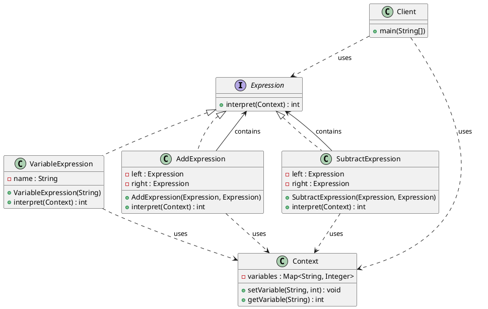

# 解释器模式（Interpreter Pattern）—— 表达式解释示例完整整理

> 目标：给定一个语言，定义它的文法表示，并定义一个解释器，这个解释器使用该表示来解释语言中的句子。  
> 你会在：需要解释特定语言的句子、需要构建简单的语法解析器、需要定义领域特定语言的场景中遇到它。

本文通过表达式解释（Expression Interpreter）示例，讲解解释器模式的实现：

**抽象表达式 → 终结符表达式 → 非终结符表达式 → 上下文**

重点回答两个问题：

1. 解释器模式如何实现语言的解释和执行
2. 它解决了什么问题，又引入了什么代价

---

## 1. 为什么需要解释器模式

### 1.1 典型场景

- **语言解释**：需要解释特定语言的句子，如数学表达式、SQL 语句、正则表达式等
- **语法解析**：需要构建简单的语法解析器，解析特定格式的文本
- **领域特定语言**：需要定义领域特定语言（DSL），简化复杂操作
- **规则引擎**：需要实现规则引擎，解释和执行规则
- **表达式计算**：需要实现表达式计算器，支持变量和运算符

### 1.2 解释器模式的核心思想

```
抽象表达式（Expression）
  ├─ 终结符表达式（TerminalExpression）
  │   └─ VariableExpression（变量表达式）
  └─ 非终结符表达式（NonTerminalExpression）
      ├─ AddExpression（加法表达式）
      └─ SubtractExpression（减法表达式）
          ↓
上下文（Context）
  └─ 存储变量值
```

解释器模式通过定义语言的文法表示，使用抽象语法树（AST）来表示语言的句子，然后通过解释器来解释和执行这些句子。

---

## 2. 解释器模式结构总览

| 角色           | 说明                           | 示例                    |
| -------------- | ------------------------------ | ----------------------- |
| AbstractExpression | 抽象表达式，定义解释接口 | `Expression`            |
| TerminalExpression | 终结符表达式，实现终结符的解释 | `VariableExpression`    |
| NonTerminalExpression | 非终结符表达式，实现非终结符的解释 | `AddExpression`、`SubtractExpression` |
| Context        | 上下文，存储解释器需要的全局信息 | `Context`               |
| Client         | 客户端，构建表达式并解释执行    | `Client`                |

---

## 3. 核心组件

### 3.1 抽象表达式（AbstractExpression）

**接口定义：**

```java
/**
 * 表达式
 */
public interface Expression {

    /**
     * 解释表达式
     * 
     * 根据上下文解释表达式，返回计算结果
     * 
     * @param context 上下文对象，包含变量值等信息
     * @return 计算结果
     */
    int interpret(Context context);
}
```

**关键点：**
- 定义表达式的统一接口
- `interpret()` 方法是解释器模式的核心
- 所有具体表达式都实现这个接口

---

### 3.2 终结符表达式（TerminalExpression）

**终结符表达式实现：**

```java
/**
 * 终结符表达式(变量表达式)
 */
public class VariableExpression implements Expression {

    private String name; // 变量名

    public VariableExpression(String name) {
        this.name = name;
    }

    @Override
    public int interpret(Context context) {
        return context.getVariable(name); // 获取变量值
    }
}
```

**关键点：**
- 终结符表达式是语法树中的叶子节点
- 直接返回变量的值，不再递归调用其他表达式
- 变量表达式是最基本的表达式单元

---

### 3.3 非终结符表达式（NonTerminalExpression）

**非终结符表达式实现：**

```java
/**
 * 非终结符表达式(加法表达式)
 */
public class AddExpression implements Expression {

    private Expression left; // 左表达式
    private Expression right; // 右表达式

    public AddExpression(Expression left, Expression right) {
        this.left = left;
        this.right = right;
    }

    @Override
    public int interpret(Context context) {
        // 递归解释左表达式和右表达式，然后相加
        return left.interpret(context) + right.interpret(context);
    }
}
```

**关键点：**
- 非终结符表达式是语法树中的内部节点
- 包含其他表达式（左表达式和右表达式）
- 递归调用子表达式的 `interpret()` 方法，然后执行相应操作

---

### 3.4 上下文（Context）

**上下文实现：**

```java
/**
 * 上下文
 */
public class Context {

    private Map<String, Integer> variables = new HashMap<>(); // 变量表

    /**
     * 设置变量
     * @param name 变量名
     * @param value 变量值
     */
    public void setVariable(String name, int value) {
        variables.put(name, value);
    }

    /**
     * 获取变量
     * @param name 变量名
     * @return 变量值
     */
    public int getVariable(String name) {
        return variables.get(name);
    }
}
```

**关键点：**
- 上下文存储解释器需要的全局信息
- 在这个例子中，上下文存储变量的值
- 表达式通过上下文获取变量值

---

## 4. 使用示例

### 4.1 基本使用

```java
public class Client {

    public static void main(String[] args) {
        Context context = new Context();
        context.setVariable("a", 10);
        context.setVariable("b", 20);
        context.setVariable("c", 30);

        // 表达式 1: a + b
        Expression expression = new AddExpression(
            new VariableExpression("a"), 
            new VariableExpression("b")
        );
        System.out.println(expression.interpret(context)); // 输出: 30
        
        System.out.println("=====================");
        
        // 表达式 2: a - b
        expression = new SubtractExpression(
            new VariableExpression("a"), 
            new VariableExpression("b")
        );
        System.out.println(expression.interpret(context)); // 输出: -10
        
        System.out.println("=====================");
        
        // 表达式 3: a + (b - c)
        expression = new AddExpression(
            new VariableExpression("a"), 
            new SubtractExpression(
                new VariableExpression("b"), 
                new VariableExpression("c")
            )
        );
        System.out.println(expression.interpret(context)); // 输出: 0
    }
}
```

**输出：**

```
30
=====================
-10
=====================
0
```

**关键点：**
- 客户端创建上下文，设置变量值
- 客户端构建表达式树（抽象语法树）
- 调用表达式的 `interpret()` 方法解释执行
- 表达式树的结构决定了计算的优先级

### 4.2 抽象语法树（AST）

**表达式 `a + (b - c)` 的抽象语法树：**

```
        AddExpression
        /           \
Variable("a")   SubtractExpression
                  /           \
            Variable("b")  Variable("c")
```

**解释执行流程：**

```
1. 调用 AddExpression.interpret(context)
   ↓
2. 调用 VariableExpression("a").interpret(context) → 返回 10
   ↓
3. 调用 SubtractExpression.interpret(context)
   ↓
4. 调用 VariableExpression("b").interpret(context) → 返回 20
   ↓
5. 调用 VariableExpression("c").interpret(context) → 返回 30
   ↓
6. 计算 20 - 30 = -10
   ↓
7. 计算 10 + (-10) = 0
```

### 4.3 工作流程图

```
[Client]
  ↓ 创建上下文，设置变量
[Context] variables: {a=10, b=20, c=30}
  ↓ 构建表达式树
[Expression Tree]
  ↓ interpret(context)
[TerminalExpression] → 获取变量值
[NonTerminalExpression] → 递归解释子表达式
  ↓ 计算结果
[Result]
```

---

## 5. 代码结构

本示例包含以下目录结构：

```
interpreter/
├── Expression.java          # 抽象表达式接口
├── VariableExpression.java  # 终结符表达式（变量表达式）
├── AddExpression.java       # 非终结符表达式（加法表达式）
├── SubtractExpression.java  # 非终结符表达式（减法表达式）
├── Context.java            # 上下文
└── Client.java             # 客户端
```

---

## 6. UML 类图

### 6.1 Mermaid 类图



### 6.2 PlantUML 类图



---

## 7. 解释器模式 vs 其他模式

### 7.1 解释器模式 vs 组合模式

| 对比项 | 解释器模式 | 组合模式 |
|--------|-----------|---------|
| **目的** | 解释语言的句子 | 组合对象形成树形结构 |
| **关注点** | 语言的解释和执行 | 对象的组合和统一处理 |
| **节点类型** | 终结符和非终结符 | 叶子节点和组合节点 |
| **操作** | 解释执行 | 统一操作接口 |

**区别：**
- 解释器模式：关注语言的解释和执行，节点有明确的语义
- 组合模式：关注对象的组合，节点是通用的容器

### 7.2 解释器模式 vs 访问者模式

| 对比项 | 解释器模式 | 访问者模式 |
|--------|-----------|-----------|
| **目的** | 解释语言的句子 | 对元素执行操作 |
| **关注点** | 语言的解释和执行 | 操作与元素的分离 |
| **结构** | 抽象语法树 | 对象结构 |
| **操作** | 解释执行 | 访问者执行操作 |

**区别：**
- 解释器模式：关注语言的解释和执行
- 访问者模式：关注操作与元素的分离

### 7.3 解释器模式 vs 策略模式

| 对比项 | 解释器模式 | 策略模式 |
|--------|-----------|---------|
| **目的** | 解释语言的句子 | 封装算法 |
| **关注点** | 语言的解释和执行 | 算法的封装和替换 |
| **结构** | 抽象语法树 | 算法接口和实现 |
| **使用场景** | 语言解释 | 算法可替换 |

**区别：**
- 解释器模式：关注语言的解释和执行，使用抽象语法树
- 策略模式：关注算法的封装和替换，使用策略接口

---

## 8. 解释器模式的特点

### 8.1 优点

- ✅ **易于扩展**：添加新的表达式类型只需要添加新的表达式类
- ✅ **易于实现**：每个表达式类只负责自己的解释逻辑
- ✅ **符合开闭原则**：对扩展开放，对修改关闭
- ✅ **文法表示清晰**：使用抽象语法树清晰表示语言的文法
- ✅ **灵活性强**：可以动态构建和修改表达式树

### 8.2 缺点

- ❌ **类数量多**：如果文法复杂，会产生大量的表达式类
- ❌ **效率较低**：递归解释执行可能效率较低
- ❌ **难以维护**：复杂的文法会导致复杂的表达式树
- ❌ **不适合复杂文法**：对于复杂的文法，解释器模式可能不合适

---

## 9. 使用场景

### 9.1 适用场景

- ✅ **简单文法**：语言的文法相对简单，可以用类层次结构表示
- ✅ **频繁使用**：需要频繁解释执行语言的句子
- ✅ **易于扩展**：需要易于扩展和修改文法
- ✅ **领域特定语言**：需要定义领域特定语言（DSL）
- ✅ **表达式计算**：需要实现表达式计算器

### 9.2 常见应用

- **正则表达式**：正则表达式的解释和执行
- **SQL 解析**：SQL 语句的解析和执行
- **数学表达式**：数学表达式的计算
- **规则引擎**：规则的解释和执行
- **编译器**：编程语言的词法分析和语法分析

---

## 10. 实际应用示例

### 10.1 正则表达式解释器

```java
// 正则表达式解释器
public interface RegexExpression {
    boolean interpret(String text);
}

public class LiteralExpression implements RegexExpression {
    private String literal;
    
    @Override
    public boolean interpret(String text) {
        return text.contains(literal);
    }
}

public class OrExpression implements RegexExpression {
    private RegexExpression left;
    private RegexExpression right;
    
    @Override
    public boolean interpret(String text) {
        return left.interpret(text) || right.interpret(text);
    }
}
```

### 10.2 SQL 查询解释器

```java
// SQL 查询解释器
public interface SQLExpression {
    List<Record> interpret(DatabaseContext context);
}

public class SelectExpression implements SQLExpression {
    private List<String> columns;
    private FromExpression from;
    private WhereExpression where;
    
    @Override
    public List<Record> interpret(DatabaseContext context) {
        List<Record> records = from.interpret(context);
        if (where != null) {
            records = where.filter(records);
        }
        return selectColumns(records, columns);
    }
}
```

### 10.3 规则引擎

```java
// 规则引擎解释器
public interface RuleExpression {
    boolean evaluate(RuleContext context);
}

public class AndRule implements RuleExpression {
    private RuleExpression left;
    private RuleExpression right;
    
    @Override
    public boolean evaluate(RuleContext context) {
        return left.evaluate(context) && right.evaluate(context);
    }
}

public class ConditionRule implements RuleExpression {
    private String field;
    private String operator;
    private Object value;
    
    @Override
    public boolean evaluate(RuleContext context) {
        Object fieldValue = context.getField(field);
        return compare(fieldValue, operator, value);
    }
}
```

---

## 11. 解释器模式的变体

### 11.1 标准解释器模式（当前实现）

**特点：**
- 使用抽象语法树表示语言的句子
- 每个表达式类实现 `interpret()` 方法
- 递归解释执行表达式树

**示例：**
```java
public interface Expression {
    int interpret(Context context);
}
```

### 11.2 函数式解释器模式

**特点：**
- 使用函数式编程风格
- 表达式是函数，可以组合
- 更简洁的实现

**示例：**
```java
public interface Expression {
    int interpret(Context context);
}

// 使用 Lambda 表达式
Expression add = (ctx) -> ctx.get("a") + ctx.get("b");
Expression sub = (ctx) -> ctx.get("a") - ctx.get("b");
```

### 11.3 流式解释器模式

**特点：**
- 使用流式 API 构建表达式
- 更直观的表达式构建方式
- 支持链式调用

**示例：**
```java
Expression expression = ExpressionBuilder
    .variable("a")
    .add()
    .variable("b")
    .build();
```

---

## 12. 面试要点

### 12.1 基础问题

- **解释器模式解决什么问题？**
  - 要点：给定一个语言，定义它的文法表示，并定义一个解释器，这个解释器使用该表示来解释语言中的句子

- **解释器模式的核心是什么？**
  - 要点：使用抽象语法树（AST）表示语言的句子，通过递归解释执行表达式树

- **解释器模式如何实现？**
  - 要点：定义抽象表达式接口，实现终结符表达式和非终结符表达式，使用上下文存储全局信息

### 12.2 实现细节

- **什么是终结符表达式和非终结符表达式？**
  - 要点：终结符表达式是语法树中的叶子节点，直接返回值；非终结符表达式是内部节点，包含其他表达式

- **解释器模式如何构建抽象语法树？**
  - 要点：客户端构建表达式树，非终结符表达式包含子表达式，形成树形结构

- **解释器模式的性能问题如何解决？**
  - 要点：可以使用缓存、预编译、优化表达式树等方式提高性能

### 12.3 实践问题

- **什么时候使用解释器模式？**
  - 要点：语言的文法相对简单、需要频繁解释执行、需要易于扩展和修改文法

- **解释器模式在哪些框架中有应用？**
  - 要点：正则表达式、SQL 解析、数学表达式计算、规则引擎、编译器等

- **解释器模式的缺点是什么？**
  - 要点：类数量多、效率较低、难以维护、不适合复杂文法

---

## 13. 总结

解释器模式是一个**非常重要的行为型设计模式**，它解决了语言解释和执行的问题：

**核心价值：**

1. **易于扩展**：添加新的表达式类型只需要添加新的表达式类
2. **易于实现**：每个表达式类只负责自己的解释逻辑
3. **符合开闭原则**：对扩展开放，对修改关闭
4. **文法表示清晰**：使用抽象语法树清晰表示语言的文法
5. **灵活性强**：可以动态构建和修改表达式树

**模式特点：**

```
抽象表达式（Expression）
  ├─ 终结符表达式（TerminalExpression）
  │   └─ VariableExpression（变量表达式）
  └─ 非终结符表达式（NonTerminalExpression）
      ├─ AddExpression（加法表达式）
      └─ SubtractExpression（减法表达式）
          ↓
上下文（Context）
  └─ 存储变量值
```

**最佳实践：**

- 适用于文法相对简单的语言
- 使用抽象语法树表示语言的句子
- 递归解释执行表达式树
- 注意性能问题，可以使用缓存和优化
- 合理使用解释器模式，避免过度设计

**一句话总结：**

> 当需要解释特定语言的句子，语言的文法相对简单，且需要易于扩展和修改时，使用解释器模式。

---

## 14. 参考资源

- [设计模式：可复用面向对象软件的基础](https://book.douban.com/subject/1052241/)
- [Head First 设计模式](https://book.douban.com/subject/2243615/)
- [解释器模式](https://en.wikipedia.org/wiki/Interpreter_pattern)
