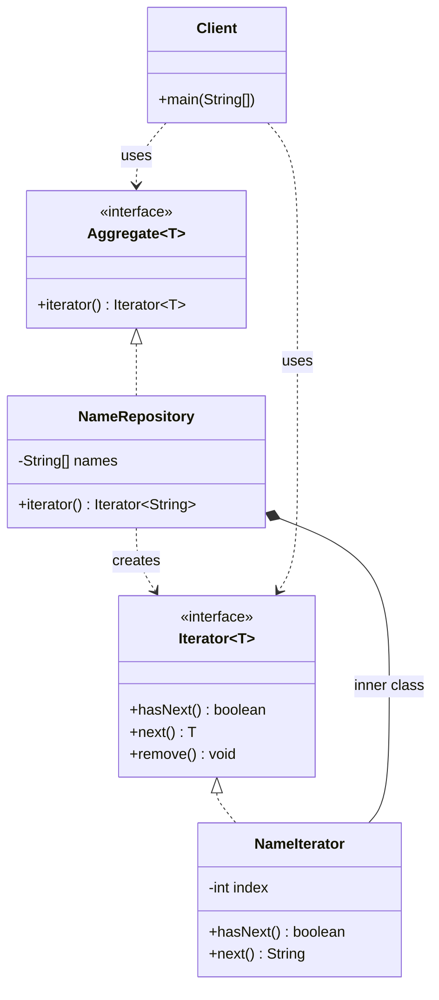

# 迭代器模式（Iterator Pattern）—— 名字仓库示例完整整理

> 目标：提供一种方法顺序访问一个聚合对象中各个元素，而又无须暴露该对象的内部表示。  
> 你会在：需要遍历集合对象、需要统一遍历接口、需要支持多种遍历方式的场景中遇到它。

本文通过名字仓库（NameRepository）示例，讲解迭代器模式的实现：

**聚合接口 → 具体聚合 → 迭代器接口 → 具体迭代器**

重点回答两个问题：

1. 迭代器模式如何实现集合对象的统一遍历
2. 它解决了什么问题，又引入了什么代价

---

## 1. 为什么需要迭代器模式

### 1.1 典型场景

- **统一遍历接口**：需要为不同的集合对象提供统一的遍历接口，隐藏集合的内部实现
- **解耦遍历逻辑**：需要将遍历逻辑从集合类中分离出来，降低耦合度
- **支持多种遍历**：需要支持多种遍历方式（顺序、逆序、过滤等），而不修改集合类
- **隐藏内部结构**：需要隐藏集合的内部结构，客户端不需要知道集合的具体实现
- **简化客户端代码**：需要简化客户端代码，使用统一的遍历方式

### 1.2 迭代器模式的核心思想

```
聚合接口（Aggregate）
  └─ 具体聚合（NameRepository）
      ├─ 存储数据
      └─ 创建迭代器
          ↓
迭代器接口（Iterator）
  └─ 具体迭代器（NameIterator）
      ├─ hasNext() 判断是否有下一个元素
      └─ next() 获取下一个元素
```

迭代器模式通过将遍历逻辑封装在迭代器中，使客户端可以统一地遍历不同的集合对象，而不需要知道集合的内部实现。

---

## 2. 迭代器模式结构总览

| 角色           | 说明                           | 示例                    |
| -------------- | ------------------------------ | ----------------------- |
| Aggregate      | 聚合接口，定义创建迭代器的方法 | `Aggregate<T>`         |
| ConcreteAggregate | 具体聚合，实现聚合接口，存储数据 | `NameRepository`      |
| Iterator       | 迭代器接口，定义遍历方法        | `Iterator<T>`（Java 内置） |
| ConcreteIterator | 具体迭代器，实现迭代器接口 | `NameIterator`        |
| Client         | 客户端，使用迭代器遍历集合      | `Client`               |

---

## 3. 核心组件

### 3.1 聚合接口（Aggregate）

**接口定义：**

```java
/**
 * 自定义聚合接口
 */
public interface Aggregate<T> {
    
    /**
     * 创建迭代器
     * @return 迭代器
     */
    Iterator<T> iterator();
}
```

**关键点：**
- 定义聚合的统一接口
- `iterator()` 方法用于创建迭代器
- 使用泛型支持不同类型的元素

---

### 3.2 具体聚合（ConcreteAggregate）

**具体聚合实现：**

```java
/**
 * 名字仓库
 */
public class NameRepository implements Aggregate<String> {

    private String[] names = { "Robert", "John", "Julie", "Lora" };

    @Override
    public Iterator<String> iterator() {
        return new NameIterator();
    }

    /**
     * 名字迭代器（内部类）
     */
    class NameIterator implements Iterator<String> {
        private int index;

        @Override
        public boolean hasNext() {
            return index < names.length;
        }

        @Override
        public String next() {
            return names[index++];
        }
    }
}
```

**关键点：**
- 实现聚合接口，存储数据
- `iterator()` 方法返回具体的迭代器实例
- 迭代器作为内部类，可以访问外部类的私有数据
- 迭代器维护遍历状态（index）

---

### 3.3 迭代器接口（Iterator）

**Java 内置迭代器接口：**

```java
public interface Iterator<E> {
    /**
     * 判断是否有下一个元素
     * @return true 如果有下一个元素，false 否则
     */
    boolean hasNext();

    /**
     * 获取下一个元素
     * @return 下一个元素
     */
    E next();

    /**
     * 移除当前元素（可选操作）
     */
    default void remove() {
        throw new UnsupportedOperationException("remove");
    }
}
```

**关键点：**
- `hasNext()` 方法判断是否还有下一个元素
- `next()` 方法获取下一个元素并移动指针
- `remove()` 方法是可选操作，用于移除当前元素

---

### 3.4 具体迭代器（ConcreteIterator）

**具体迭代器实现：**

```java
class NameIterator implements Iterator<String> {
    private int index;

    @Override
    public boolean hasNext() {
        return index < names.length;
    }

    @Override
    public String next() {
        return names[index++];
    }
}
```

**关键点：**
- 实现迭代器接口
- 维护遍历状态（index）
- `hasNext()` 判断是否还有元素
- `next()` 返回当前元素并移动指针

---

## 4. 使用示例

### 4.1 基本使用

```java
public class Client {
    public static void main(String[] args) {
        // 使用 ArrayList 的迭代器
        ArrayList<String> arrayList = new ArrayList<String>();
        arrayList.add("张三");
        arrayList.add("李四");
        arrayList.add("王五");
        Iterator<String> iterator = arrayList.iterator();
        if (iterator.hasNext()) {
            System.out.println(iterator.next());
        }
        
        System.out.println("=====================");
        
        // 使用自定义聚合接口的迭代器
        NameRepository nameRepository = new NameRepository();
        Iterator<String> nameIterator = nameRepository.iterator();
        while (nameIterator.hasNext()) {
            System.out.println(nameIterator.next());
        }
    }
}
```

**输出：**

```
张三
=====================
Robert
John
Julie
Lora
```

**关键点：**
- 客户端使用统一的迭代器接口遍历不同的集合
- 不需要知道集合的内部实现（数组、链表等）
- 遍历逻辑封装在迭代器中

### 4.2 工作流程

```
1. 创建聚合对象（NameRepository）
   ↓
2. 调用 iterator() 方法创建迭代器
   ↓
3. 使用 hasNext() 判断是否有下一个元素
   ↓
4. 使用 next() 获取下一个元素
   ↓
5. 重复步骤 3-4 直到遍历完成
```

### 4.3 遍历方式对比

**不使用迭代器模式：**
```java
// 需要知道集合的内部实现
String[] names = { "Robert", "John", "Julie", "Lora" };
for (int i = 0; i < names.length; i++) {
    System.out.println(names[i]);
}
```

**使用迭代器模式：**
```java
// 不需要知道集合的内部实现
NameRepository nameRepository = new NameRepository();
Iterator<String> iterator = nameRepository.iterator();
while (iterator.hasNext()) {
    System.out.println(iterator.next());
}
```

---

## 5. 代码结构

本示例包含以下目录结构：

```
iterator/
├── Aggregate.java        # 聚合接口
├── NameRepository.java   # 具体聚合实现（包含内部迭代器）
└── Client.java           # 客户端
```

---

## 6. UML 类图

### 6.1 Mermaid 类图



### 6.2 PlantUML 类图

```plantuml
@startuml
interface Aggregate<T> {
  + iterator() : Iterator<T>
}

class NameRepository {
  - names : String[]
  + iterator() : Iterator<String>
  + NameIterator
}

interface Iterator<T> {
  + hasNext() : boolean
  + next() : T
  + remove() : void
}

class NameIterator {
  - index : int
  + hasNext() : boolean
  + next() : String
}

class Client {
  + main(String[])
}

Aggregate<String> <|.. NameRepository
Iterator<String> <|.. NameIterator
NameRepository ..> Iterator<String> : creates
NameRepository +-- NameIterator : inner class
Client ..> Aggregate<String> : uses
Client ..> Iterator<String> : uses
@enduml
```

---

## 7. 迭代器模式 vs 其他模式

### 7.1 迭代器模式 vs 访问者模式

| 对比项 | 迭代器模式 | 访问者模式 |
|--------|-----------|-----------|
| **目的** | 遍历集合元素 | 对集合元素执行操作 |
| **关注点** | 如何遍历 | 对元素做什么操作 |
| **遍历方式** | 顺序遍历 | 可以自定义遍历顺序 |
| **操作** | 只读取元素 | 可以对元素执行复杂操作 |
| **使用场景** | 遍历集合 | 对集合元素执行多种操作 |

**区别：**
- 迭代器模式：关注如何遍历集合元素
- 访问者模式：关注对集合元素执行什么操作

### 7.2 迭代器模式 vs 组合模式

| 对比项 | 迭代器模式 | 组合模式 |
|--------|-----------|---------|
| **目的** | 遍历集合元素 | 组合对象形成树形结构 |
| **关注点** | 遍历方式 | 对象组合 |
| **结构** | 线性结构 | 树形结构 |
| **遍历** | 顺序遍历 | 递归遍历 |

**区别：**
- 迭代器模式：用于遍历线性集合
- 组合模式：用于组合对象形成树形结构，可以配合迭代器模式使用

### 7.3 迭代器模式 vs 策略模式

| 对比项 | 迭代器模式 | 策略模式 |
|--------|-----------|---------|
| **目的** | 遍历集合元素 | 封装算法 |
| **关注点** | 遍历方式 | 算法选择 |
| **变化点** | 遍历方式 | 算法实现 |
| **使用场景** | 遍历集合 | 多种算法完成同一任务 |

**区别：**
- 迭代器模式：关注遍历方式
- 策略模式：关注算法选择

---

## 8. 迭代器模式的特点

### 8.1 优点

- ✅ **统一遍历接口**：为不同的集合对象提供统一的遍历接口
- ✅ **解耦遍历逻辑**：将遍历逻辑从集合类中分离出来，降低耦合度
- ✅ **支持多种遍历**：可以轻松实现多种遍历方式（顺序、逆序、过滤等）
- ✅ **隐藏内部结构**：隐藏集合的内部结构，客户端不需要知道集合的具体实现
- ✅ **简化客户端代码**：简化客户端代码，使用统一的遍历方式
- ✅ **符合单一职责原则**：集合类负责存储数据，迭代器负责遍历

### 8.2 缺点

- ❌ **增加类数量**：每个集合类都需要对应的迭代器类，增加了类的数量
- ❌ **性能开销**：迭代器对象需要维护遍历状态，可能带来一定的性能开销
- ❌ **不支持并发修改**：大多数迭代器不支持在遍历过程中修改集合
- ❌ **复杂度增加**：对于简单的集合，使用迭代器可能增加不必要的复杂度

---

## 9. 使用场景

### 9.1 适用场景

- ✅ **统一遍历接口**：需要为不同的集合对象提供统一的遍历接口
- ✅ **解耦遍历逻辑**：需要将遍历逻辑从集合类中分离出来
- ✅ **支持多种遍历**：需要支持多种遍历方式（顺序、逆序、过滤等）
- ✅ **隐藏内部结构**：需要隐藏集合的内部结构，客户端不需要知道集合的具体实现
- ✅ **简化客户端代码**：需要简化客户端代码，使用统一的遍历方式

### 9.2 常见应用

- **Java 集合框架**：`ArrayList`、`LinkedList`、`HashSet` 等都实现了迭代器
- **数据库查询结果**：遍历查询结果集
- **文件系统**：遍历目录和文件
- **XML/JSON 解析**：遍历解析结果
- **树形结构**：遍历树形数据结构

---

## 10. 实际应用示例

### 10.1 Java 集合框架

```java
// Java 集合框架中的迭代器模式
List<String> list = new ArrayList<>();
list.add("A");
list.add("B");
list.add("C");

Iterator<String> iterator = list.iterator();
while (iterator.hasNext()) {
    String element = iterator.next();
    System.out.println(element);
}

// 使用增强 for 循环（内部使用迭代器）
for (String element : list) {
    System.out.println(element);
}
```

### 10.2 自定义集合类

```java
// 自定义集合类实现迭代器
public class MyCollection<T> implements Iterable<T> {
    private T[] elements;
    
    @Override
    public Iterator<T> iterator() {
        return new MyIterator();
    }
    
    private class MyIterator implements Iterator<T> {
        private int index = 0;
        
        @Override
        public boolean hasNext() {
            return index < elements.length;
        }
        
        @Override
        public T next() {
            return elements[index++];
        }
    }
}
```

### 10.3 过滤迭代器

```java
// 过滤迭代器：只返回满足条件的元素
public class FilterIterator<T> implements Iterator<T> {
    private Iterator<T> iterator;
    private Predicate<T> predicate;
    private T next;
    
    public FilterIterator(Iterator<T> iterator, Predicate<T> predicate) {
        this.iterator = iterator;
        this.predicate = predicate;
        findNext();
    }
    
    private void findNext() {
        while (iterator.hasNext()) {
            T element = iterator.next();
            if (predicate.test(element)) {
                next = element;
                return;
            }
        }
        next = null;
    }
    
    @Override
    public boolean hasNext() {
        return next != null;
    }
    
    @Override
    public T next() {
        T result = next;
        findNext();
        return result;
    }
}
```

---

## 11. 迭代器模式的变体

### 11.1 内部迭代器（当前实现）

**特点：**
- 迭代器作为聚合类的内部类
- 迭代器可以访问聚合类的私有数据
- 实现简单，耦合度高

**示例：**
```java
public class NameRepository implements Aggregate<String> {
    private String[] names;
    
    @Override
    public Iterator<String> iterator() {
        return new NameIterator();
    }
    
    class NameIterator implements Iterator<String> {
        private int index;
        // 可以访问外部类的 names
    }
}
```

### 11.2 外部迭代器

**特点：**
- 迭代器作为独立的类
- 迭代器通过聚合类的公共接口访问数据
- 实现复杂，耦合度低

**示例：**
```java
public class NameIterator implements Iterator<String> {
    private NameRepository repository;
    private int index;
    
    public NameIterator(NameRepository repository) {
        this.repository = repository;
    }
    // 通过 repository 的公共方法访问数据
}
```

### 11.3 双向迭代器

**特点：**
- 支持向前和向后遍历
- 提供 `previous()` 和 `hasPrevious()` 方法

**示例：**
```java
public interface BidirectionalIterator<T> extends Iterator<T> {
    boolean hasPrevious();
    T previous();
}

public class BidirectionalNameIterator implements BidirectionalIterator<String> {
    private String[] names;
    private int index;
    
    @Override
    public boolean hasPrevious() {
        return index > 0;
    }
    
    @Override
    public String previous() {
        return names[--index];
    }
}
```

---

## 12. 面试要点

### 12.1 基础问题

- **迭代器模式解决什么问题？**
  - 要点：提供一种方法顺序访问一个聚合对象中各个元素，而又无须暴露该对象的内部表示

- **迭代器模式的核心是什么？**
  - 要点：将遍历逻辑封装在迭代器中，使客户端可以统一地遍历不同的集合对象

- **迭代器模式如何实现？**
  - 要点：定义聚合接口和迭代器接口，具体聚合实现聚合接口并创建迭代器，具体迭代器实现迭代器接口

### 12.2 实现细节

- **迭代器模式和 for 循环的区别？**
  - 要点：迭代器模式提供了统一的遍历接口，隐藏了集合的内部实现，支持多种遍历方式

- **为什么迭代器模式要分离遍历逻辑？**
  - 要点：降低耦合度，支持多种遍历方式，符合单一职责原则

- **迭代器模式如何处理并发修改？**
  - 要点：大多数迭代器不支持在遍历过程中修改集合，可以使用 `ConcurrentModificationException` 检测并发修改

### 12.3 实践问题

- **什么时候使用迭代器模式？**
  - 要点：需要统一遍历接口、需要解耦遍历逻辑、需要支持多种遍历方式

- **迭代器模式在哪些框架中有应用？**
  - 要点：Java 集合框架、数据库查询结果、文件系统、XML/JSON 解析等

- **如何优化迭代器模式的性能？**
  - 要点：使用内部迭代器减少对象创建、缓存迭代器状态、使用增强 for 循环等

---

## 13. 总结

迭代器模式是一个**非常重要的行为型设计模式**，它解决了集合对象遍历的问题：

**核心价值：**

1. **统一遍历接口**：为不同的集合对象提供统一的遍历接口
2. **解耦遍历逻辑**：将遍历逻辑从集合类中分离出来，降低耦合度
3. **支持多种遍历**：可以轻松实现多种遍历方式（顺序、逆序、过滤等）
4. **隐藏内部结构**：隐藏集合的内部结构，客户端不需要知道集合的具体实现
5. **简化客户端代码**：简化客户端代码，使用统一的遍历方式

**模式特点：**

```
聚合接口（Aggregate）
  └─ 具体聚合（NameRepository）
      ├─ 存储数据
      └─ 创建迭代器
          ↓
迭代器接口（Iterator）
  └─ 具体迭代器（NameIterator）
      ├─ hasNext() 判断是否有下一个元素
      └─ next() 获取下一个元素
```

**最佳实践：**

- 使用 Java 内置的 `Iterator` 接口和 `Iterable` 接口
- 迭代器作为聚合类的内部类，可以访问私有数据
- 支持增强 for 循环（实现 `Iterable` 接口）
- 注意并发修改问题，使用 `ConcurrentModificationException` 检测
- 合理使用迭代器模式，避免过度设计

**一句话总结：**

> 当需要提供一种方法顺序访问一个聚合对象中各个元素，而又无须暴露该对象的内部表示时，使用迭代器模式。

---

## 14. 参考资源

- [设计模式：可复用面向对象软件的基础](https://book.douban.com/subject/1052241/)
- [Head First 设计模式](https://book.douban.com/subject/2243615/)
- [迭代器模式](https://en.wikipedia.org/wiki/Iterator_pattern)
- [Java Iterator 接口文档](https://docs.oracle.com/javase/8/docs/api/java/util/Iterator.html)
