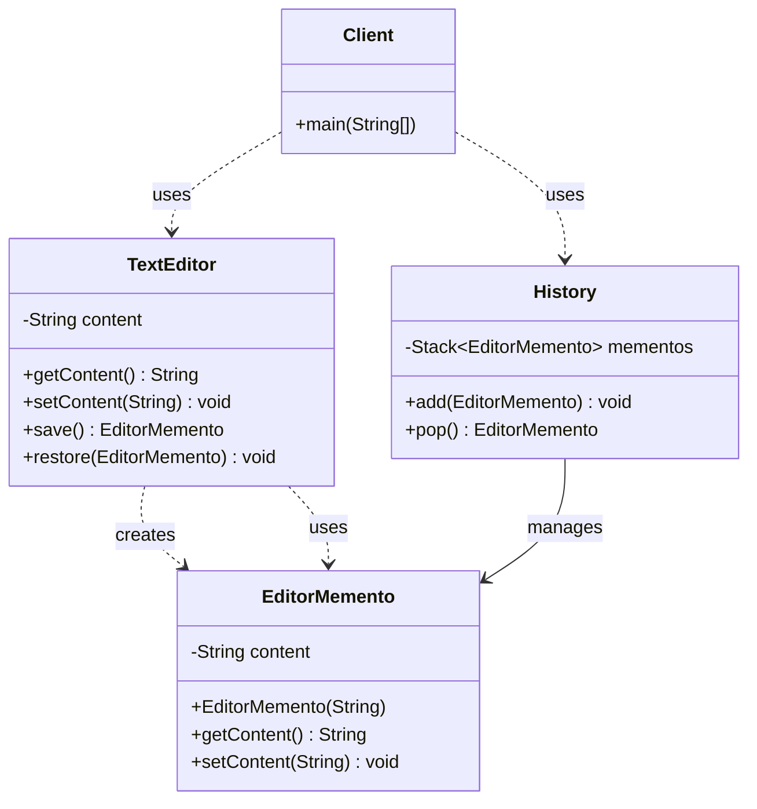
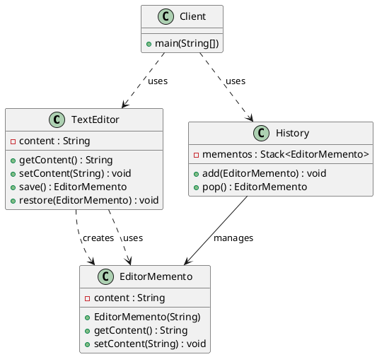

# 备忘录模式（Memento Pattern）—— 文本编辑器示例完整整理

> 目标：在不破坏封装性的前提下，捕获一个对象的内部状态，并在该对象之外保存这个状态，这样以后就可以将该对象恢复到原先保存的状态。  
> 你会在：需要实现撤销/重做功能、需要保存对象状态以便恢复、需要实现快照功能的场景中遇到它。

本文通过文本编辑器（TextEditor）示例，讲解备忘录模式的实现：

**原发器 → 备忘录 → 管理者**

重点回答两个问题：

1. 备忘录模式如何实现对象状态的保存和恢复
2. 它解决了什么问题，又引入了什么代价

---

## 1. 为什么需要备忘录模式

### 1.1 典型场景

- **撤销/重做**：需要实现撤销和重做功能，恢复到之前的状态
- **状态保存**：需要保存对象的内部状态，以便后续恢复
- **快照功能**：需要实现快照功能，保存对象在某个时刻的状态
- **事务回滚**：需要实现事务回滚，恢复到事务开始前的状态
- **版本控制**：需要实现版本控制，可以回退到之前的版本

### 1.2 备忘录模式的核心思想

```
原发器（Originator）
  ├─ 当前状态（content）
  ├─ save() 创建备忘录
  └─ restore() 恢复状态
      ↓
备忘录（Memento）
  └─ 保存状态（content）
      ↓
管理者（Caretaker）
  └─ 管理备忘录（History）
      ├─ add() 添加备忘录
      └─ pop() 弹出备忘录
```

备忘录模式通过将对象的状态封装在备忘录中，由管理者负责保存和管理，实现对象状态的保存和恢复，而不破坏对象的封装性。

---

## 2. 备忘录模式结构总览

| 角色           | 说明                           | 示例                    |
| -------------- | ------------------------------ | ----------------------- |
| Originator     | 原发器，需要保存状态的对象      | `TextEditor`            |
| Memento        | 备忘录，保存原发器的内部状态    | `EditorMemento`         |
| Caretaker      | 管理者，负责保存和管理备忘录    | `History`               |
| Client         | 客户端，使用原发器和管理者      | `Client`                |

---

## 3. 核心组件

### 3.1 原发器（Originator）

**原发器实现：**

```java
/**
 * 文本编辑器
 */
public class TextEditor {

    private String content;

    public String getContent() {
        return content;
    }

    public void setContent(String content) {
        this.content = content;
    }

    /**
     * 保存
     * 创建备忘录，保存当前状态
     * @return 备忘录对象
     */
    public EditorMemento save() {
        return new EditorMemento(content); // 创建备忘录
    }

    /**
     * 恢复
     * 从备忘录中恢复状态
     * @param memento 备忘录对象
     */
    public void restore(EditorMemento memento) {
        this.content = memento.getContent();
    }
}
```

**关键点：**
- 原发器是需要保存状态的对象
- `save()` 方法创建备忘录，保存当前状态
- `restore()` 方法从备忘录中恢复状态
- 原发器负责创建和恢复备忘录

---

### 3.2 备忘录（Memento）

**备忘录实现：**

```java
/**
 * 备忘录
 */
public class EditorMemento {

    private String content; // 内容

    public EditorMemento(String content) {
        this.content = content;
    }

    public String getContent() {
        return content;
    }

    public void setContent(String content) {
        this.content = content;
    }
}
```

**关键点：**
- 备忘录保存原发器的内部状态
- 备忘录应该只被原发器访问，不应该被其他对象直接访问
- 可以设置备忘录为原发器的内部类，或者限制访问权限

---

### 3.3 管理者（Caretaker）

**管理者实现：**

```java
/**
 * 历史记录
 */
public class History {

    private Stack<EditorMemento> mementos = new Stack<EditorMemento>(); // 备忘录栈

    /**
     * 添加
     * 将备忘录添加到历史记录中
     * @param memento 备忘录对象
     */
    public void add(EditorMemento memento) {
        mementos.push(memento);
    }

    /**
     * 弹出（回退）
     * 从历史记录中弹出最后一个备忘录
     * @return 备忘录对象
     */
    public EditorMemento pop() {
        return mementos.pop();
    }
}
```

**关键点：**
- 管理者负责保存和管理备忘录
- 使用栈（Stack）保存备忘录，支持撤销操作
- 管理者不应该访问备忘录的内部状态，只负责保存和管理

---

## 4. 使用示例

### 4.1 基本使用

```java
public class Client {
    public static void main(String[] args) {
        History history = new History();
        TextEditor textEditor = new TextEditor();
        
        // 保存状态 "1"
        textEditor.setContent("1");
        history.add(textEditor.save());
        
        // 保存状态 "2"
        textEditor.setContent("2");
        history.add(textEditor.save());
        
        // 设置状态 "3"（不保存到历史记录）
        textEditor.setContent("3");
        
        // 第一次输出：当前内容应该是 "3"
        System.out.println(textEditor.getContent());
        
        // 恢复到上一个状态
        textEditor.restore(history.pop());
        
        System.out.println("=====================");
        
        // 第二次输出：恢复后内容应该是 "2"
        System.out.println(textEditor.getContent());
    }
}
```

**输出：**

```
3
=====================
2
```

**关键点：**
- 原发器调用 `save()` 创建备忘录
- 管理者调用 `add()` 保存备忘录
- 管理者调用 `pop()` 获取备忘录
- 原发器调用 `restore()` 恢复状态

### 4.2 工作流程

```
1. 原发器设置状态
   ↓
2. 原发器调用 save() 创建备忘录
   ↓
3. 管理者调用 add() 保存备忘录
   ↓
4. 重复步骤 1-3，保存多个状态
   ↓
5. 管理者调用 pop() 获取备忘录
   ↓
6. 原发器调用 restore() 恢复状态
```

### 4.3 状态保存和恢复流程

```
[TextEditor] content = "1"
  ↓ save()
[EditorMemento] content = "1"
  ↓ add()
[History] stack: [Memento("1")]

[TextEditor] content = "2"
  ↓ save()
[EditorMemento] content = "2"
  ↓ add()
[History] stack: [Memento("1"), Memento("2")]

[TextEditor] content = "3" (不保存)

[History] pop() → Memento("2")
  ↓ restore()
[TextEditor] content = "2"
```

---

## 5. 代码结构

本示例包含以下目录结构：

```
memento/
├── TextEditor.java      # 原发器（文本编辑器）
├── EditorMemento.java   # 备忘录
├── History.java         # 管理者（历史记录）
└── Client.java         # 客户端
```

---

## 6. UML 类图

### 6.1 Mermaid 类图



### 6.2 PlantUML 类图



---

## 7. 备忘录模式 vs 其他模式

### 7.1 备忘录模式 vs 命令模式

| 对比项 | 备忘录模式 | 命令模式 |
|--------|-----------|---------|
| **目的** | 保存和恢复对象状态 | 封装请求，支持撤销 |
| **关注点** | 对象状态的保存和恢复 | 请求的封装和处理 |
| **撤销方式** | 通过恢复状态实现撤销 | 通过执行反向操作实现撤销 |
| **状态保存** | 保存对象的完整状态 | 保存命令的历史记录 |

**区别：**
- 备忘录模式：通过保存和恢复对象状态实现撤销
- 命令模式：通过执行反向操作实现撤销

### 7.2 备忘录模式 vs 原型模式

| 对比项 | 备忘录模式 | 原型模式 |
|--------|-----------|---------|
| **目的** | 保存和恢复对象状态 | 克隆对象 |
| **关注点** | 对象状态的保存和恢复 | 对象的克隆 |
| **使用场景** | 撤销/重做功能 | 对象创建 |

**区别：**
- 备忘录模式：关注对象状态的保存和恢复
- 原型模式：关注对象的克隆

### 7.3 备忘录模式 vs 状态模式

| 对比项 | 备忘录模式 | 状态模式 |
|--------|-----------|---------|
| **目的** | 保存和恢复对象状态 | 封装对象的状态转换 |
| **关注点** | 状态的保存和恢复 | 状态的行为和转换 |
| **使用场景** | 撤销/重做功能 | 状态机 |

**区别：**
- 备忘录模式：关注状态的保存和恢复
- 状态模式：关注状态的行为和转换

---

## 8. 备忘录模式的特点

### 8.1 优点

- ✅ **封装性好**：不破坏对象的封装性，状态保存在备忘录中
- ✅ **状态恢复**：可以方便地恢复到之前的状态
- ✅ **撤销功能**：可以轻松实现撤销和重做功能
- ✅ **历史记录**：可以保存多个历史状态，支持多次撤销
- ✅ **职责分离**：原发器、备忘录、管理者职责清晰

### 8.2 缺点

- ❌ **内存消耗**：保存多个状态会消耗大量内存
- ❌ **性能问题**：频繁保存和恢复状态可能影响性能
- ❌ **状态管理**：需要管理多个状态，可能变得复杂
- ❌ **深拷贝问题**：如果对象包含引用类型，需要实现深拷贝

---

## 9. 使用场景

### 9.1 适用场景

- ✅ **撤销/重做**：需要实现撤销和重做功能
- ✅ **状态保存**：需要保存对象的内部状态，以便后续恢复
- ✅ **快照功能**：需要实现快照功能，保存对象在某个时刻的状态
- ✅ **事务回滚**：需要实现事务回滚，恢复到事务开始前的状态
- ✅ **版本控制**：需要实现版本控制，可以回退到之前的版本

### 9.2 常见应用

- **文本编辑器**：撤销/重做功能
- **图形编辑器**：撤销/重做功能
- **游戏开发**：存档/读档功能
- **数据库**：事务回滚
- **版本控制**：Git、SVN 等版本控制系统

---

## 10. 实际应用示例

### 10.1 文本编辑器撤销功能

```java
// 文本编辑器中的备忘录模式
public class TextEditor {
    private String content;
    
    public EditorMemento save() {
        return new EditorMemento(content);
    }
    
    public void restore(EditorMemento memento) {
        this.content = memento.getContent();
    }
}

public class History {
    private Stack<EditorMemento> mementos = new Stack<>();
    
    public void add(EditorMemento memento) {
        mementos.push(memento);
    }
    
    public EditorMemento undo() {
        if (mementos.isEmpty()) {
            return null;
        }
        mementos.pop(); // 弹出当前状态
        return mementos.isEmpty() ? null : mementos.peek(); // 返回前一个状态
    }
}
```

### 10.2 游戏存档功能

```java
// 游戏中的备忘录模式
public class GameState {
    private int level;
    private int score;
    private String playerName;
    
    public GameMemento save() {
        return new GameMemento(level, score, playerName);
    }
    
    public void restore(GameMemento memento) {
        this.level = memento.getLevel();
        this.score = memento.getScore();
        this.playerName = memento.getPlayerName();
    }
}
```

### 10.3 数据库事务回滚

```java
// 数据库事务中的备忘录模式
public class Transaction {
    private Map<String, Object> state;
    
    public TransactionMemento save() {
        return new TransactionMemento(new HashMap<>(state));
    }
    
    public void rollback(TransactionMemento memento) {
        this.state = new HashMap<>(memento.getState());
    }
}
```

---

## 11. 备忘录模式的变体

### 11.1 标准备忘录模式（当前实现）

**特点：**
- 备忘录是独立的类
- 原发器可以访问备忘录的所有方法
- 管理者只负责保存和管理备忘录

**示例：**
```java
public class EditorMemento {
    private String content;
    // ...
}
```

### 11.2 宽接口备忘录模式

**特点：**
- 备忘录提供宽接口给原发器
- 备忘录提供窄接口给管理者
- 通过接口分离实现封装

**示例：**
```java
// 宽接口：原发器可以访问
public interface MementoOriginator {
    String getContent();
    void setContent(String content);
}

// 窄接口：管理者只能保存，不能访问
public interface MementoCaretaker {
    // 没有方法，只能保存
}
```

### 11.3 内部类备忘录模式

**特点：**
- 备忘录作为原发器的内部类
- 只有原发器可以创建和访问备忘录
- 更好的封装性

**示例：**
```java
public class TextEditor {
    private String content;
    
    public Memento save() {
        return new Memento(content);
    }
    
    private class Memento {
        private String content;
        private Memento(String content) {
            this.content = content;
        }
        private String getContent() {
            return content;
        }
    }
}
```

---

## 12. 面试要点

### 12.1 基础问题

- **备忘录模式解决什么问题？**
  - 要点：在不破坏封装性的前提下，捕获一个对象的内部状态，并在该对象之外保存这个状态，以便以后可以恢复到原先保存的状态

- **备忘录模式的核心是什么？**
  - 要点：将对象的状态封装在备忘录中，由管理者负责保存和管理，实现对象状态的保存和恢复

- **备忘录模式如何实现？**
  - 要点：原发器创建备忘录保存状态，管理者保存和管理备忘录，原发器从备忘录中恢复状态

### 12.2 实现细节

- **备忘录模式如何保证封装性？**
  - 要点：备忘录只保存状态，不暴露原发器的内部实现，可以设置为原发器的内部类

- **备忘录模式的内存问题如何解决？**
  - 要点：可以限制保存的状态数量，使用增量保存，或者只保存关键状态

- **备忘录模式如何实现撤销和重做？**
  - 要点：使用栈保存历史状态，撤销时弹出当前状态，重做时使用另一个栈保存撤销的状态

### 12.3 实践问题

- **什么时候使用备忘录模式？**
  - 要点：需要实现撤销/重做功能、需要保存对象状态以便恢复、需要实现快照功能

- **备忘录模式在哪些框架中有应用？**
  - 要点：文本编辑器、图形编辑器、游戏开发、数据库事务、版本控制系统等

- **备忘录模式的缺点是什么？**
  - 要点：内存消耗大、性能问题、状态管理复杂、深拷贝问题

---

## 13. 总结

备忘录模式是一个**非常重要的行为型设计模式**，它解决了对象状态的保存和恢复问题：

**核心价值：**

1. **封装性好**：不破坏对象的封装性，状态保存在备忘录中
2. **状态恢复**：可以方便地恢复到之前的状态
3. **撤销功能**：可以轻松实现撤销和重做功能
4. **历史记录**：可以保存多个历史状态，支持多次撤销
5. **职责分离**：原发器、备忘录、管理者职责清晰

**模式特点：**

```
原发器（TextEditor）
  ├─ 当前状态（content）
  ├─ save() 创建备忘录
  └─ restore() 恢复状态
      ↓
备忘录（EditorMemento）
  └─ 保存状态（content）
      ↓
管理者（History）
  └─ 管理备忘录（Stack）
      ├─ add() 添加备忘录
      └─ pop() 弹出备忘录
```

**最佳实践：**

- 备忘录应该只保存必要的状态，避免内存浪费
- 可以限制保存的状态数量，防止内存溢出
- 备忘录可以设置为原发器的内部类，提高封装性
- 注意深拷贝问题，如果对象包含引用类型，需要实现深拷贝
- 合理使用备忘录模式，避免过度设计

**一句话总结：**

> 当需要在不破坏封装性的前提下，保存和恢复对象的内部状态，实现撤销/重做功能时，使用备忘录模式。

---

## 14. 参考资源

- [设计模式：可复用面向对象软件的基础](https://book.douban.com/subject/1052241/)
- [Head First 设计模式](https://book.douban.com/subject/2243615/)
- [备忘录模式](https://en.wikipedia.org/wiki/Memento_pattern)
