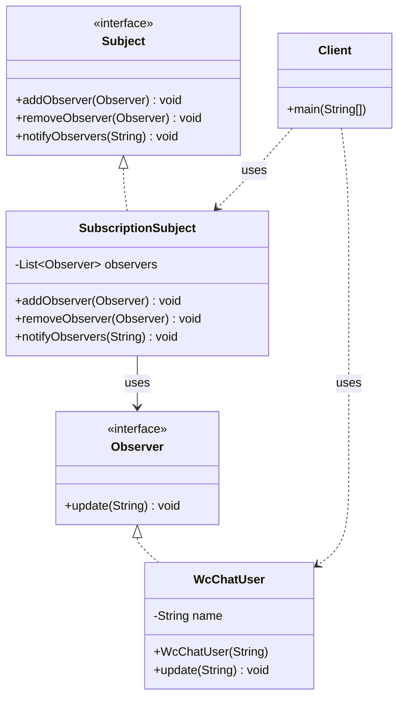
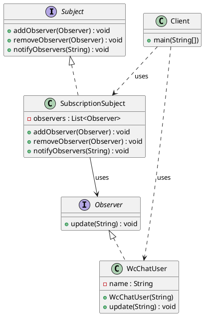

# 观察者模式（Observer Pattern）—— 订阅主题示例完整整理

> 目标：定义对象间的一种一对多的依赖关系，当一个对象的状态发生改变时，所有依赖于它的对象都得到通知并被自动更新。  
> 你会在：需要实现发布-订阅机制、事件驱动系统、模型-视图分离的场景中遇到它。

本文通过订阅主题（微信公众号）示例，讲解观察者模式的实现：

**主题接口 → 具体主题 → 观察者接口 → 具体观察者**

重点回答两个问题：

1. 观察者模式如何实现对象间的解耦和通知机制
2. 它解决了什么问题，又引入了什么代价

---

## 1. 为什么需要观察者模式

### 1.1 典型场景

- **发布-订阅**：需要实现发布-订阅机制，一个对象的状态改变需要通知多个对象
- **事件驱动**：需要实现事件驱动系统，对象之间需要松耦合的通信
- **模型-视图分离**：需要实现模型-视图分离，模型变化时自动更新视图
- **避免紧耦合**：需要避免对象之间的紧耦合，提高系统的可维护性
- **动态通知**：需要动态地添加或删除观察者，运行时决定通知哪些对象

### 1.2 观察者模式的核心思想

```
主题（Subject）
  ├─ 维护观察者列表
  ├─ 添加观察者
  ├─ 删除观察者
  └─ 通知观察者
      ↓
观察者（Observer）
  ├─ 具体观察者A（WcChatUser）
  │   └─ 收到通知后执行更新操作
  └─ 具体观察者B（WcChatUser）
      └─ 收到通知后执行更新操作
```

观察者模式通过定义对象间的一对多依赖关系，实现当一个对象的状态发生改变时，所有依赖于它的对象都得到通知并被自动更新。

---

## 2. 观察者模式结构总览

| 角色           | 说明                           | 示例                    |
| -------------- | ------------------------------ | ----------------------- |
| Subject        | 主题接口，定义添加、删除、通知观察者的方法 | `Subject`            |
| ConcreteSubject | 具体主题，维护观察者列表并通知观察者 | `SubscriptionSubject` |
| Observer       | 观察者接口，定义更新方法          | `Observer`            |
| ConcreteObserver | 具体观察者，实现更新方法          | `WcChatUser`          |
| Client         | 客户端，使用主题和观察者            | `Client`               |

---

## 3. 核心组件

### 3.1 主题接口（Subject）

**接口定义：**

```java
/**
 * 主题（被观察者抽象接口）
 */
public interface Subject {

    /**
     * 添加观察者
     * @param observer 观察者
     */
    void addObserver(Observer observer);

    /**
     * 删除观察者
     * @param observer 观察者
     */
    void removeObserver(Observer observer);

    /**
     * 通知观察者
     * @param message 消息
     */
    void notifyObservers(String message);

}
```

**关键点：**
- 定义主题的统一接口
- `addObserver()` 方法用于添加观察者
- `removeObserver()` 方法用于删除观察者
- `notifyObservers()` 方法用于通知所有观察者

---

### 3.2 具体主题（ConcreteSubject）

**具体主题实现：**

```java
/**
 * 订阅主题，具体的主题实现
 */
public class SubscriptionSubject implements Subject {

    private List<Observer> observers = new ArrayList<>();

    @Override
    public void addObserver(Observer observer) {
        observers.add(observer);
    }

    @Override
    public void removeObserver(Observer observer) {
        observers.remove(observer);
    }

    @Override
    public void notifyObservers(String message) {
        for (Observer observer : observers) {
            observer.update(message);
        }
    }
}
```

**关键点：**
- 维护观察者列表
- 实现添加、删除、通知观察者的方法
- 通知时遍历所有观察者并调用其 `update()` 方法

---

### 3.3 观察者接口（Observer）

**接口定义：**

```java
/**
 * 观察者接口
 * 定义了观察者接口，每个观察者都需要实现这个接口
 */
public interface Observer {

    /**
     * 更新
     * @param message 消息
     */
    void update(String message);

}
```

**关键点：**
- 定义观察者的统一接口
- `update()` 方法接收主题的通知消息
- 所有具体观察者都实现这个接口

---

### 3.4 具体观察者（ConcreteObserver）

**具体观察者实现：**

```java
/**
 * 微信公众号用户，具体的观察者
 */
public class WcChatUser implements Observer {

    private String name;

    public WcChatUser(String name) {
        this.name = name;
    }

    @Override
    public void update(String message) {
        System.out.println(name + "收到消息: " + message);
    }
}
```

**关键点：**
- 实现观察者接口
- `update()` 方法定义收到通知后的行为
- 可以维护自己的状态

---

## 4. 使用示例

### 4.1 基本使用

```java
public class Client {

    public static void main(String[] args) {
        SubscriptionSubject subject = new SubscriptionSubject();
        Observer observer1 = new WcChatUser("张三");
        Observer observer2 = new WcChatUser("李四");
        
        subject.addObserver(observer1);
        subject.addObserver(observer2);
        
        subject.notifyObservers("公众号更新了1"); // 通知观察者
        
        subject.removeObserver(observer1); // 删除观察者
        
        subject.notifyObservers("公众号更新了2"); // 通知观察者
    }
}
```

**输出：**

```
张三收到消息: 公众号更新了1
李四收到消息: 公众号更新了1
李四收到消息: 公众号更新了2
```

**关键点：**
- 客户端创建主题和观察者对象
- 将观察者添加到主题中
- 主题状态改变时通知所有观察者
- 可以动态添加或删除观察者

### 4.2 工作流程

```
1. 创建主题对象（SubscriptionSubject）
   ↓
2. 创建观察者对象（WcChatUser）
   ↓
3. 将观察者添加到主题（addObserver）
   ↓
4. 主题状态改变，通知观察者（notifyObservers）
   ↓
5. 观察者收到通知，执行更新操作（update）
   ↓
6. 可以动态删除观察者（removeObserver）
```

### 4.3 交互图

```
[主题] --添加--> [观察者列表]
[主题] --通知--> [观察者1]
[主题] --通知--> [观察者2]
[主题] --删除--> [观察者1]
[主题] --通知--> [观察者2]
```

---

## 5. 代码结构

本示例包含以下目录结构：

```
observer/
├── Subject.java              # 主题接口
├── SubscriptionSubject.java  # 具体主题实现
├── Observer.java            # 观察者接口
├── WcChatUser.java          # 具体观察者实现
└── Client.java              # 客户端
```

---

## 6. UML 类图

### 6.1 Mermaid 类图



### 6.2 PlantUML 类图



---

## 7. 观察者模式 vs 其他模式

### 7.1 观察者模式与发布-订阅模式

**观察者模式（Observer Pattern）和发布-订阅模式（Publish-Subscribe Pattern）本质上是同一种模式的不同表述。**

- **观察者模式**：GoF 设计模式中的标准名称，强调主题（Subject）和观察者（Observer）的直接关系
- **发布-订阅模式**：更通用的术语，强调发布者（Publisher）和订阅者（Subscriber）的概念

**核心思想相同：**
- 定义对象间的一对多依赖关系
- 当一个对象的状态发生改变时，所有依赖于它的对象都得到通知并被自动更新

**实现方式的细微差别：**
- **直接实现**：主题直接维护观察者列表并调用观察者方法（本示例的实现方式）
- **通过消息代理**：通过消息队列或事件总线解耦，发布者和订阅者不直接通信（分布式系统中的常见实现）

**总结：** 观察者模式和发布-订阅模式是同一模式的不同表述，核心思想一致，只是实现方式可能有所不同。

### 7.2 观察者模式 vs 策略模式

| 对比项 | 观察者模式 | 策略模式 |
|--------|-----------|---------|
| **目的** | 实现对象间的通知机制 | 封装算法，算法可替换 |
| **关系** | 一对多关系 | 一对一关系 |
| **使用场景** | 事件通知、发布-订阅 | 多种算法完成同一任务 |
| **关注点** | 对象间的通信 | 算法的封装和替换 |

**区别：**
- 观察者模式：关注对象间的通知机制，一对多关系
- 策略模式：关注算法的封装和替换，一对一关系

### 7.3 观察者模式 vs 责任链模式

| 对比项 | 观察者模式 | 责任链模式 |
|--------|-----------|-----------|
| **目的** | 实现对象间的通知机制 | 将请求沿着链传递 |
| **处理方式** | 所有观察者都收到通知 | 请求沿着链传递，由链中的对象处理 |
| **关系** | 一对多关系 | 链式关系 |
| **使用场景** | 事件通知、发布-订阅 | 多级审批、过滤器链 |

**区别：**
- 观察者模式：所有观察者都收到通知，一对多关系
- 责任链模式：请求沿着链传递，由链中的对象处理，链式关系

---

## 8. 观察者模式的特点

### 8.1 优点

- ✅ **解耦**：主题和观察者之间松耦合，主题不需要知道观察者的具体实现
- ✅ **动态通知**：可以动态地添加或删除观察者，运行时决定通知哪些对象
- ✅ **符合开闭原则**：添加新观察者无需修改主题代码
- ✅ **一对多通信**：一个主题可以通知多个观察者
- ✅ **事件驱动**：支持事件驱动的编程模型

### 8.2 缺点

- ❌ **通知顺序不确定**：如果观察者之间有依赖关系，通知顺序可能导致问题
- ❌ **循环依赖**：如果观察者之间相互观察，可能导致循环依赖
- ❌ **性能问题**：如果观察者数量很多，通知所有观察者可能影响性能
- ❌ **内存泄漏**：如果观察者没有正确移除，可能导致内存泄漏

---

## 9. 使用场景

### 9.1 适用场景

- ✅ **发布-订阅**：需要实现发布-订阅机制，一个对象的状态改变需要通知多个对象
- ✅ **事件驱动**：需要实现事件驱动系统，对象之间需要松耦合的通信
- ✅ **模型-视图分离**：需要实现模型-视图分离，模型变化时自动更新视图
- ✅ **动态通知**：需要动态地添加或删除观察者，运行时决定通知哪些对象

### 9.2 常见应用

- **GUI 框架**：按钮点击事件、窗口关闭事件等
- **消息队列**：发布-订阅消息系统
- **MVC 架构**：模型变化时自动更新视图
- **事件总线**：事件驱动的系统架构
- **监听器模式**：Java 中的各种监听器（ActionListener、MouseListener 等）

---

## 10. 实际应用示例

### 10.1 Java 内置观察者模式

```java
// Java 内置的观察者模式（已废弃，但可以参考）
import java.util.Observable;
import java.util.Observer;

public class NewsPublisher extends Observable {
    public void publishNews(String news) {
        setChanged();
        notifyObservers(news);
    }
}

public class NewsSubscriber implements Observer {
    @Override
    public void update(Observable o, Object arg) {
        System.out.println("收到新闻: " + arg);
    }
}
```

### 10.2 事件监听器

```java
// 事件监听器模式
public interface EventListener {
    void onEvent(Event event);
}

public class Button {
    private List<EventListener> listeners = new ArrayList<>();
    
    public void addListener(EventListener listener) {
        listeners.add(listener);
    }
    
    public void click() {
        Event event = new Event("click");
        for (EventListener listener : listeners) {
            listener.onEvent(event);
        }
    }
}
```

### 10.3 MVC 架构

```java
// MVC 架构中的观察者模式
public class Model {
    private List<View> views = new ArrayList<>();
    
    public void addView(View view) {
        views.add(view);
    }
    
    public void updateData(String data) {
        // 更新数据
        notifyViews(data);
    }
    
    private void notifyViews(String data) {
        for (View view : views) {
            view.update(data);
        }
    }
}
```

---

## 11. 观察者模式的变体

### 11.1 推模式（Push Model）

**特点：**
- 主题将详细数据推送给观察者
- 观察者被动接收数据

**示例：**
```java
public interface Observer {
    void update(String message, String author, Date time); // 推送详细数据
}
```

### 11.2 拉模式（Pull Model）

**特点：**
- 主题只通知观察者状态改变
- 观察者主动从主题拉取数据

**示例：**
```java
public interface Observer {
    void update(Subject subject); // 观察者主动拉取数据
}

public class WcChatUser implements Observer {
    @Override
    public void update(Subject subject) {
        String message = subject.getMessage(); // 主动拉取数据
        System.out.println(name + "收到消息: " + message);
    }
}
```

### 11.3 事件对象模式

**特点：**
- 使用事件对象封装通知信息
- 更灵活，可以传递不同类型的事件

**示例：**
```java
public interface Observer {
    void update(Event event);
}

public class Event {
    private String type;
    private Object data;
    // ...
}
```

---

## 12. 面试要点

### 12.1 基础问题

- **观察者模式解决什么问题？**
  - 要点：解决对象间的一对多依赖关系，实现当一个对象的状态发生改变时，所有依赖于它的对象都得到通知并被自动更新

- **观察者模式的核心是什么？**
  - 要点：定义对象间的一对多依赖关系，主题维护观察者列表，状态改变时通知所有观察者

- **观察者模式如何实现？**
  - 要点：定义主题接口和观察者接口，具体主题维护观察者列表并通知观察者，具体观察者实现更新方法

### 12.2 实现细节

- **观察者模式和发布-订阅模式的关系？**
  - 要点：观察者模式和发布-订阅模式本质上是同一种模式的不同表述，核心思想一致，只是实现方式可能有所不同（直接调用 vs 通过消息代理）

- **为什么观察者模式要维护观察者列表？**
  - 要点：实现一对多通知机制，主题可以通知多个观察者

- **观察者模式如何处理通知顺序？**
  - 要点：通常按照添加顺序通知，如果需要特定顺序，可以使用有序集合或优先级队列

### 12.3 实践问题

- **什么时候使用观察者模式？**
  - 要点：需要实现发布-订阅机制、事件驱动系统、模型-视图分离

- **观察者模式在哪些框架中有应用？**
  - 要点：GUI 框架、消息队列、MVC 架构、事件总线等

- **如何优化观察者模式的性能？**
  - 要点：使用异步通知、批量通知、观察者池等

---

## 13. 总结

观察者模式是一个**非常重要的行为型设计模式**，它解决了对象间的一对多依赖关系问题：

**核心价值：**

1. **解耦**：主题和观察者之间松耦合，主题不需要知道观察者的具体实现
2. **动态通知**：可以动态地添加或删除观察者，运行时决定通知哪些对象
3. **符合开闭原则**：添加新观察者无需修改主题代码
4. **一对多通信**：一个主题可以通知多个观察者
5. **事件驱动**：支持事件驱动的编程模型

**模式特点：**

```
主题接口（Subject）
  └─ 具体主题（SubscriptionSubject）
      ├─ 维护观察者列表
      ├─ 添加观察者
      ├─ 删除观察者
      └─ 通知观察者
          ↓
观察者接口（Observer）
  ├─ 具体观察者A（WcChatUser）
  └─ 具体观察者B（WcChatUser）
```

**最佳实践：**

- 主题维护观察者列表，状态改变时通知所有观察者
- 观察者实现更新方法，定义收到通知后的行为
- 可以动态添加或删除观察者
- 注意通知顺序和性能问题
- 避免循环依赖和内存泄漏

**一句话总结：**

> 当需要实现对象间的一对多依赖关系，当一个对象的状态发生改变时，所有依赖于它的对象都得到通知并被自动更新时，使用观察者模式。

---

## 14. 参考资源

- [设计模式：可复用面向对象软件的基础](https://book.douban.com/subject/1052241/)
- [Head First 设计模式](https://book.douban.com/subject/2243615/)
- [观察者模式](https://en.wikipedia.org/wiki/Observer_pattern)
