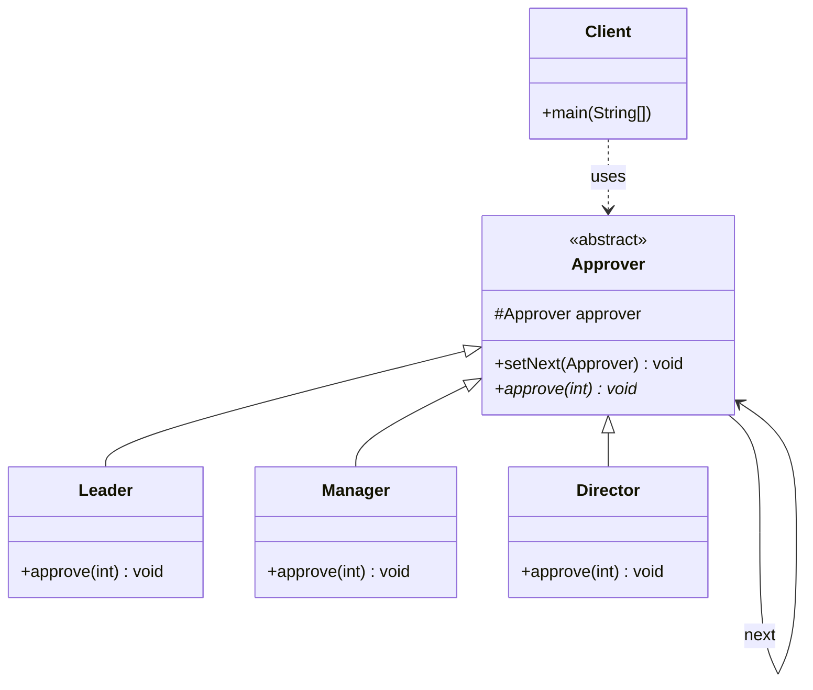
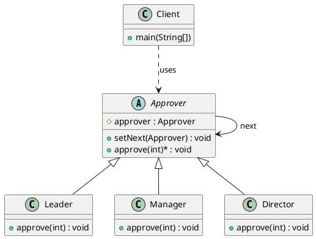

# 责任链模式（Chain of Responsibility Pattern）—— Approver 示例完整整理

> 目标：使多个对象都有机会处理请求，从而避免请求的发送者和接收者之间的耦合关系。将这些对象连成一条链，并沿着这条链传递请求，直到有一个对象处理它为止。  
> 你会在：需要多个对象处理同一个请求、需要动态指定处理者、需要避免请求发送者和接收者耦合的场景中遇到它。

本文通过 Approver（请假审批）示例，讲解责任链模式的实现：

**抽象处理者 → 具体处理者 → 责任链**

重点回答两个问题：

1. 责任链模式如何实现请求的传递和处理
2. 它解决了什么问题，又引入了什么代价

---

## 1. 为什么需要责任链模式

### 1.1 典型场景

- **多级审批**：需要多个对象处理同一个请求，如请假审批、报销审批
- **动态处理**：需要动态指定处理者，处理者可以动态组合
- **解耦请求**：需要避免请求发送者和接收者之间的耦合
- **灵活扩展**：需要灵活地添加或删除处理者
- **避免条件判断**：需要避免使用大量的 if-else 或 switch-case 语句

### 1.2 责任链模式的核心思想

```
请求 → 处理者1 → 处理者2 → 处理者3 → ...
      (无法处理) (无法处理) (可以处理)
```

责任链模式通过将多个处理者连成一条链，请求沿着链传递，直到有一个处理者能够处理它为止。

---

## 2. 责任链模式结构总览

| 角色           | 说明                           | 示例                    |
| -------------- | ------------------------------ | ----------------------- |
| Handler        | 抽象处理者，定义处理接口        | `Approver`              |
| ConcreteHandler | 具体处理者，实现处理逻辑        | `Leader`、`Manager`、`Director` |
| Client         | 客户端，创建责任链并发送请求     | `Client`                |

---

## 3. 核心组件

### 3.1 抽象处理者（Handler）

**抽象类定义：**

```java
/**
 * 抽象处理者
 */
public abstract class Approver {
    
    /**
     * 下一个处理者（责任链的关键）
     */
    protected Approver approver;

    /**
     * 设置下一个处理者
     * @param approver 下一个处理者
     */
    public void setNext(Approver approver) {
        this.approver = approver;
    }

    /**
     * 处理请假请求
     * @param days 请假天数
     */
    public abstract void approve(int days);
}
```

**关键点：**
- 持有下一个处理者的引用（责任链的关键）
- `setNext()` 方法用于设置下一个处理者
- `approve()` 方法是抽象方法，由子类实现

---

### 3.2 具体处理者（ConcreteHandler）

#### 3.2.1 Leader（组长）

```java
/**
 * 具体处理者：组长
 * 可以批准 3 天以内的请假
 */
public class Leader extends Approver {

    @Override
    public void approve(int days) {
        if (days <= 3) {
            // 可以处理，直接批准
            System.out.println("Leader 批准了 " + days + " 天的请假请求");
        } else {
            // 无法处理，传递给下一个处理者
            if (approver != null) {
                approver.approve(days);
            } else {
                System.out.println("Leader 无法处理 " + days + " 天的请假请求");
            }
        }
    }
}
```

#### 3.2.2 Manager（经理）

```java
/**
 * 具体处理者：经理
 * 可以批准 7 天以内的请假
 */
public class Manager extends Approver {

    @Override
    public void approve(int days) {
        if (days <= 7) {
            // 可以处理，直接批准
            System.out.println("Manager 批准了 " + days + " 天的请假请求");
        } else {
            // 无法处理，传递给下一个处理者
            if (approver != null) {
                approver.approve(days);
            } else {
                System.out.println("Manager 无法处理 " + days + " 天的请假请求");
            }
        }
    }
}
```

#### 3.2.3 Director（总监）

```java
/**
 * 具体处理者：总监
 * 可以批准 10 天以内的请假，超过 10 天拒绝
 */
public class Director extends Approver {

    @Override
    public void approve(int days) {
        if (days <= 10) {
            // 可以处理，直接批准
            System.out.println("Director 批准了 " + days + " 天的请假请求");
        } else {
            // 无法处理，拒绝（责任链的末端）
            System.out.println("Director 拒绝了 " + days + " 天的请假请求");
        }
    }
}
```

**关键点：**
- 每个处理者都有自己的处理范围
- 如果可以处理，直接处理并结束
- 如果无法处理，传递给下一个处理者
- 责任链的末端处理者需要处理所有无法处理的请求

---

## 4. 使用示例

### 4.1 基本使用

```java
public class Client {

    public static void main(String[] args) {
        // 创建处理者
        Manager manager = new Manager();
        Leader leader = new Leader();
        Director director = new Director();

        // 设置责任链：manager -> leader -> director
        manager.setNext(leader);
        leader.setNext(director);

        // 发送请求
        manager.approve(1);   // Manager 批准
        manager.approve(3);   // Manager 批准
        manager.approve(7);   // Manager 批准
        manager.approve(10);  // Director 批准
        manager.approve(20);  // Director 拒绝
    }
}
```

**输出：**

```
Manager 批准了 1 天的请假请求
Manager 批准了 3 天的请假请求
Manager 批准了 7 天的请假请求
Director 批准了 10 天的请假请求
Director 拒绝了 20 天的请假请求
```

**关键点：**
- 客户端创建处理者并设置责任链
- 请求从第一个处理者开始传递
- 每个处理者根据自己的能力决定是否处理
- 如果无法处理，传递给下一个处理者

### 4.2 请求传递流程

```
请求：1天
  ↓
Manager (可以处理，days <= 7) → 批准，结束

请求：10天
  ↓
Manager (无法处理，days > 7) → 传递给 Leader
  ↓
Leader (无法处理，days > 3) → 传递给 Director
  ↓
Director (可以处理，days <= 10) → 批准，结束

请求：20天
  ↓
Manager (无法处理，days > 7) → 传递给 Leader
  ↓
Leader (无法处理，days > 3) → 传递给 Director
  ↓
Director (无法处理，days > 10) → 拒绝，结束
```

### 4.3 动态调整责任链

```java
// 可以动态调整责任链的顺序
Manager manager = new Manager();
Leader leader = new Leader();
Director director = new Director();

// 方案1：manager -> leader -> director
manager.setNext(leader);
leader.setNext(director);

// 方案2：leader -> manager -> director
leader.setNext(manager);
manager.setNext(director);

// 方案3：只使用 manager 和 director
manager.setNext(director);
```

---

## 5. 代码结构

本示例包含以下目录结构：

```
responsibility/
├── Approver.java      # 抽象处理者
├── Leader.java        # 具体处理者（组长）
├── Manager.java       # 具体处理者（经理）
├── Director.java      # 具体处理者（总监）
└── Client.java        # 客户端
```

---

## 6. UML 类图

### 6.1 Mermaid 类图



### 6.2 PlantUML 类图



---

## 7. 责任链模式 vs 其他模式

### 7.1 责任链模式 vs 命令模式

| 对比项 | 责任链模式 | 命令模式 |
|--------|-----------|---------|
| **目的** | 将请求沿着链传递，直到有对象处理 | 将请求封装成对象，支持撤销、排队 |
| **处理方式** | 链中的对象依次尝试处理 | 命令对象直接处理请求 |
| **撤销** | 不支持撤销 | 支持撤销操作 |
| **使用场景** | 多级审批、过滤器链 | GUI 操作、事务处理 |

**区别：**
- 责任链模式：请求沿着链传递，由链中的对象处理
- 命令模式：请求封装成命令对象，直接处理

### 7.2 责任链模式 vs 策略模式

| 对比项 | 责任链模式 | 策略模式 |
|--------|-----------|---------|
| **目的** | 将请求沿着链传递，直到有对象处理 | 封装算法，使算法可替换 |
| **选择方式** | 链中的对象依次尝试 | 客户端主动选择 |
| **处理方式** | 自动传递，直到找到处理者 | 直接执行选定的策略 |
| **使用场景** | 多级审批、过滤器链 | 支付方式、排序算法 |

**区别：**
- 责任链模式：请求自动传递，链中的对象依次尝试
- 策略模式：客户端主动选择策略，直接执行

### 7.3 责任链模式 vs 装饰器模式

| 对比项 | 责任链模式 | 装饰器模式 |
|--------|-----------|-----------|
| **目的** | 将请求沿着链传递，直到有对象处理 | 动态添加功能，可以叠加 |
| **处理方式** | 链中的对象依次尝试，只有一个处理 | 装饰器依次处理，所有装饰器都执行 |
| **结果** | 只有一个处理者处理请求 | 所有装饰器都参与处理 |
| **使用场景** | 多级审批、过滤器链 | 功能增强、功能组合 |

**区别：**
- 责任链模式：只有一个处理者处理请求
- 装饰器模式：所有装饰器都参与处理

---

## 8. 责任链模式的特点

### 8.1 优点

- ✅ **解耦请求**：将请求发送者和接收者解耦
- ✅ **动态组合**：可以动态地组合处理者，灵活调整责任链
- ✅ **避免条件判断**：消除了大量的 if-else 或 switch-case 语句
- ✅ **符合开闭原则**：添加新处理者无需修改现有代码
- ✅ **职责单一**：每个处理者只负责自己的处理范围

### 8.2 缺点

- ❌ **性能问题**：请求需要沿着链传递，可能影响性能
- ❌ **调试困难**：请求传递路径不明确，调试比较困难
- ❌ **链的完整性**：需要确保责任链的完整性，否则请求可能无法处理
- ❌ **循环引用**：如果设置不当，可能导致循环引用

---

## 9. 使用场景

### 9.1 适用场景

- ✅ **多级审批**：请假审批、报销审批、采购审批等
- ✅ **过滤器链**：Web 过滤器、日志过滤器、安全过滤器等
- ✅ **事件处理**：GUI 事件处理、异常处理等
- ✅ **权限验证**：多级权限验证、访问控制等
- ✅ **请求处理**：HTTP 请求处理、消息处理等

### 9.2 常见应用

- **审批系统**：请假审批、报销审批、采购审批
- **Web 框架**：Servlet 过滤器链、Spring 拦截器链
- **日志框架**：日志过滤器链、日志处理器链
- **安全框架**：权限验证链、访问控制链
- **异常处理**：异常处理器链、错误处理链

---

## 10. 实际应用示例

### 10.1 Servlet 过滤器链

```java
// Servlet 过滤器就是责任链模式的应用
public class AuthenticationFilter implements Filter {
    @Override
    public void doFilter(ServletRequest request, ServletResponse response, 
                        FilterChain chain) throws IOException, ServletException {
        // 处理认证逻辑
        if (isAuthenticated(request)) {
            // 传递给下一个过滤器
            chain.doFilter(request, response);
        } else {
            // 拒绝请求
            response.sendRedirect("/login");
        }
    }
}
```

### 10.2 Spring 拦截器链

```java
// Spring 拦截器也是责任链模式的应用
public class LoggingInterceptor implements HandlerInterceptor {
    @Override
    public boolean preHandle(HttpServletRequest request, 
                           HttpServletResponse response, 
                           Object handler) throws Exception {
        // 处理日志逻辑
        logRequest(request);
        // 返回 true 继续传递，返回 false 中断链
        return true;
    }
}
```

### 10.3 异常处理链

```java
// 异常处理链
public abstract class ExceptionHandler {
    protected ExceptionHandler next;
    
    public void setNext(ExceptionHandler next) {
        this.next = next;
    }
    
    public void handle(Exception e) {
        if (canHandle(e)) {
            doHandle(e);
        } else if (next != null) {
            next.handle(e);
        } else {
            throw new RuntimeException("无法处理的异常", e);
        }
    }
    
    protected abstract boolean canHandle(Exception e);
    protected abstract void doHandle(Exception e);
}
```

---

## 11. 责任链模式的变体

### 11.1 纯责任链模式

**特点：**
- 请求必须被处理，不能丢失
- 责任链的末端必须处理所有请求

**示例：**
```java
public class Director extends Approver {
    @Override
    public void approve(int days) {
        if (days <= 10) {
            System.out.println("Director 批准了 " + days + " 天的请假请求");
        } else {
            // 末端处理者必须处理所有请求
            System.out.println("Director 拒绝了 " + days + " 天的请假请求");
        }
    }
}
```

### 11.2 不纯责任链模式

**特点：**
- 请求可能不被处理
- 责任链的末端可以不处理请求

**示例：**
```java
public class Director extends Approver {
    @Override
    public void approve(int days) {
        if (days <= 10) {
            System.out.println("Director 批准了 " + days + " 天的请假请求");
        } else {
            // 可以不处理，请求丢失
            if (approver != null) {
                approver.approve(days);
            }
            // 如果没有下一个处理者，请求丢失
        }
    }
}
```

---

## 12. 面试要点

### 12.1 基础问题

- **责任链模式解决什么问题？**
  - 要点：解决多个对象处理同一个请求的问题，避免请求发送者和接收者之间的耦合

- **责任链模式的核心是什么？**
  - 要点：将多个处理者连成一条链，请求沿着链传递，直到有一个处理者能够处理它

- **责任链模式如何实现？**
  - 要点：抽象处理者持有下一个处理者的引用，具体处理者实现处理逻辑，如果无法处理则传递给下一个处理者

### 12.2 实现细节

- **责任链模式和命令模式的区别？**
  - 要点：责任链模式请求沿着链传递，命令模式请求封装成对象直接处理

- **为什么责任链模式要持有下一个处理者的引用？**
  - 要点：实现请求的传递，如果当前处理者无法处理，可以传递给下一个处理者

- **责任链模式如何处理无法处理的请求？**
  - 要点：纯责任链模式末端必须处理所有请求，不纯责任链模式请求可能丢失

### 12.3 实践问题

- **什么时候使用责任链模式？**
  - 要点：需要多个对象处理同一个请求、需要动态指定处理者、需要避免请求发送者和接收者耦合

- **责任链模式在哪些框架中有应用？**
  - 要点：Servlet 过滤器链、Spring 拦截器链、日志框架、安全框架等

- **如何优化责任链模式的性能？**
  - 要点：减少链的长度、使用缓存、提前终止链的传递等

---

## 13. 总结

责任链模式是一个**非常重要的行为型设计模式**，它解决了多个对象处理同一个请求的核心问题：

**核心价值：**

1. **解耦请求**：将请求发送者和接收者解耦
2. **动态组合**：可以动态地组合处理者，灵活调整责任链
3. **避免条件判断**：消除了大量的 if-else 或 switch-case 语句
4. **符合开闭原则**：添加新处理者无需修改现有代码
5. **职责单一**：每个处理者只负责自己的处理范围

**模式特点：**

```
抽象处理者（Approver）
  ├─ 持有下一个处理者的引用
  └─ 定义处理接口
      ↓
具体处理者（Leader、Manager、Director）
  ├─ 实现处理逻辑
  ├─ 如果可以处理，直接处理
  └─ 如果无法处理，传递给下一个处理者
      ↓
客户端（Client）
  └─ 创建责任链，发送请求
```

**最佳实践：**

- 抽象处理者持有下一个处理者的引用
- 具体处理者实现处理逻辑，如果无法处理则传递
- 责任链的末端必须处理所有无法处理的请求（纯责任链模式）
- 可以动态调整责任链的顺序
- 避免循环引用

**一句话总结：**

> 当需要多个对象处理同一个请求时，用责任链模式将处理者连成一条链，请求沿着链传递，直到有一个处理者能够处理它为止。

---

## 14. 参考资源

- [设计模式：可复用面向对象软件的基础](https://book.douban.com/subject/1052241/)
- [Head First 设计模式](https://book.douban.com/subject/2243615/)
- [Servlet 过滤器文档](https://docs.oracle.com/javaee/7/api/javax/servlet/Filter.html)
- [Spring 拦截器文档](https://docs.spring.io/spring-framework/docs/current/reference/html/web.html#mvc-handlermapping-interceptor)
