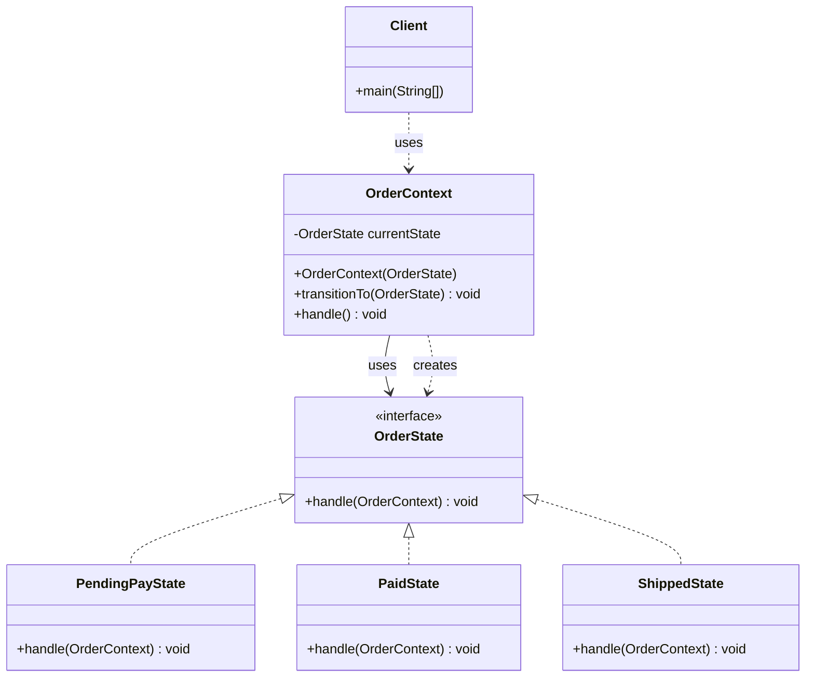
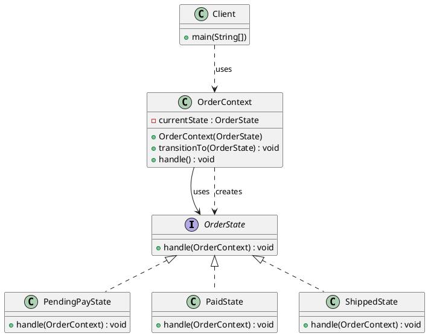

# 状态模式（State Pattern）—— OrderState 示例完整整理

> 目标：允许对象在内部状态发生改变时改变它的行为，对象看起来好像修改了它的类。  
> 你会在：对象的行为依赖于它的状态、需要根据状态改变行为、需要消除大量的条件判断语句的场景中遇到它。

本文通过 OrderState（订单状态）示例，讲解状态模式的实现：

**状态接口 → 具体状态 → 上下文类**

重点回答两个问题：

1. 状态模式如何实现状态的封装和转换
2. 它解决了什么问题，又引入了什么代价

---

## 1. 为什么需要状态模式

### 1.1 典型场景

- **状态依赖行为**：对象的行为依赖于它的状态，不同状态下行为不同
- **状态转换**：需要根据状态改变行为，状态之间可以转换
- **避免条件判断**：需要消除大量的 if-else 或 switch-case 语句
- **状态封装**：需要将状态相关的行为封装到状态类中
- **扩展性**：需要方便地添加新状态

### 1.2 状态模式的核心思想

```
上下文（Context）
  ├─ 持有当前状态的引用
  └─ 委托给当前状态处理
      ↓
状态接口（State）
  ├─ 具体状态A（PendingPayState）
  │   └─ 处理完后转换到下一个状态，继续处理
  ├─ 具体状态B（PaidState）
  │   └─ 处理完后转换到下一个状态，继续处理
  └─ 具体状态C（ShippedState）
      └─ 最终状态，不再转换
```

状态模式通过将状态封装成独立的类，使对象在不同状态下表现出不同的行为。

---

## 2. 状态模式结构总览

| 角色           | 说明                           | 示例                    |
| -------------- | ------------------------------ | ----------------------- |
| State          | 状态接口，定义状态行为          | `OrderState`            |
| ConcreteState  | 具体状态，实现状态行为          | `PendingPayState`、`PaidState`、`ShippedState` |
| Context        | 上下文类，持有当前状态引用      | `OrderContext`          |
| Client         | 客户端，使用上下文类            | `Client`                |

---

## 3. 核心组件

### 3.1 状态接口（State）

**接口定义：**

```java
/**
 * 订单状态接口
 * 
 * 定义了订单状态的接口，每个状态都需要实现这个接口
 */
public interface OrderState {
    /**
     * 处理订单
     * @param context 订单上下文
     */
    void handle(OrderContext context);
}
```

**关键点：**
- 定义状态的统一接口
- `handle()` 方法接收上下文对象，可以修改上下文的状态
- 所有具体状态都实现这个接口

---

### 3.2 具体状态（ConcreteState）

#### 3.2.1 待支付状态

```java
/**
 * 待支付状态
 */
public class PendingPayState implements OrderState {

    @Override
    public void handle(OrderContext context) {
        System.out.println("待支付状态");
        // 状态转换：待支付 -> 已支付
        context.transitionTo(new PaidState());
        // 继续处理下一个状态
        context.handle();
    }
}
```

#### 3.2.2 已支付状态

```java
/**
 * 已支付状态
 */
public class PaidState implements OrderState {

    @Override
    public void handle(OrderContext context) {
        System.out.println("已支付状态");
        // 状态转换：已支付 -> 已发货
        context.transitionTo(new ShippedState());
        // 继续处理下一个状态
        context.handle();
    }
}
```

#### 3.2.3 已发货状态

```java
/**
 * 已发货状态
 */
public class ShippedState implements OrderState {

    @Override
    public void handle(OrderContext context) {
        System.out.println("已发货状态");
        // 最终状态，不再转换
    }
}
```

**关键点：**
- 每个状态类封装了该状态下的行为
- 状态可以转换到下一个状态（通过修改上下文的状态）
- 最终状态不再转换

---

### 3.3 上下文类（Context）

**上下文类定义：**

```java
/**
 * 订单上下文
 */
public class OrderContext {
    
    /**
     * 当前状态
     */
    private OrderState currentState;

    /**
     * 构造函数，初始化当前状态
     * @param currentState 初始状态
     */
    public OrderContext(OrderState currentState) {
        this.currentState = currentState;
    }

    /**
     * 转换到下一个状态
     * @param nextState 下一个状态
     */
    public void transitionTo(OrderState nextState) {
        this.currentState = nextState;
    }

    /**
     * 处理订单
     * 委托给当前状态处理
     */
    public void handle() {
        currentState.handle(this);
    }
}
```

**关键点：**
- 上下文类持有当前状态的引用
- `handle()` 方法委托给当前状态处理
- `transitionTo()` 方法用于状态转换
- 上下文类不关心具体状态，只关心状态接口

---

## 4. 使用示例

### 4.1 基本使用

```java
public class Client {

    public static void main(String[] args) {
        // 创建订单上下文，初始状态为待支付
        OrderContext orderContext = new OrderContext(new PendingPayState());
        
        // 处理订单，状态会自动转换
        orderContext.handle();
    }
}
```

**输出：**

```
待支付状态
已支付状态
已发货状态
```

**关键点：**
- 客户端创建上下文对象，设置初始状态
- 调用 `handle()` 方法，状态自动转换
- 每个状态处理完后自动转换到下一个状态

### 4.2 状态转换流程

```
初始状态：PendingPayState（待支付）
  ↓ handle()
输出："待支付状态"
设置状态：PaidState（已支付）
  ↓ handle()
输出："已支付状态"
设置状态：ShippedState（已发货）
  ↓ handle()
输出："已发货状态"
结束（最终状态）
```

### 4.3 状态转换图

```
[待支付] --支付--> [已支付] --发货--> [已发货]
   ↑                                    ↓
   └──────────────取消订单──────────────┘
```

---

## 5. 代码结构

本示例包含以下目录结构：

```
state/
├── OrderState.java          # 状态接口
├── PendingPayState.java     # 具体状态（待支付）
├── PaidState.java           # 具体状态（已支付）
├── ShippedState.java        # 具体状态（已发货）
├── OrderContext.java        # 上下文类
└── Client.java              # 客户端
```

---

## 6. UML 类图

### 6.1 Mermaid 类图



### 6.2 PlantUML 类图



---

## 7. 状态模式 vs 其他模式

### 7.1 状态模式 vs 策略模式

| 对比项 | 状态模式 | 策略模式 |
|--------|---------|---------|
| **目的** | 封装状态，状态可以转换 | 封装算法，算法可替换 |
| **状态转换** | 状态可以自动转换 | 策略由客户端选择 |
| **使用场景** | 对象行为依赖于状态 | 多种算法完成同一任务 |
| **关系** | 状态之间有转换关系 | 策略之间独立 |

**区别：**
- 状态模式：状态之间有转换关系，状态可以自动转换
- 策略模式：策略之间独立，由客户端选择

**代码对比：**

```java
// 状态模式：状态可以转换
public class PendingPayState implements OrderState {
    public void handle(OrderContext context) {
        context.transitionTo(new PaidState());  // 状态转换
        context.handle();
    }
}

// 策略模式：策略由客户端选择
PayContext context = new PayContext(new AliPayStrategy());  // 客户端选择策略
context.pay(100);
```

### 7.2 状态模式 vs 命令模式

| 对比项 | 状态模式 | 命令模式 |
|--------|---------|---------|
| **目的** | 封装状态，状态可以转换 | 封装请求，支持撤销、排队 |
| **关注点** | 对象的状态和行为 | 请求的封装和处理 |
| **状态转换** | 状态可以自动转换 | 不支持状态转换 |
| **使用场景** | 对象行为依赖于状态 | GUI 操作、事务处理 |

**区别：**
- 状态模式：关注对象的状态和行为
- 命令模式：关注请求的封装和处理

### 7.3 状态模式 vs 责任链模式

| 对比项 | 状态模式 | 责任链模式 |
|--------|---------|-----------|
| **目的** | 封装状态，状态可以转换 | 将请求沿着链传递 |
| **处理方式** | 状态自动转换 | 请求沿着链传递 |
| **状态转换** | 状态可以自动转换 | 不支持状态转换 |
| **使用场景** | 对象行为依赖于状态 | 多级审批、过滤器链 |

**区别：**
- 状态模式：状态自动转换，对象行为依赖于状态
- 责任链模式：请求沿着链传递，由链中的对象处理

---

## 8. 状态模式的特点

### 8.1 优点

- ✅ **消除条件判断**：消除了大量的 if-else 或 switch-case 语句
- ✅ **状态封装**：将状态相关的行为封装到状态类中
- ✅ **状态转换**：状态之间的转换逻辑清晰
- ✅ **符合开闭原则**：添加新状态无需修改现有代码
- ✅ **职责单一**：每个状态类只负责一个状态的行为

### 8.2 缺点

- ❌ **类数量增加**：每个状态都需要一个类，如果状态很多，类数量会急剧增加
- ❌ **状态转换复杂**：如果状态转换逻辑复杂，可能导致状态类之间的耦合
- ❌ **状态转换不明确**：状态转换逻辑分散在各个状态类中，不够直观

---

## 9. 使用场景

### 9.1 适用场景

- ✅ **状态依赖行为**：对象的行为依赖于它的状态，不同状态下行为不同
- ✅ **状态转换**：需要根据状态改变行为，状态之间可以转换
- ✅ **避免条件判断**：需要消除大量的 if-else 或 switch-case 语句
- ✅ **状态封装**：需要将状态相关的行为封装到状态类中

### 9.2 常见应用

- **订单系统**：订单状态（待支付、已支付、已发货、已完成等）
- **工作流系统**：工作流状态（待审批、审批中、已通过、已拒绝等）
- **游戏开发**：游戏角色状态（待机、移动、攻击、死亡等）
- **状态机**：有限状态机（FSM）的实现
- **GUI 框架**：按钮状态（正常、悬停、按下、禁用等）

---

## 10. 实际应用示例

### 10.1 订单状态机

```java
// 订单状态机
public class OrderStateMachine {
    private OrderState currentState;
    
    public OrderStateMachine() {
        this.currentState = new PendingPayState();
    }
    
    public void pay() {
        if (currentState instanceof PendingPayState) {
            currentState = new PaidState();
        }
    }
    
    public void ship() {
        if (currentState instanceof PaidState) {
            currentState = new ShippedState();
        }
    }
    
    public void handle() {
        currentState.handle(this);
    }
}
```

### 10.2 工作流状态

```java
// 工作流状态
public interface WorkflowState {
    void submit(WorkflowContext context);
    void approve(WorkflowContext context);
    void reject(WorkflowContext context);
}

public class PendingState implements WorkflowState {
    @Override
    public void submit(WorkflowContext context) {
        context.transitionTo(new ReviewingState());
    }
    
    @Override
    public void approve(WorkflowContext context) {
        // 待审批状态不能直接批准
    }
    
    @Override
    public void reject(WorkflowContext context) {
        // 待审批状态不能直接拒绝
    }
}
```

### 10.3 游戏角色状态

```java
// 游戏角色状态
public interface CharacterState {
    void move(Character character);
    void attack(Character character);
    void idle(Character character);
}

public class IdleState implements CharacterState {
    @Override
    public void move(Character character) {
        character.setState(new MovingState());
    }
    
    @Override
    public void attack(Character character) {
        character.setState(new AttackingState());
    }
    
    @Override
    public void idle(Character character) {
        // 已经是待机状态
    }
}
```

---

## 11. 状态模式的变体

### 11.1 状态转换在状态类中（当前实现）

**特点：**
- 状态转换逻辑在状态类中
- 状态类负责转换到下一个状态

**示例：**
```java
public class PendingPayState implements OrderState {
    @Override
    public void handle(OrderContext context) {
        System.out.println("待支付状态");
        context.transitionTo(new PaidState());  // 状态转换在状态类中
        context.handle();
    }
}
```

### 11.2 状态转换在上下文类中

**特点：**
- 状态转换逻辑在上下文类中
- 上下文类负责状态转换

**示例：**
```java
public class OrderContext {
    private OrderState currentState;
    
    public void pay() {
        if (currentState instanceof PendingPayState) {
            currentState = new PaidState();  // 状态转换在上下文类中
        }
    }
    
    public void handle() {
        currentState.handle(this);
    }
}
```

### 11.3 状态转换表

**特点：**
- 使用状态转换表定义状态转换规则
- 状态转换逻辑集中管理

**示例：**
```java
public class OrderContext {
    private OrderState currentState;
    private Map<OrderState, OrderState> stateTransitionMap;
    
    public OrderContext() {
        stateTransitionMap = new HashMap<>();
        stateTransitionMap.put(new PendingPayState(), new PaidState());
        stateTransitionMap.put(new PaidState(), new ShippedState());
    }
    
    public void transition() {
        currentState = stateTransitionMap.get(currentState);
    }
}
```

---

## 12. 面试要点

### 12.1 基础问题

- **状态模式解决什么问题？**
  - 要点：解决对象行为依赖于状态的问题，消除大量的条件判断语句

- **状态模式的核心是什么？**
  - 要点：将状态封装成独立的类，使对象在不同状态下表现出不同的行为

- **状态模式如何实现？**
  - 要点：定义状态接口，实现具体状态类，上下文类持有当前状态引用，委托给状态处理

### 12.2 实现细节

- **状态模式和策略模式的区别？**
  - 要点：状态模式状态可以自动转换，策略模式策略由客户端选择

- **为什么状态模式要持有状态的引用？**
  - 要点：实现状态的封装和转换，使对象在不同状态下表现出不同的行为

- **状态模式如何处理状态转换？**
  - 要点：状态类可以修改上下文的状态，实现状态转换

### 12.3 实践问题

- **什么时候使用状态模式？**
  - 要点：对象行为依赖于状态、需要状态转换、需要消除条件判断

- **状态模式在哪些框架中有应用？**
  - 要点：订单系统、工作流系统、游戏开发、状态机等

- **如何优化状态模式的性能？**
  - 要点：使用状态对象池、缓存状态对象、优化状态转换逻辑等

---

## 13. 总结

状态模式是一个**非常重要的行为型设计模式**，它解决了对象行为依赖于状态的核心问题：

**核心价值：**

1. **消除条件判断**：消除了大量的 if-else 或 switch-case 语句
2. **状态封装**：将状态相关的行为封装到状态类中
3. **状态转换**：状态之间的转换逻辑清晰
4. **符合开闭原则**：添加新状态无需修改现有代码
5. **职责单一**：每个状态类只负责一个状态的行为

**模式特点：**

```
状态接口（OrderState）
  ├─ 具体状态A（PendingPayState）
  ├─ 具体状态B（PaidState）
  └─ 具体状态C（ShippedState）
      ↓
上下文类（OrderContext）
  ├─ 持有当前状态的引用
  └─ 委托给当前状态处理
      ↓
客户端（Client）
  └─ 创建上下文，设置初始状态
```

**最佳实践：**

- 状态类封装该状态下的行为
- 状态可以转换到下一个状态（通过修改上下文的状态）
- 上下文类持有当前状态的引用，委托给状态处理
- 状态转换逻辑可以放在状态类中或上下文类中
- 使用状态对象池优化性能

**一句话总结：**

> 当对象的行为依赖于它的状态时，用状态模式将状态封装成独立的类，使对象在不同状态下表现出不同的行为，消除大量的条件判断语句。

---

## 14. 参考资源

- [设计模式：可复用面向对象软件的基础](https://book.douban.com/subject/1052241/)
- [Head First 设计模式](https://book.douban.com/subject/2243615/)
- [状态机模式](https://en.wikipedia.org/wiki/Finite-state_machine)
