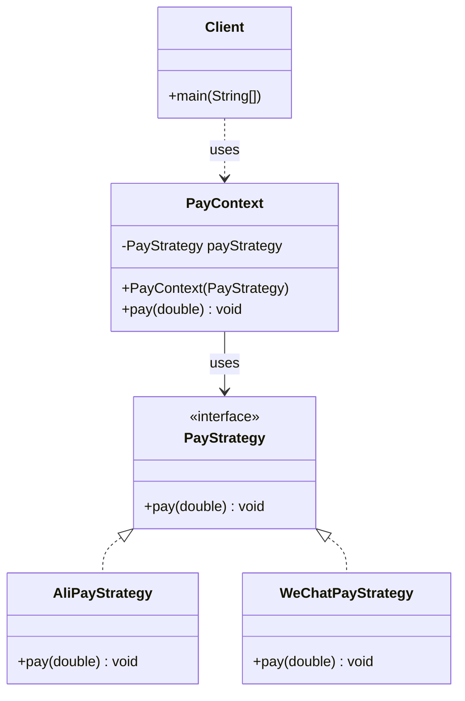
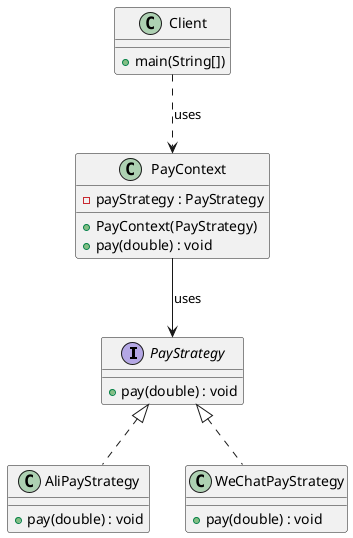

# 策略模式（Strategy Pattern）—— PayStrategy 示例完整整理

> 目标：定义一系列算法，把它们一个个封装起来，并且使它们可相互替换。策略模式让算法独立于使用它的客户而变化。  
> 你会在：需要在运行时选择算法、有多种方式完成同一任务、需要避免使用多重条件判断的场景中遇到它。

本文通过 PayStrategy（支付策略）示例，讲解策略模式的实现：

**策略接口 → 具体策略 → 上下文类**

重点回答两个问题：

1. 策略模式如何实现算法的封装和替换
2. 它解决了什么问题，又引入了什么代价

---

## 1. 为什么需要策略模式

### 1.1 典型场景

- **多种算法**：有多种方式完成同一任务，需要在运行时选择
- **避免条件判断**：需要避免使用大量的 if-else 或 switch-case 语句
- **算法封装**：需要将算法封装成独立的类，便于管理和扩展
- **动态切换**：需要在运行时动态切换算法
- **开闭原则**：需要在不修改现有代码的情况下添加新算法

### 1.2 策略模式的核心思想

```
客户端 → 上下文类 → 策略接口
                      ├─ 策略A
                      ├─ 策略B
                      └─ 策略C
```

策略模式通过封装算法到独立的策略类中，使它们可以互相替换，实现算法的独立变化。

---

## 2. 策略模式结构总览

| 角色           | 说明                           | 示例                    |
| -------------- | ------------------------------ | ----------------------- |
| Strategy       | 策略接口，定义算法接口          | `PayStrategy`           |
| ConcreteStrategy | 具体策略，实现具体算法          | `AliPayStrategy`、`WeChatPayStrategy` |
| Context        | 上下文类，持有策略引用          | `PayContext`            |
| Client         | 客户端，使用上下文类            | `Client`                |

---

## 3. 核心组件

### 3.1 策略接口（Strategy）

**接口定义：**

```java
/**
 * 支付策略接口
 */
public interface PayStrategy {
    /**
     * 支付方法
     * @param amount 支付金额
     */
    void pay(double amount);
}
```

**关键点：**
- 定义算法的统一接口
- 所有具体策略都实现这个接口
- 接口方法签名要一致，便于替换

---

### 3.2 具体策略（ConcreteStrategy）

#### 3.2.1 支付宝策略

```java
public class AliPayStrategy implements PayStrategy {

    @Override
    public void pay(double amount) {
        System.out.println("支付宝支付：" + amount);
    }
}
```

#### 3.2.2 微信支付策略

```java
public class WeChatPayStrategy implements PayStrategy {

    @Override
    public void pay(double amount) {
        System.out.println("微信支付：" + amount);
    }
}
```

**关键点：**
- 实现策略接口
- 每个策略封装一个具体的算法
- 策略之间可以互相替换

---

### 3.3 上下文类（Context）

**上下文类定义：**

```java
/**
 * 支付上下文
 */
public class PayContext {
    /**
     * 持有策略的引用（组合关系）
     */
    private PayStrategy payStrategy;

    /**
     * 构造函数，注入策略
     * @param payStrategy 支付策略
     */
    public PayContext(PayStrategy payStrategy) {
        this.payStrategy = payStrategy;
    }

    /**
     * 执行支付
     * @param amount 支付金额
     */
    public void pay(double amount) {
        payStrategy.pay(amount);
    }
}
```

**关键点：**
- 持有策略的引用（组合关系，而非继承）
- 通过构造函数注入策略
- 委托给策略对象执行具体算法
- 可以在运行时切换策略

---

## 4. 使用示例

### 4.1 基本使用

```java
public class Client {

    public static void main(String[] args) {
        // 使用支付宝支付
        PayContext payContext = new PayContext(new AliPayStrategy());
        payContext.pay(100);
        
        System.out.println("=====================");
        
        // 切换到微信支付
        payContext = new PayContext(new WeChatPayStrategy());
        payContext.pay(100);
    }
}
```

**输出：**

```
支付宝支付：100.0
=====================
微信支付：100.0
```

**关键点：**
- 客户端通过上下文类使用策略
- 可以在运行时切换不同的策略
- 客户端无需知道具体策略的实现细节

### 4.2 动态切换策略

```java
public class PayContext {
    private PayStrategy payStrategy;

    public PayContext(PayStrategy payStrategy) {
        this.payStrategy = payStrategy;
    }

    /**
     * 设置策略（允许运行时切换）
     */
    public void setPayStrategy(PayStrategy payStrategy) {
        this.payStrategy = payStrategy;
    }

    public void pay(double amount) {
        payStrategy.pay(amount);
    }
}

// 使用示例
PayContext context = new PayContext(new AliPayStrategy());
context.pay(100);  // 支付宝支付

context.setPayStrategy(new WeChatPayStrategy());
context.pay(100);  // 切换到微信支付
```

**优势：**
- 可以在运行时动态切换策略
- 不需要创建新的上下文对象
- 更加灵活

### 4.3 扩展新策略

如果需要添加新的支付方式（如银行卡支付），只需要：

```java
public class BankCardPayStrategy implements PayStrategy {
    @Override
    public void pay(double amount) {
        System.out.println("银行卡支付：" + amount);
    }
}
```

客户端使用：

```java
PayContext context = new PayContext(new BankCardPayStrategy());
context.pay(100);  // 银行卡支付
```

**优势：**
- 无需修改现有代码（开闭原则）
- 新策略自动兼容现有系统
- 代码扩展性好

---

## 5. 代码结构

本示例包含以下目录结构：

```
strategy/
├── PayStrategy.java         # 策略接口
├── AliPayStrategy.java      # 具体策略（支付宝）
├── WeChatPayStrategy.java   # 具体策略（微信）
├── PayContext.java          # 上下文类
└── Client.java              # 客户端
```

---

## 6. UML 类图

### 6.1 Mermaid 类图



### 6.2 PlantUML 类图



---

## 7. 策略模式 vs 其他模式

### 7.1 策略模式 vs 模板方法模式

| 对比项 | 策略模式 | 模板方法模式 |
|--------|---------|-------------|
| **关系** | 组合关系 | 继承关系 |
| **算法结构** | 算法完全独立 | 算法有固定骨架 |
| **灵活性** | 运行时切换策略 | 编译时确定子类 |
| **代码复用** | 通过组合复用 | 通过继承复用 |
| **适用场景** | 算法可以完全替换 | 算法有固定流程 |

**代码对比：**

```java
// 策略模式：使用组合
public class PayContext {
    private PayStrategy strategy;  // 组合
    public void pay() { strategy.pay(); }
}

// 模板方法模式：使用继承
public abstract class BankingBusiness {
    public final void process() {  // 固定流程
        takeNumber();
        handleBusiness();  // 抽象方法
        evaluate();
    }
}
```

### 7.2 策略模式 vs 工厂模式

| 对比项 | 策略模式 | 工厂模式 |
|--------|---------|---------|
| **关注点** | 算法的选择和使用 | 对象的创建 |
| **目的** | 封装算法，使其可替换 | 封装对象创建过程 |
| **使用时机** | 运行时选择算法 | 创建对象时选择类型 |

**区别：**
- 策略模式：关注"用什么算法"
- 工厂模式：关注"创建什么对象"

### 7.3 策略模式 vs 状态模式

| 对比项 | 策略模式 | 状态模式 |
|--------|---------|---------|
| **目的** | 封装算法，可替换 | 封装状态，状态转换 |
| **切换** | 客户端主动切换 | 状态自动转换 |
| **关系** | 策略之间独立 | 状态之间有转换关系 |

**区别：**
- 策略模式：策略之间独立，客户端选择
- 状态模式：状态之间有转换关系，状态自动转换

---

## 8. 策略模式的特点

### 8.1 优点

- ✅ **算法封装**：将算法封装成独立的类，便于管理和维护
- ✅ **避免条件判断**：消除了大量的 if-else 或 switch-case 语句
- ✅ **开闭原则**：对扩展开放，对修改关闭，添加新策略无需修改现有代码
- ✅ **运行时切换**：可以在运行时动态切换算法
- ✅ **代码复用**：策略可以在多个上下文中复用
- ✅ **符合单一职责原则**：每个策略类只负责一个算法

### 8.2 缺点

- ❌ **类数量增加**：每个策略都需要一个类，如果策略很多，类数量会急剧增加
- ❌ **客户端需要了解策略**：客户端需要知道有哪些策略，并选择合适的策略
- ❌ **策略对象创建**：每次使用都需要创建策略对象，可能带来性能开销
- ❌ **策略之间无法共享数据**：如果策略之间需要共享数据，会比较困难

---

## 9. 使用场景

### 9.1 适用场景

- ✅ **多种算法**：有多种方式完成同一任务，需要在运行时选择
- ✅ **避免条件判断**：需要避免使用大量的 if-else 或 switch-case 语句
- ✅ **算法封装**：需要将算法封装成独立的类，便于管理和扩展
- ✅ **动态切换**：需要在运行时动态切换算法
- ✅ **算法复用**：需要在多个地方复用相同的算法

### 9.2 常见应用

- **支付系统**：不同的支付方式（支付宝、微信、银行卡等）
- **排序算法**：不同的排序策略（快速排序、归并排序、堆排序等）
- **压缩算法**：不同的压缩策略（ZIP、RAR、7Z 等）
- **验证策略**：不同的验证方式（邮箱验证、手机验证、短信验证等）
- **折扣计算**：不同的折扣策略（满减、打折、优惠券等）
- **Java 集合框架**：`Comparator` 接口就是策略模式的典型应用

---

## 10. 实际应用示例

### 10.1 Java 集合框架中的策略模式

```java
// Comparator 接口就是策略模式
List<String> list = Arrays.asList("apple", "banana", "cherry");

// 策略1：按字母顺序排序
Collections.sort(list, (a, b) -> a.compareTo(b));

// 策略2：按长度排序
Collections.sort(list, (a, b) -> a.length() - b.length());

// 策略3：按逆序排序
Collections.sort(list, (a, b) -> b.compareTo(a));
```

### 10.2 Spring 框架中的策略模式

```java
// Spring 的 ResourceLoader 使用策略模式
ResourceLoader loader = new DefaultResourceLoader();
Resource resource = loader.getResource("classpath:config.xml");
```

### 10.3 扩展示例：排序策略

```java
// 策略接口
public interface SortStrategy {
    void sort(int[] array);
}

// 具体策略：快速排序
public class QuickSortStrategy implements SortStrategy {
    @Override
    public void sort(int[] array) {
        // 快速排序实现
        System.out.println("使用快速排序");
    }
}

// 具体策略：归并排序
public class MergeSortStrategy implements SortStrategy {
    @Override
    public void sort(int[] array) {
        // 归并排序实现
        System.out.println("使用归并排序");
    }
}

// 上下文类
public class SortContext {
    private SortStrategy strategy;
    
    public SortContext(SortStrategy strategy) {
        this.strategy = strategy;
    }
    
    public void sort(int[] array) {
        strategy.sort(array);
    }
}
```

---

## 11. 面试要点

### 11.1 基础问题

- **策略模式解决什么问题？**
  - 要点：解决多种算法选择的问题，避免使用大量的 if-else 语句，实现算法的封装和替换

- **策略模式的核心是什么？**
  - 要点：定义一系列算法，封装成独立的策略类，使它们可以互相替换，通过组合关系使用策略

- **策略模式如何实现？**
  - 要点：定义策略接口，实现具体策略类，上下文类持有策略引用，客户端通过上下文使用策略

### 11.2 实现细节

- **策略模式和模板方法模式的区别？**
  - 要点：策略模式使用组合关系，模板方法模式使用继承关系；策略模式算法完全独立，模板方法模式算法有固定骨架

- **为什么策略模式使用组合而不是继承？**
  - 要点：组合关系更灵活，可以在运行时切换策略，符合"组合优于继承"的原则

- **策略模式如何避免条件判断？**
  - 要点：将不同的算法封装成不同的策略类，通过多态机制实现算法的选择，避免 if-else 语句

### 11.3 实践问题

- **什么时候使用策略模式？**
  - 要点：有多种方式完成同一任务、需要避免条件判断、需要在运行时选择算法

- **策略模式在哪些框架中有应用？**
  - 要点：Java 集合框架的 `Comparator`、Spring 的 `ResourceLoader`、支付系统、排序算法等

- **如何优化策略模式的性能？**
  - 要点：使用策略工厂、缓存策略对象、使用枚举实现单例策略等

---

## 12. 总结

策略模式是一个**非常重要的行为型设计模式**，它解决了多种算法选择的核心问题：

**核心价值：**

1. **算法封装**：将算法封装成独立的类，便于管理和维护
2. **避免条件判断**：消除了大量的 if-else 或 switch-case 语句
3. **开闭原则**：对扩展开放，对修改关闭，添加新策略无需修改现有代码
4. **运行时切换**：可以在运行时动态切换算法
5. **代码复用**：策略可以在多个上下文中复用

**模式特点：**

```
策略接口（PayStrategy）
  ├─ 具体策略A（AliPayStrategy）
  ├─ 具体策略B（WeChatPayStrategy）
  └─ 具体策略C（BankCardPayStrategy）
      ↓
上下文类（PayContext）- 持有策略引用（组合关系）
      ↓
客户端（Client）- 通过上下文使用策略
```

**最佳实践：**

- 使用组合关系而非继承关系
- 策略接口方法签名要一致
- 上下文类可以支持运行时切换策略
- 可以使用策略工厂管理策略对象
- 策略类应该是无状态的（如果可能）

**一句话总结：**

> 当有多种方式完成同一任务时，用策略模式将算法封装成独立的策略类，通过组合关系使用策略，实现算法的独立变化和运行时切换。

---

## 13. 参考资源

- [设计模式：可复用面向对象软件的基础](https://book.douban.com/subject/1052241/)
- [Head First 设计模式](https://book.douban.com/subject/2243615/)
- [Java 集合框架文档](https://docs.oracle.com/javase/tutorial/collections/)
