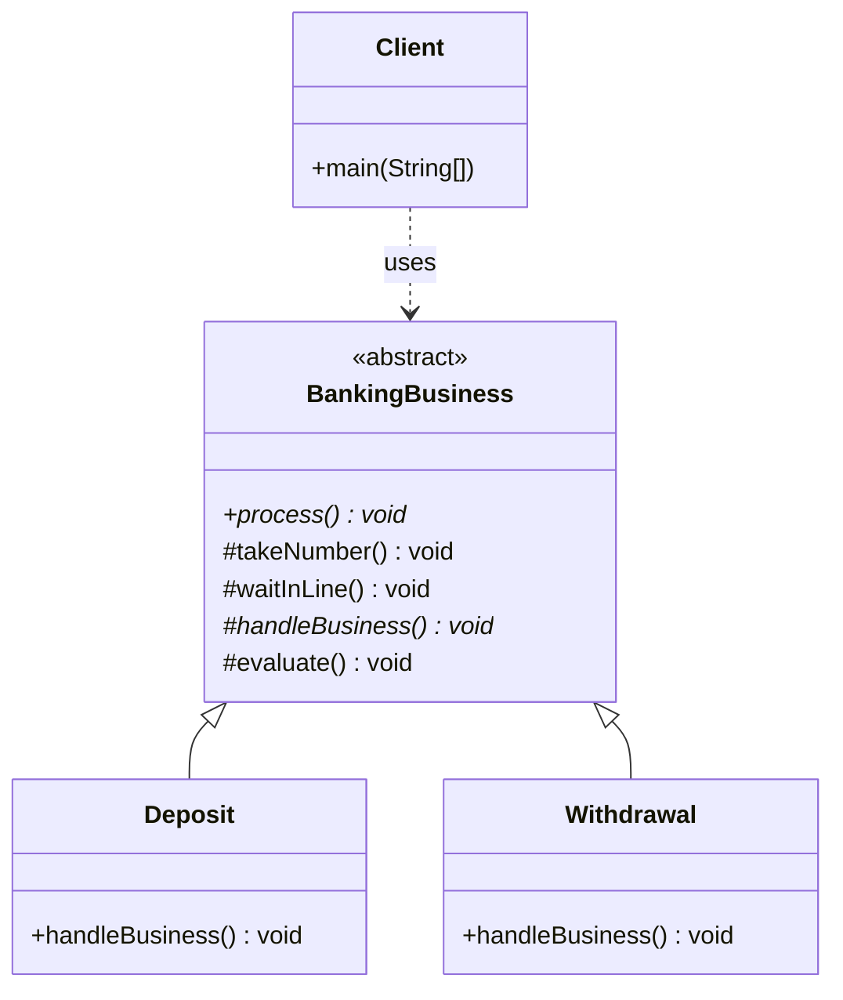
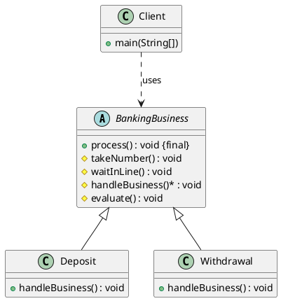

# 模板方法模式（Template Method Pattern）—— BankingBusiness 示例完整整理

> 目标：定义一个操作中算法的骨架，而将一些步骤延迟到子类中。模板方法使得子类可以不改变一个算法的结构即可重定义该算法的某些特定步骤。  
> 你会在：多个类有相似的流程但部分步骤不同、需要控制算法的执行顺序、需要复用公共代码的场景中遇到它。

本文通过 BankingBusiness（银行业务办理）示例，讲解模板方法模式的实现：

**抽象模板类 → 具体子类**

重点回答两个问题：

1. 模板方法模式如何实现代码复用和流程控制
2. 它解决了什么问题，又引入了什么代价

---

## 1. 为什么需要模板方法模式

### 1.1 典型场景

- **相似流程**：多个类有相似的执行流程，但部分步骤不同
- **代码复用**：需要复用公共代码，避免重复实现
- **流程控制**：需要控制算法的执行顺序，确保步骤按固定顺序执行
- **扩展性**：需要在保持算法结构不变的情况下，允许子类自定义某些步骤

### 1.2 模板方法模式的核心思想

```
抽象模板类
  ├─ 模板方法（final，定义算法骨架）
  ├─ 固定步骤（具体实现）
  └─ 抽象步骤（由子类实现）
      ↓
具体子类（只实现抽象步骤）
```

模板方法模式通过定义算法的骨架，将可变部分延迟到子类实现，实现代码复用和流程控制。

---

## 2. 模板方法模式结构总览

| 角色           | 说明                           | 示例                    |
| -------------- | ------------------------------ | ----------------------- |
| AbstractClass  | 抽象模板类，定义算法骨架        | `BankingBusiness`       |
| ConcreteClass  | 具体子类，实现抽象步骤          | `Deposit`、`Withdrawal` |
| Client         | 客户端，使用模板类              | `Client`                |

---

## 3. 核心组件

### 3.1 抽象模板类（AbstractClass）

**抽象类定义：**

```java
/**
 * 银行业务抽象类
 */
public abstract class BankingBusiness {

    /**
     * 模板方法：定义算法的骨架
     * 使用 final 关键字防止子类重写，确保算法结构不变
     */
    public final void process() {
        takeNumber();        // 步骤1：取号
        waitInLine();        // 步骤2：等待叫号
        handleBusiness();    // 步骤3：办理业务（抽象方法，由子类实现）
        evaluate();          // 步骤4：评价
    }

    /**
     * 固定步骤1：取号（所有业务都需要）
     */
    protected void takeNumber() {
        System.out.println("取号");
    }

    /**
     * 固定步骤2：等待叫号（所有业务都需要）
     */
    protected void waitInLine() {
        System.out.println("等待叫号");
    }

    /**
     * 抽象步骤：办理业务（不同业务不同实现）
     * 由子类实现具体的业务逻辑
     */
    protected abstract void handleBusiness();

    /**
     * 固定步骤3：评价（所有业务都需要）
     */
    protected void evaluate() {
        System.out.println("评价");
    }
}
```

**关键点：**
- `process()` 方法是**模板方法**，使用 `final` 关键字防止子类重写
- `takeNumber()`、`waitInLine()`、`evaluate()` 是**固定步骤**，所有子类共享
- `handleBusiness()` 是**抽象步骤**，由子类实现
- 使用 `protected` 访问修饰符，允许子类访问但对外隐藏实现细节

---

## 4. 具体子类（ConcreteClass）

### 4.1 存款业务

```java
public class Deposit extends BankingBusiness {

    /**
     * 实现抽象步骤：办理存款业务
     */
    @Override
    protected void handleBusiness() {
        System.out.println("存款");
    }
}
```

### 4.2 取款业务

```java
public class Withdrawal extends BankingBusiness {

    /**
     * 实现抽象步骤：办理取款业务
     */
    @Override
    protected void handleBusiness() {
        System.out.println("取款");
    }
}
```

**关键点：**
- 子类只需要实现 `handleBusiness()` 方法
- 其他步骤（取号、等待、评价）由父类统一处理
- 代码简洁，复用性高

---

## 5. 使用示例

### 5.1 基本使用

```java
public class Client {

    public static void main(String[] args) {
        // 办理存款业务
        BankingBusiness deposit = new Deposit();
        deposit.process();
        
        System.out.println("=====================");
        
        // 办理取款业务
        BankingBusiness withdrawal = new Withdrawal();
        withdrawal.process();
    }
}
```

**输出：**

```
取号
等待叫号
存款
评价
=====================
取号
等待叫号
取款
评价
```

**关键点：**
- 客户端调用 `process()` 方法，自动执行完整的业务流程
- 不同业务类型执行不同的 `handleBusiness()` 方法
- 公共流程（取号、等待、评价）自动执行，无需重复代码

### 5.2 扩展新业务

如果需要添加新的业务类型（如转账），只需要：

```java
public class Transfer extends BankingBusiness {
    @Override
    protected void handleBusiness() {
        System.out.println("转账");
    }
}
```

客户端使用：

```java
BankingBusiness transfer = new Transfer();
transfer.process();  // 自动执行：取号 → 等待 → 转账 → 评价
```

**优势：**
- 无需修改现有代码（开闭原则）
- 新业务自动继承公共流程
- 代码复用性高

---

## 6. 代码结构

本示例包含以下目录结构：

```
template/
├── BankingBusiness.java    # 抽象模板类
├── Deposit.java           # 具体子类（存款）
├── Withdrawal.java        # 具体子类（取款）
└── Client.java            # 客户端
```

---

## 7. UML 类图

### 7.1 Mermaid 类图



### 7.2 PlantUML 类图



---

## 8. 模板方法模式的步骤类型

### 8.1 模板方法（Template Method）

**定义：** 定义算法骨架的方法，使用 `final` 关键字防止子类重写。

**特点：**
- 必须是 `final` 方法
- 调用其他步骤方法
- 控制算法的执行顺序

**示例：**
```java
public final void process() {
    takeNumber();
    waitInLine();
    handleBusiness();
    evaluate();
}
```

### 8.2 固定步骤（Concrete Method）

**定义：** 在抽象类中已经实现的方法，所有子类共享。

**特点：**
- 有具体实现
- 子类可以直接使用或选择重写
- 通常使用 `protected` 访问修饰符

**示例：**
```java
protected void takeNumber() {
    System.out.println("取号");
}
```

### 8.3 抽象步骤（Abstract Method）

**定义：** 在抽象类中声明但没有实现的方法，必须由子类实现。

**特点：**
- 使用 `abstract` 关键字
- 没有方法体
- 子类必须实现

**示例：**
```java
protected abstract void handleBusiness();
```

### 8.4 钩子方法（Hook Method）

**定义：** 在抽象类中提供默认实现，子类可以选择性重写的方法。

**特点：**
- 有默认实现
- 子类可以选择重写
- 用于控制算法的某些可选行为

**示例：**
```java
// 在抽象类中
protected boolean needEvaluate() {
    return true;  // 默认需要评价
}

protected void evaluate() {
    if (needEvaluate()) {
        System.out.println("评价");
    }
}

// 在子类中可以选择重写
@Override
protected boolean needEvaluate() {
    return false;  // 某些业务不需要评价
}
```

---

## 9. 模板方法模式的特点

### 9.1 优点

- ✅ **代码复用**：公共代码在抽象类中实现，子类只需实现差异部分
- ✅ **流程控制**：模板方法控制算法执行顺序，确保步骤按固定顺序执行
- ✅ **扩展性好**：添加新子类只需实现抽象方法，无需修改现有代码（开闭原则）
- ✅ **提高可维护性**：修改公共流程只需修改抽象类，所有子类自动生效
- ✅ **符合开闭原则**：对扩展开放，对修改关闭

### 9.2 缺点

- ❌ **类数量增加**：每个具体实现都需要一个子类
- ❌ **继承的局限性**：Java 单继承限制，子类无法继承其他类
- ❌ **复杂度增加**：如果算法步骤过多，抽象类会变得复杂
- ❌ **灵活性受限**：模板方法固定了算法结构，子类无法改变执行顺序

---

## 10. 使用场景

### 10.1 适用场景

- ✅ **相似流程**：多个类有相似的执行流程，但部分步骤不同
- ✅ **代码复用**：需要复用公共代码，避免重复实现
- ✅ **流程控制**：需要控制算法的执行顺序，确保步骤按固定顺序执行
- ✅ **框架设计**：框架定义算法骨架，用户实现具体步骤

### 10.2 常见应用

- **框架设计**：Spring、JUnit 等框架大量使用模板方法模式
  - Spring 的 `JdbcTemplate`：定义数据库操作流程，用户实现具体 SQL
  - JUnit 的测试框架：定义测试流程，用户实现测试方法
- **算法框架**：定义算法骨架，用户实现具体步骤
- **业务流程**：定义业务流程，不同业务实现不同步骤
- **数据处理**：定义数据处理流程，不同数据源实现不同读取方式

---

## 11. 与其他模式的关系

### 11.1 与策略模式的区别

- **模板方法模式**：定义算法骨架，子类实现具体步骤（继承）
- **策略模式**：定义算法族，客户端选择算法（组合）

**区别：**
- 模板方法：使用继承，控制算法流程
- 策略模式：使用组合，选择算法实现

### 11.2 与工厂方法模式的区别

- **模板方法模式**：定义算法骨架，子类实现具体步骤
- **工厂方法模式**：定义创建对象的接口，子类决定创建哪个对象

**区别：**
- 模板方法：关注算法的执行流程
- 工厂方法：关注对象的创建过程

### 11.3 与命令模式的区别

- **模板方法模式**：定义算法骨架，子类实现具体步骤
- **命令模式**：将请求封装成对象，支持请求的排队、记录、撤销等

**区别：**
- 模板方法：关注算法的结构
- 命令模式：关注请求的封装和处理

---

## 12. 面试要点

### 12.1 基础问题

- **模板方法模式解决什么问题？**
  - 要点：解决多个类有相似流程但部分步骤不同的问题，实现代码复用和流程控制

- **模板方法模式的核心是什么？**
  - 要点：定义算法骨架，将可变部分延迟到子类实现，使用 `final` 关键字防止子类重写模板方法

- **模板方法模式如何实现？**
  - 要点：抽象类定义模板方法（final）和抽象步骤，子类实现抽象步骤

### 12.2 实现细节

- **为什么模板方法要使用 final 关键字？**
  - 要点：防止子类重写模板方法，确保算法结构不变，保证流程控制

- **模板方法模式有哪些步骤类型？**
  - 要点：模板方法（final）、固定步骤（具体实现）、抽象步骤（abstract）、钩子方法（可选重写）

- **模板方法模式和策略模式的区别？**
  - 要点：模板方法使用继承控制流程，策略模式使用组合选择算法

### 12.3 实践问题

- **什么时候使用模板方法模式？**
  - 要点：多个类有相似流程但部分步骤不同、需要代码复用和流程控制

- **模板方法模式在哪些框架中有应用？**
  - 要点：Spring 的 `JdbcTemplate`、JUnit 测试框架、Servlet 的 `HttpServlet`

- **如何优化模板方法模式的性能？**
  - 要点：合理设计步骤粒度、使用钩子方法提供灵活性、避免过度抽象

---

## 13. 总结

模板方法模式是一个**非常重要的行为型设计模式**，它解决了多个类有相似流程但部分步骤不同的核心问题：

**核心价值：**

1. **代码复用**：公共代码在抽象类中实现，子类只需实现差异部分
2. **流程控制**：模板方法控制算法执行顺序，确保步骤按固定顺序执行
3. **扩展性好**：添加新子类只需实现抽象方法，无需修改现有代码
4. **提高可维护性**：修改公共流程只需修改抽象类，所有子类自动生效

**模式特点：**

```
抽象模板类（BankingBusiness）
  ├─ 模板方法（process）- final，定义算法骨架
  ├─ 固定步骤（takeNumber、waitInLine、evaluate）
  └─ 抽象步骤（handleBusiness）- 由子类实现
      ↓
具体子类（Deposit、Withdrawal）
  └─ 只实现抽象步骤
```

**最佳实践：**

- 模板方法使用 `final` 关键字防止子类重写
- 固定步骤使用 `protected` 访问修饰符
- 抽象步骤使用 `abstract` 关键字
- 合理设计步骤粒度，避免过度抽象
- 使用钩子方法提供灵活性

**一句话总结：**

> 当多个类有相似的执行流程但部分步骤不同时，用模板方法模式定义算法骨架，将可变部分延迟到子类实现，实现代码复用和流程控制。

---

## 14. 参考资源

- [设计模式：可复用面向对象软件的基础](https://book.douban.com/subject/1052241/)
- [Head First 设计模式](https://book.douban.com/subject/2243615/)
- [Spring Framework 文档](https://spring.io/projects/spring-framework)
