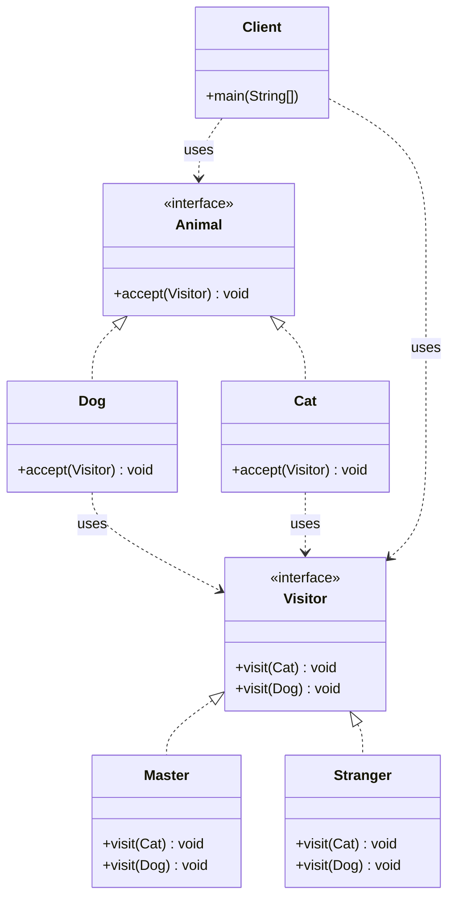
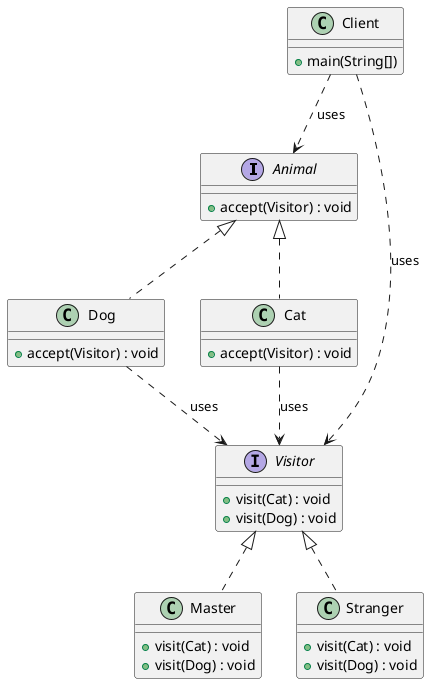

# 访问者模式（Visitor Pattern）—— 动物访问示例完整整理

> 目标：表示一个作用于某对象结构中的各元素的操作，它使你可以在不改变各元素的类的前提下定义作用于这些元素的新操作。  
> 你会在：需要对一个对象结构中的元素执行多种不同操作、需要将操作与元素类分离、需要添加新操作而不修改元素类的场景中遇到它。

本文通过动物访问（Animal Visitor）示例，讲解访问者模式的实现：

**元素接口 → 具体元素 → 访问者接口 → 具体访问者**

重点回答两个问题：

1. 访问者模式如何实现操作与元素类的分离
2. 它解决了什么问题，又引入了什么代价

---

## 1. 为什么需要访问者模式

### 1.1 典型场景

- **多种操作**：需要对一个对象结构中的元素执行多种不同操作
- **操作分离**：需要将操作从元素类中分离出来，避免元素类变得臃肿
- **开闭原则**：需要添加新操作而不修改元素类，符合开闭原则
- **集中管理**：需要将相关操作集中管理，便于维护和扩展
- **类型安全**：需要在编译时确定操作的类型，避免运行时错误

### 1.2 访问者模式的核心思想

```
元素接口（Element）
  ├─ 具体元素A（Dog）
  │   └─ accept(Visitor) 接受访问者
  └─ 具体元素B（Cat）
      └─ accept(Visitor) 接受访问者
          ↓
访问者接口（Visitor）
  ├─ 具体访问者A（Master）
  │   ├─ visit(Dog) 访问狗
  │   └─ visit(Cat) 访问猫
  └─ 具体访问者B（Stranger）
      ├─ visit(Dog) 访问狗
      └─ visit(Cat) 访问猫
```

访问者模式通过双重分发机制，将操作从元素类中分离出来，封装在访问者中，使添加新操作只需要添加新的访问者类。

---

## 2. 访问者模式结构总览

| 角色           | 说明                           | 示例                    |
| -------------- | ------------------------------ | ----------------------- |
| Element        | 元素接口，定义接受访问者的方法 | `Animal`               |
| ConcreteElement | 具体元素，实现元素接口          | `Dog`、`Cat`           |
| Visitor        | 访问者接口，定义访问方法        | `Visitor`              |
| ConcreteVisitor | 具体访问者，实现访问者接口      | `Master`、`Stranger`   |
| Client         | 客户端，使用访问者访问元素      | `Client`               |

---

## 3. 核心组件

### 3.1 元素接口（Element）

**接口定义：**

```java
/**
 * 动物接口（Element）
 * 
 * 访问者模式中的元素接口，定义接受访问者的方法
 * 所有具体元素类都需要实现这个接口
 */
public interface Animal {

    /**
     * 接受访问者访问
     * 
     * 这是访问者模式的核心方法，实现双重分发：
     * 1. 第一次分发：根据元素类型（Dog/Cat）选择 accept 方法
     * 2. 第二次分发：在 accept 方法中调用 visitor.visit(this)，根据访问者类型选择 visit 方法
     * 
     * @param visitor 访问者对象
     */
    void accept(Visitor visitor);
}
```

**关键点：**
- 定义元素的统一接口
- `accept()` 方法是访问者模式的核心，实现双重分发
- 所有具体元素类都需要实现这个接口

---

### 3.2 具体元素（ConcreteElement）

**具体元素实现：**

```java
/**
 * 狗类（ConcreteElement）
 */
public class Dog implements Animal {

    /**
     * 接受访问者访问
     * 
     * 实现双重分发机制：
     * 1. 第一次分发：根据元素类型（Dog）选择此 accept 方法
     * 2. 第二次分发：调用 visitor.visit(this)，根据访问者类型选择对应的 visit(Dog) 方法
     * 
     * 注意：accept 方法中不应该包含业务逻辑，所有操作都应该在访问者的 visit 方法中实现
     */
    @Override
    public void accept(Visitor visitor) {
        visitor.visit(this);
    }
}
```

**关键点：**
- 实现元素接口
- `accept()` 方法只负责调用访问者的 `visit()` 方法
- **不应该包含任何业务逻辑**，所有操作都在访问者中实现

---

### 3.3 访问者接口（Visitor）

**接口定义：**

```java
/**
 * 访问者接口（Visitor）
 * 
 * 访问者模式中的访问者接口，定义了对不同元素类型的访问方法
 * 每个方法对应一种元素类型，访问者可以根据元素类型执行不同的操作
 */
public interface Visitor {
    
    /**
     * 访问猫
     * @param cat 被访问的猫对象
     */
    void visit(Cat cat);

    /**
     * 访问狗
     * @param dog 被访问的狗对象
     */
    void visit(Dog dog);
}
```

**关键点：**
- 定义访问者的统一接口
- 每个方法对应一种元素类型
- 使用方法重载实现多态

---

### 3.4 具体访问者（ConcreteVisitor）

**具体访问者实现：**

```java
/**
 * 主人（ConcreteVisitor）
 * 
 * 访问者模式中的具体访问者类，实现 Visitor 接口
 * 定义了主人对不同动物的操作逻辑
 */
public class Master implements Visitor {

    @Override
    public void visit(Dog dog) {
        System.out.println("主人喂狗");
        System.out.println("狗吃骨头");
    }

    @Override
    public void visit(Cat cat) {
        System.out.println("主人喂猫");
        System.out.println("猫吃鱼");
    }
}
```

**关键点：**
- 实现访问者接口
- 定义对不同元素类型的操作逻辑
- 所有操作逻辑都在访问者中实现

---

## 4. 使用示例

### 4.1 基本使用

```java
public class Client {

    public static void main(String[] args) {
        // 创建元素对象
        Animal dog = new Dog();
        Animal cat = new Cat();
        
        // 创建访问者对象
        Visitor master = new Master();
        Visitor stranger = new Stranger();
        
        // 主人访问动物
        System.out.println("=== 主人访问动物 ===");
        dog.accept(master);  // 双重分发：Dog.accept() -> Master.visit(Dog)
        cat.accept(master);  // 双重分发：Cat.accept() -> Master.visit(Cat)
        
        System.out.println("=====================");
        
        // 陌生人访问动物
        System.out.println("=== 陌生人访问动物 ===");
        dog.accept(stranger);  // 双重分发：Dog.accept() -> Stranger.visit(Dog)
        cat.accept(stranger);  // 双重分发：Cat.accept() -> Stranger.visit(Cat)
    }
}
```

**输出：**

```
=== 主人访问动物 ===
主人喂狗
狗吃骨头
主人喂猫
猫吃鱼
=====================
=== 陌生人访问动物 ===
陌生人喂狗
狗吃骨头
陌生人喂猫
猫吃鱼
```

**关键点：**
- 元素调用 `accept()` 方法接受访问者
- 在 `accept()` 方法中，元素调用 `visitor.visit(this)` 将自身传递给访问者
- 访问者根据元素类型和自身类型执行相应的操作

### 4.2 双重分发机制

**双重分发的工作流程：**

```
1. 元素调用 accept(visitor)
   ↓
2. 第一次分发：根据元素类型（Dog/Cat）选择 accept 方法
   ↓
3. 在 accept 方法中调用 visitor.visit(this)
   ↓
4. 第二次分发：根据访问者类型（Master/Stranger）和元素类型选择 visit 方法
   ↓
5. 执行访问者的 visit 方法中的操作逻辑
```

**示例：**

```java
dog.accept(master);
// 步骤1：调用 Dog.accept(master)
// 步骤2：在 Dog.accept() 中调用 master.visit(this)，this 是 Dog 类型
// 步骤3：调用 Master.visit(Dog)，执行主人喂狗的操作
```

### 4.3 工作流程图

```
[Client] 
  ↓ 创建
[Animal] ← [Visitor]
  ↓ accept(visitor)
[ConcreteElement.accept()]
  ↓ visitor.visit(this)
[ConcreteVisitor.visit()]
  ↓ 执行操作
[操作结果]
```

---

## 5. 代码结构

本示例包含以下目录结构：

```
visitor/
├── Animal.java        # 元素接口
├── Dog.java           # 具体元素（狗）
├── Cat.java           # 具体元素（猫）
├── Visitor.java       # 访问者接口
├── Master.java        # 具体访问者（主人）
├── Stranger.java      # 具体访问者（陌生人）
└── Client.java        # 客户端
```

---

## 6. UML 类图

### 6.1 Mermaid 类图



### 6.2 PlantUML 类图



---

## 7. 访问者模式 vs 其他模式

### 7.1 访问者模式 vs 迭代器模式

| 对比项 | 访问者模式 | 迭代器模式 |
|--------|-----------|-----------|
| **目的** | 对集合元素执行操作 | 遍历集合元素 |
| **关注点** | 对元素做什么操作 | 如何遍历元素 |
| **操作** | 可以对元素执行复杂操作 | 只读取元素 |
| **扩展性** | 添加新操作只需添加新访问者 | 添加新遍历方式需要修改迭代器 |

**区别：**
- 访问者模式：关注对集合元素执行什么操作
- 迭代器模式：关注如何遍历集合元素

### 7.2 访问者模式 vs 策略模式

| 对比项 | 访问者模式 | 策略模式 |
|--------|-----------|---------|
| **目的** | 对元素执行操作 | 封装算法 |
| **关系** | 多对多关系（多个元素 × 多个操作） | 一对一关系（一个上下文 × 一个策略） |
| **扩展性** | 添加新操作只需添加新访问者 | 添加新策略只需添加新策略类 |
| **使用场景** | 对象结构稳定，操作多变 | 算法可替换 |

**区别：**
- 访问者模式：适用于对象结构稳定、操作多变的场景
- 策略模式：适用于算法可替换的场景

### 7.3 访问者模式 vs 命令模式

| 对比项 | 访问者模式 | 命令模式 |
|--------|-----------|---------|
| **目的** | 对元素执行操作 | 封装请求 |
| **关注点** | 操作与元素的分离 | 请求的封装和处理 |
| **扩展性** | 添加新操作只需添加新访问者 | 添加新命令只需添加新命令类 |
| **撤销** | 不支持撤销 | 支持撤销 |

**区别：**
- 访问者模式：关注操作与元素的分离
- 命令模式：关注请求的封装和处理，支持撤销

---

## 8. 访问者模式的特点

### 8.1 优点

- ✅ **操作分离**：将操作从元素类中分离出来，避免元素类变得臃肿
- ✅ **符合开闭原则**：添加新操作只需要添加新的访问者类，无需修改元素类
- ✅ **集中管理**：将相关操作集中管理，便于维护和扩展
- ✅ **类型安全**：在编译时确定操作的类型，避免运行时错误
- ✅ **双重分发**：通过双重分发机制，实现元素和访问者的动态绑定

### 8.2 缺点

- ❌ **增加元素类型困难**：添加新的元素类型需要修改所有访问者接口和实现类
- ❌ **破坏封装**：访问者需要访问元素的内部状态，可能破坏封装
- ❌ **依赖具体类**：访问者接口依赖具体的元素类，而不是抽象接口
- ❌ **复杂度增加**：双重分发机制增加了代码的复杂度
- ❌ **不适合频繁变化**：如果元素类型经常变化，不适合使用访问者模式

---

## 9. 使用场景

### 9.1 适用场景

- ✅ **对象结构稳定**：对象结构（元素类型）相对稳定，不会频繁变化
- ✅ **操作多变**：需要对对象结构中的元素执行多种不同操作
- ✅ **操作分离**：需要将操作从元素类中分离出来，避免元素类变得臃肿
- ✅ **集中管理**：需要将相关操作集中管理，便于维护和扩展
- ✅ **类型安全**：需要在编译时确定操作的类型

### 9.2 常见应用

- **编译器**：AST（抽象语法树）的遍历和操作
- **文档处理**：XML/JSON 文档的解析和处理
- **图形处理**：图形对象的渲染、导出等操作
- **报表生成**：数据结构的多种报表生成
- **代码分析**：代码结构的静态分析工具

---

## 10. 实际应用示例

### 10.1 编译器 AST 遍历

```java
// 编译器中的访问者模式
public interface ASTVisitor {
    void visit(AssignmentNode node);
    void visit(IfNode node);
    void visit(WhileNode node);
}

public class CodeGenerator implements ASTVisitor {
    @Override
    public void visit(AssignmentNode node) {
        // 生成赋值语句的代码
    }
    
    @Override
    public void visit(IfNode node) {
        // 生成 if 语句的代码
    }
    
    @Override
    public void visit(WhileNode node) {
        // 生成 while 语句的代码
    }
}

public class TypeChecker implements ASTVisitor {
    @Override
    public void visit(AssignmentNode node) {
        // 检查赋值语句的类型
    }
    // ...
}
```

### 10.2 XML 文档处理

```java
// XML 文档处理中的访问者模式
public interface XMLVisitor {
    void visit(Element element);
    void visit(Attribute attribute);
    void visit(Text text);
}

public class XMLPrinter implements XMLVisitor {
    @Override
    public void visit(Element element) {
        // 打印元素
    }
    // ...
}

public class XMLValidator implements XMLVisitor {
    @Override
    public void visit(Element element) {
        // 验证元素
    }
    // ...
}
```

### 10.3 图形对象处理

```java
// 图形对象处理中的访问者模式
public interface ShapeVisitor {
    void visit(Circle circle);
    void visit(Rectangle rectangle);
    void visit(Triangle triangle);
}

public class RenderVisitor implements ShapeVisitor {
    @Override
    public void visit(Circle circle) {
        // 渲染圆形
    }
    // ...
}

public class ExportVisitor implements ShapeVisitor {
    @Override
    public void visit(Circle circle) {
        // 导出圆形
    }
    // ...
}
```

---

## 11. 访问者模式的变体

### 11.1 标准访问者模式（当前实现）

**特点：**
- 元素接口定义 `accept(Visitor)` 方法
- 访问者接口定义 `visit(Element)` 方法
- 通过双重分发实现动态绑定

**示例：**
```java
public interface Animal {
    void accept(Visitor visitor);
}

public interface Visitor {
    void visit(Dog dog);
    void visit(Cat cat);
}
```

### 11.2 反射访问者模式

**特点：**
- 使用反射机制，避免为每个元素类型定义 visit 方法
- 访问者接口只需要一个 `visit(Object)` 方法

**示例：**
```java
public interface Visitor {
    void visit(Object element);
}

public class Master implements Visitor {
    @Override
    public void visit(Object element) {
        if (element instanceof Dog) {
            // 处理狗
        } else if (element instanceof Cat) {
            // 处理猫
        }
    }
}
```

### 11.3 泛型访问者模式

**特点：**
- 使用泛型提高类型安全性
- 访问者接口使用泛型参数

**示例：**
```java
public interface Visitor<T> {
    void visit(T element);
}

public class Master implements Visitor<Animal> {
    @Override
    public void visit(Animal animal) {
        // 处理动物
    }
}
```

---

## 12. 面试要点

### 12.1 基础问题

- **访问者模式解决什么问题？**
  - 要点：解决需要对一个对象结构中的元素执行多种不同操作，需要将操作与元素类分离的问题

- **访问者模式的核心是什么？**
  - 要点：双重分发机制，将操作从元素类中分离出来，封装在访问者中

- **访问者模式如何实现？**
  - 要点：元素接口定义 accept 方法，访问者接口定义 visit 方法，通过双重分发实现动态绑定

### 12.2 实现细节

- **什么是双重分发？**
  - 要点：第一次分发根据元素类型选择 accept 方法，第二次分发根据访问者类型选择 visit 方法

- **为什么访问者模式需要双重分发？**
  - 要点：Java 只支持单分派，需要通过双重分发实现多分派的效果

- **访问者模式的 accept 方法中应该包含业务逻辑吗？**
  - 要点：不应该，accept 方法只负责调用访问者的 visit 方法，所有操作逻辑都应该在访问者中实现

### 12.3 实践问题

- **什么时候使用访问者模式？**
  - 要点：对象结构稳定、操作多变、需要将操作与元素类分离的场景

- **访问者模式在哪些框架中有应用？**
  - 要点：编译器、XML 处理、图形处理、代码分析工具等

- **访问者模式的缺点是什么？**
  - 要点：增加元素类型困难、可能破坏封装、复杂度增加

---

## 13. 总结

访问者模式是一个**非常重要的行为型设计模式**，它解决了操作与元素类分离的问题：

**核心价值：**

1. **操作分离**：将操作从元素类中分离出来，避免元素类变得臃肿
2. **符合开闭原则**：添加新操作只需要添加新的访问者类，无需修改元素类
3. **集中管理**：将相关操作集中管理，便于维护和扩展
4. **类型安全**：在编译时确定操作的类型，避免运行时错误
5. **双重分发**：通过双重分发机制，实现元素和访问者的动态绑定

**模式特点：**

```
元素接口（Animal）
  ├─ 具体元素A（Dog）
  │   └─ accept(Visitor) 接受访问者
  └─ 具体元素B（Cat）
      └─ accept(Visitor) 接受访问者
          ↓
访问者接口（Visitor）
  ├─ 具体访问者A（Master）
  │   ├─ visit(Dog) 访问狗
  │   └─ visit(Cat) 访问猫
  └─ 具体访问者B（Stranger）
      ├─ visit(Dog) 访问狗
      └─ visit(Cat) 访问猫
```

**最佳实践：**

- accept 方法中不应该包含业务逻辑，只负责调用访问者
- 所有操作逻辑都应该在访问者的 visit 方法中实现
- 适用于对象结构稳定、操作多变的场景
- 注意访问者模式的双重分发机制
- 合理使用访问者模式，避免过度设计

**一句话总结：**

> 当需要对一个对象结构中的元素执行多种不同操作，需要将操作与元素类分离，且对象结构相对稳定时，使用访问者模式。

---

## 14. 参考资源

- [设计模式：可复用面向对象软件的基础](https://book.douban.com/subject/1052241/)
- [Head First 设计模式](https://book.douban.com/subject/2243615/)
- [访问者模式](https://en.wikipedia.org/wiki/Visitor_pattern)
