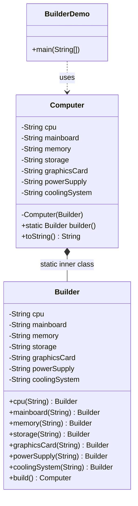
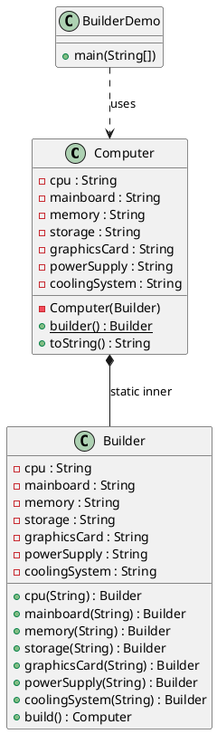

# 建造者模式（Builder Pattern）—— Computer 示例

> 目标：将复杂对象的构建与表示分离，使得同样的构建过程可以创建不同的表示。  
> 你会在：需要创建具有多个可选参数的对象、配置对象构建流程、需要保证构建过程的一致性的场景中遇到它。

---

## 1. 为什么需要建造者模式

### 1.1 问题场景

当一个对象需要多个参数来构造时，常见的做法有：

**方式一：多参数构造函数（伸缩构造器模式）**

```java
public Computer(String cpu, String mainboard) { }
public Computer(String cpu, String mainboard, String memory) { }
public Computer(String cpu, String mainboard, String memory, String storage) { }
// ... 参数组合爆炸
```

**问题：**
- ❌ 参数过多时，可读性差
- ❌ 参数顺序容易出错
- ❌ 无法区分可选参数和必需参数
- ❌ 新增参数需要新增构造函数

**方式二：JavaBean 模式（setter 方法）**

```java
Computer computer = new Computer();
computer.setCpu("Intel Core i7-11700K");
computer.setMainboard("ASUS ROG STRIX Z690-A");
// ... 可能忘记设置某些参数
```

**问题：**
- ❌ 对象可能在未完全初始化的情况下被使用
- ❌ 不能保证对象的不变性（immutability）
- ❌ 构建过程分散在多行代码中

### 1.2 建造者模式的优势

- ✅ 清晰的参数设置：链式调用，可读性强
- ✅ 灵活的参数组合：只设置需要的参数
- ✅ 保证对象完整性：通过 `build()` 方法统一构建
- ✅ 支持不可变对象：构建完成后对象不可变
- ✅ 易于扩展：新增参数只需在 Builder 中添加方法

---

## 2. 核心思想

建造者模式的核心是将复杂对象的构建过程**分离出来**，通过一个 Builder 类来逐步构建对象：

```
客户端 → Builder（逐步设置参数）→ build() → 完整对象
```

---

## 3. 代码结构

本示例包含以下类：

- `Computer`：目标产品类，包含多个配置属性
- `Computer.Builder`：建造者类，用于逐步构建 Computer 对象
- `BuilderDemo`：演示如何使用建造者模式创建 Computer 对象

---

## 4. 实现细节

### 4.1 产品类（Computer）

```java
public class Computer {

    private String cpu; // 处理器
    private String mainboard; // 主板
    private String memory; // 内存
    private String storage; // 存储
    private String graphicsCard; // 显卡
    private String powerSupply; // 电源
    private String coolingSystem; // 散热系统

    // 私有构造函数，只能通过 Builder 创建
    private Computer(Builder builder) {
        this.cpu = builder.cpu;
        this.mainboard = builder.mainboard;
        this.memory = builder.memory;
        this.storage = builder.storage;
        this.graphicsCard = builder.graphicsCard;
        this.powerSupply = builder.powerSupply;
        this.coolingSystem = builder.coolingSystem;
    }

    // 静态工厂方法，返回 Builder 实例
    public static Builder builder() {
        return new Builder();
    }

    // toString 方法用于展示对象信息
    @Override
    public String toString() {
        return "Computer{" +
                "cpu='" + cpu + '\'' +
                ", mainboard='" + mainboard + '\'' +
                ", memory='" + memory + '\'' +
                ", storage='" + storage + '\'' +
                ", graphicsCard='" + graphicsCard + '\'' +
                ", powerSupply='" + powerSupply + '\'' +
                ", coolingSystem='" + coolingSystem + '\'' +
                '}';
    }
}
```

**关键点：**
- 所有字段都是 `private final`（可选，实现不可变）
- 构造函数是 `private`，防止直接实例化
- 提供静态方法 `builder()` 获取 Builder 实例

### 4.2 建造者类（Builder）

```java
public static class Builder {

    private String cpu;
    private String mainboard;
    private String memory;
    private String storage;
    private String graphicsCard;
    private String powerSupply;
    private String coolingSystem;

    // 每个参数都有对应的 setter 方法，返回 Builder 自身（链式调用）
    public Builder cpu(String cpu) {
        this.cpu = cpu;
        return this;
    }

    public Builder mainboard(String mainboard) {
        this.mainboard = mainboard;
        return this;
    }

    public Builder memory(String memory) {
        this.memory = memory;
        return this;
    }

    public Builder storage(String storage) {
        this.storage = storage;
        return this;
    }

    public Builder graphicsCard(String graphicsCard) {
        this.graphicsCard = graphicsCard;
        return this;
    }

    public Builder powerSupply(String powerSupply) {
        this.powerSupply = powerSupply;
        return this;
    }

    public Builder coolingSystem(String coolingSystem) {
        this.coolingSystem = coolingSystem;
        return this;
    }

    // 构建方法，创建最终的 Computer 对象
    public Computer build() {
        return new Computer(this);
    }
}
```

**关键点：**
- Builder 是静态内部类，可以访问外部类的私有构造函数
- 每个 setter 方法都返回 `this`，支持链式调用
- `build()` 方法调用外部类的私有构造函数创建对象

---

## 5. 使用示例

### 5.1 基本使用

```java
public class BuilderDemo {
    public static void main(String[] args) {
        Computer computer = Computer.builder()
                .cpu("Intel Core i7-11700K")
                .mainboard("ASUS ROG STRIX Z690-A GAMING WIFI")
                .memory("16GB DDR4 3200MHz")
                .storage("1TB SSD")
                .graphicsCard("NVIDIA GeForce RTX 3080")
                .powerSupply("Corsair RM850x")
                .coolingSystem("Noctua NH-D15")
                .build();

        System.out.println(computer);
    }
}
```

### 5.2 灵活的参数组合

```java
// 只设置部分参数（假设某些参数有默认值或可选）
Computer minimal = Computer.builder()
        .cpu("Intel Core i5-12400")
        .mainboard("ASUS PRIME B660M-K")
        .memory("8GB DDR4")
        .build();

// 不同顺序的参数设置（链式调用的优势）
Computer gaming = Computer.builder()
        .graphicsCard("NVIDIA GeForce RTX 4090")
        .cpu("AMD Ryzen 9 7950X")
        .memory("32GB DDR5")
        .storage("2TB NVMe SSD")
        .mainboard("ASUS ROG CROSSHAIR X670E HERO")
        .powerSupply("Corsair RM1000x")
        .coolingSystem("NZXT Kraken Z73")
        .build();
```

---

## 6. 使用场景

### 6.1 适用场景

- ✅ **参数众多的对象构造**：当一个对象需要多个参数（通常 4 个以上）时
- ✅ **可选参数较多**：有些参数是必需的，有些是可选的
- ✅ **需要保证对象完整性**：确保对象在完全初始化后才能使用
- ✅ **需要构建不可变对象**：构建完成后对象状态不可变
- ✅ **需要清晰的构建流程**：通过链式调用提高代码可读性

### 6.2 常见应用

- **配置对象**：数据库配置、HTTP 客户端配置、线程池配置
- **复杂对象构建**：SQL 查询构建器（如 MyBatis 的 SQL Builder）
- **API 请求构建**：HTTP 请求构建、RPC 调用构建
- **测试数据构建**：测试用例中的对象构建
- **框架中的应用**：Spring、Guava、Lombok 等框架都有建造者模式的应用

---

## 7. UML 类图

### 7.1 Mermaid 类图



### 7.2 PlantUML 类图



---

## 8. 优缺点分析

### 8.1 优点

- ✅ **提高可读性**：链式调用，参数设置清晰明了
- ✅ **灵活性**：可以只设置需要的参数，顺序任意
- ✅ **类型安全**：编译时检查，避免参数传递错误
- ✅ **支持不可变对象**：构建完成后对象不可变，线程安全
- ✅ **易于扩展**：新增参数只需在 Builder 中添加方法，不影响现有代码
- ✅ **可以验证参数**：在 `build()` 方法中可以对参数进行验证

### 8.2 缺点

- ❌ **代码量增加**：需要创建 Builder 类，代码量增加
- ❌ **内存开销**：Builder 对象需要额外的内存空间
- ❌ **性能略低**：相比直接构造，需要额外的对象创建开销（通常可以忽略）

---

## 9. 变体与扩展

### 9.1 带参数验证的 Builder

可以在 `build()` 方法中添加参数验证：

```java
public Computer build() {
    if (cpu == null || mainboard == null) {
        throw new IllegalStateException("CPU 和主板是必需参数");
    }
    return new Computer(this);
}
```

### 9.2 使用 Lombok 简化代码

如果项目使用 Lombok，可以用 `@Builder` 注解自动生成 Builder：

```java
import lombok.Builder;
import lombok.ToString;

@Builder
@ToString
public class Computer {
    private String cpu;
    private String mainboard;
    private String memory;
    // ...
}
```

### 9.3 继承的 Builder 模式

如果存在继承关系，可以使用递归泛型（Recursive Generic）来保证类型安全：

```java
public abstract class Computer {
    // ...
    
    abstract static class Builder<T extends Builder<T>> {
        public T cpu(String cpu) {
            this.cpu = cpu;
            return self();
        }
        // ...
        protected abstract T self();
        public abstract Computer build();
    }
}
```

---

## 10. 与其他模式的关系

### 10.1 与工厂模式的区别

- **工厂模式**：关注**创建什么对象**，隐藏创建细节
- **建造者模式**：关注**如何构建对象**，强调构建过程

### 10.2 与模板方法模式的关系

建造者模式可以与模板方法模式结合使用，定义一个构建的骨架，具体的构建步骤由子类实现。

---

## 11. 面试要点

### 11.1 基础问题

- **建造者模式解决什么问题？**
  - 要点：解决多参数对象构造的问题，提高可读性和灵活性

- **建造者模式与工厂模式的区别？**
  - 要点：工厂模式关注创建什么，建造者模式关注如何构建

- **为什么 Builder 是静态内部类？**
  - 要点：可以访问外部类的私有构造函数，同时保持封装性

### 11.2 实践问题

- **什么时候使用建造者模式？**
  - 要点：参数多（4+）、可选参数多、需要保证对象完整性

- **建造者模式如何保证线程安全？**
  - 要点：每个线程使用独立的 Builder 实例，构建完成后得到不可变对象

- **如何优化建造者模式？**
  - 要点：使用 Lombok、参数验证、默认值设置、链式调用优化

---

## 12. 总结

建造者模式是一个**实用性很强**的设计模式，特别适合：

- 参数众多的对象构造
- 需要清晰构建流程的场景
- 需要保证对象完整性的场景

在实际开发中，如果项目允许使用 Lombok，可以直接使用 `@Builder` 注解来简化代码。但对于理解模式原理和面试来说，手动实现 Builder 仍然是必要的。

**一句话总结：**

> 当对象构造变得复杂时，用建造者模式将构建过程分离出来，让代码更清晰、更灵活。
