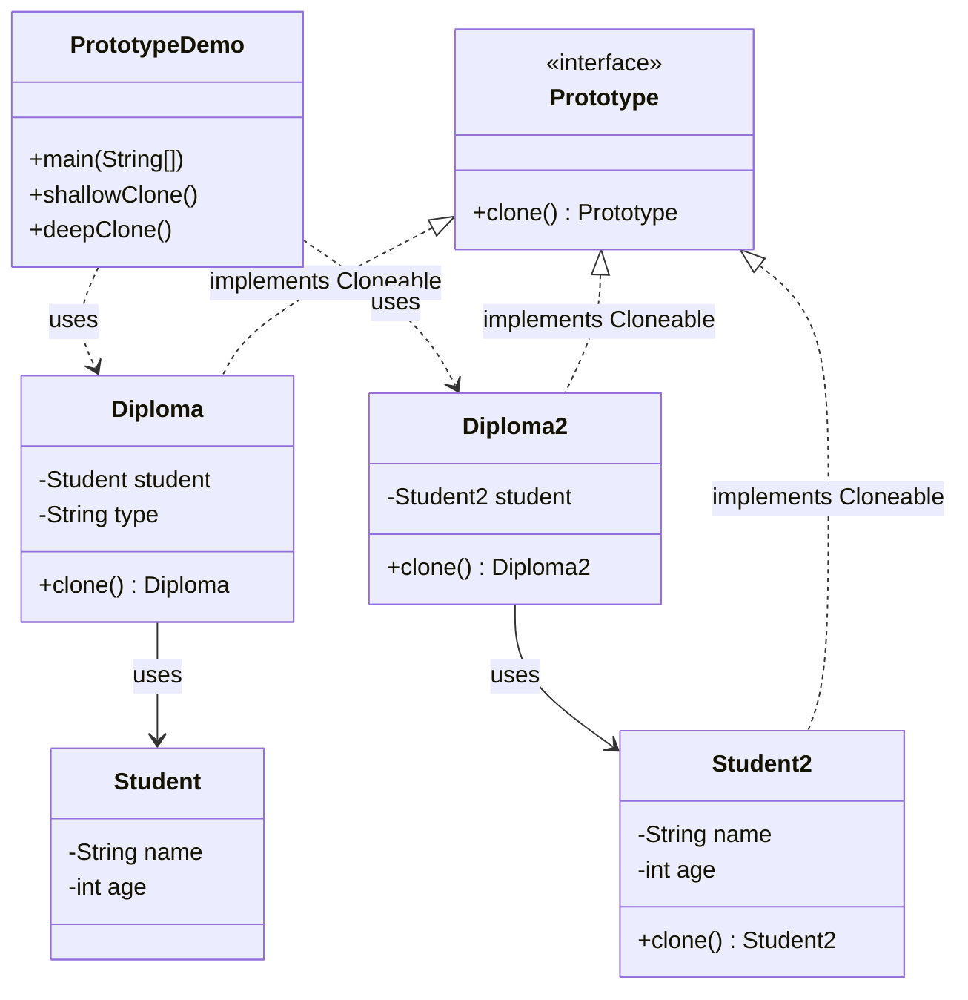
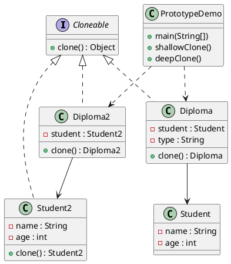

# 原型模式（Prototype Pattern）—— 浅拷贝与深拷贝示例

> 目标：通过复制已有对象来创建新对象，避免重复初始化带来的成本。  
> 你会在：需要创建大量相似对象、对象创建成本高、初始化复杂、需要快速克隆对象的场景中遇到它。

---

## 1. 为什么需要原型模式

### 1.1 问题场景

当需要创建大量相似对象时，常见的做法有：

**方式一：每次都 new 一个新对象**

```java
Student student1 = new Student();
student1.setName("John");
student1.setAge(20);
// ... 复杂的初始化过程

Student student2 = new Student();
student2.setName("John");
student2.setAge(20);
// ... 重复相同的初始化过程
```

**问题：**
- ❌ 重复的初始化代码
- ❌ 对象创建成本高（如需要从数据库读取、网络请求等）
- ❌ 代码冗余，维护困难
- ❌ 性能问题：如果对象创建很昂贵，每次都重新创建会浪费资源

**方式二：使用克隆（浅拷贝 vs 深拷贝）**

原型模式通过克隆已有对象来创建新对象，但需要注意：
- **浅拷贝**：只复制对象本身，引用字段仍然指向原对象
- **深拷贝**：对象及其引用字段都被复制，完全独立

### 1.2 原型模式的优势

- ✅ **提高性能**：避免重复的初始化过程，直接复制已有对象
- ✅ **简化创建**：通过克隆简化对象创建流程
- ✅ **灵活扩展**：可以在运行时动态创建对象副本
- ✅ **节省资源**：对于创建成本高的对象，克隆比重新创建更高效

---

## 2. 核心思想

原型模式的核心是通过**复制已有对象**来创建新对象，而不是通过构造函数创建：

```
已有对象（原型）→ clone() → 新对象（副本）
```

**关键点：**
- 实现 `Cloneable` 接口（标记接口）
- 重写 `clone()` 方法
- 决定使用浅拷贝还是深拷贝

---

## 3. 代码结构

本示例包含以下类：

- `Diploma` / `Student`：浅拷贝示例（引用字段共享）
- `Diploma2` / `Student2`：深拷贝示例（引用字段复制）
- `PrototypeDemo`：运行入口，分别演示浅拷贝与深拷贝

---

## 4. 实现细节

### 4.1 浅拷贝实现（Diploma + Student）

**Diploma 类**

```java
package com.example.prototype;

public class Diploma implements Cloneable {

    private Student student;
    private String type;

    public Diploma() {
        System.out.println("通过 new 方法创建对象");
    }

    public void setStudent(Student student) {
        this.student = student;
    }

    public Student getStudent() {
        return student;
    }

    public void setType(String type) {
        this.type = type;
    }

    public String getType() {
        return type;
    }

    /**
     * 实现的是 Object 中的 clone() 方法
     * 浅拷贝：只复制对象本身，引用字段仍然指向原对象
     */
    @Override
    public Diploma clone() {
        try {
            System.out.println("通过 clone 方法复制原型");
            return (Diploma) super.clone();
        } catch (CloneNotSupportedException e) {
            throw new RuntimeException(e);
        }
    }
}
```

**Student 类（不需要实现 Cloneable）**

```java
package com.example.prototype;

public class Student {
    private String name;
    private int age;

    public void setName(String name) {
        this.name = name;
    }

    public void setAge(int age) {
        this.age = age;
    }

    public String getName() {
        return name;
    }

    public int getAge() {
        return age;
    }
}
```

**关键点：**
- `Diploma` 实现 `Cloneable` 接口（标记接口）
- `clone()` 方法直接调用 `super.clone()`，进行浅拷贝
- `Student` 对象不会被复制，两个 `Diploma` 对象共享同一个 `Student` 引用
- `String` 类型是不可变类型，共享引用是安全的

### 4.2 深拷贝实现（Diploma2 + Student2）

**Diploma2 类**

```java
package com.example.prototype;

public class Diploma2 implements Cloneable {

    private Student2 student;

    public Diploma2() {
        System.out.println("通过 new 方法创建对象");
    }

    public void setStudent(Student2 student) {
        this.student = student;
    }

    public Student2 getStudent() {
        return student;
    }

    /**
     * 实现的是 Object 中的 clone() 方法
     * 深拷贝：对象及其引用字段都会被复制
     */
    @Override
    public Diploma2 clone() {
        try {
            System.out.println("通过 clone 方法复制原型");
            Diploma2 cloned = (Diploma2) super.clone();
            // 引用对象如果不为 null，通过引用对象的 clone() 方法进行深拷贝
            if (this.getStudent() != null) {
                cloned.setStudent(this.getStudent().clone());
            }
            return cloned;
        } catch (CloneNotSupportedException e) {
            throw new RuntimeException(e);
        }
    }
}
```

**Student2 类（需要实现 Cloneable）**

```java
package com.example.prototype;

public class Student2 implements Cloneable {

    private String name;
    private int age;

    public void setName(String name) {
        this.name = name;
    }

    public void setAge(int age) {
        this.age = age;
    }

    public String getName() {
        return name;
    }

    public int getAge() {
        return age;
    }

    @Override
    public Student2 clone() {
        // 被引用的对象也要实现 Cloneable
        try {
            return (Student2) super.clone();
        } catch (CloneNotSupportedException e) {
            throw new RuntimeException(e);
        }
    }
}
```

**关键点：**
- `Diploma2` 在 `clone()` 方法中，对引用对象也调用 `clone()` 方法
- `Student2` 也需要实现 `Cloneable` 接口
- 深拷贝后，两个 `Diploma2` 对象完全独立，互不影响

---

## 5. 使用示例

### 5.1 浅拷贝示例

```java
package com.example.prototype;

public class PrototypeDemo {

    public static void main(String[] args) {
        shallowClone();
        System.out.println("========");
        deepClone();
    }

    /**
     * 浅拷贝
     */
    public static void shallowClone() {
        Diploma original = new Diploma();
        Diploma cloned = original.clone();
        System.out.println(cloned == original); // false - 对象本身不同

        Student student = new Student();
        student.setName("John");
        student.setAge(20);

        original.setStudent(student);
        original.setType("本科");

        Diploma cloned2 = original.clone();
        cloned2.setType("硕士");
        
        // true - 浅拷贝的引用对象拷贝的是引用地址，两个对象共享同一个 Student
        System.out.println(cloned2.getStudent() == original.getStudent()); 
        
        // 本科 - 对于 String 等不可变类型（共享引用安全），使用浅拷贝足够
        System.out.println(original.getType()); 
        System.out.println(cloned2.getType()); // 硕士
    }
}
```

**浅拷贝效果：**
- 对象本身是新对象（`cloned != original`）
- 引用字段仍然指向同一个对象（`cloned2.getStudent() == original.getStudent()`）
- `String` 等不可变类型共享引用是安全的

### 5.2 深拷贝示例

```java
    /**
     * 深拷贝
     */
    public static void deepClone() {
        Diploma2 original = new Diploma2();
        Diploma2 cloned = original.clone();
        System.out.println(cloned == original); // false - 对象本身不同

        Student2 student = new Student2();
        student.setName("John");
        student.setAge(20);

        original.setStudent(student);

        Diploma2 cloned2 = original.clone();
        
        // false - 深拷贝的引用对象拷贝的是对象本身，两个对象完全独立
        System.out.println(cloned2.getStudent() == original.getStudent()); 
    }
}
```

**深拷贝效果：**
- 对象本身是新对象（`cloned != original`）
- 引用字段也被复制（`cloned2.getStudent() != original.getStudent()`）
- 两个对象完全独立，互不影响

---

## 6. 使用场景

### 6.1 适用场景

- ✅ **对象创建成本高**：需要通过数据库查询、网络请求、复杂计算等方式创建对象
- ✅ **需要大量相似对象**：对象之间差异很小，可以通过复制后修改来创建
- ✅ **需要动态创建对象**：在运行时确定需要创建的对象类型
- ✅ **保护原始对象**：避免直接操作原始对象，通过克隆创建副本进行操作
- ✅ **对象初始化复杂**：对象初始化过程很复杂，重复初始化会浪费资源

### 6.2 常见应用

- **游戏开发**：复制游戏角色、武器、道具等对象
- **图形编辑**：复制图形对象、图层等
- **配置管理**：复制配置对象，进行个性化修改
- **缓存系统**：从缓存中克隆对象，避免直接修改缓存
- **数据库操作**：克隆实体对象，进行不同操作而不影响原对象
- **框架中的应用**：Spring 的 Bean 原型作用域、Apache Commons 的序列化克隆等

---

## 7. 浅拷贝 vs 深拷贝

### 7.1 浅拷贝（Shallow Copy）

**特点：**
- 只复制对象本身
- 引用字段仍然指向原对象
- 基本类型字段被复制，引用类型字段共享

**适用场景：**
- 对象中没有可变引用字段
- 引用字段是不可变类型（如 `String`、`Integer`）
- 需要共享某些状态

**示例：**

```java
// 浅拷贝：两个对象共享同一个 Student
Diploma original = new Diploma();
original.setStudent(new Student("John", 20));
Diploma cloned = original.clone();
// cloned.getStudent() == original.getStudent() // true
```

### 7.2 深拷贝（Deep Copy）

**特点：**
- 对象及其所有引用字段都被复制
- 创建完全独立的对象副本
- 修改副本不会影响原对象

**适用场景：**
- 对象中有可变引用字段
- 需要完全独立的对象副本
- 对象层次结构复杂，需要递归复制

**示例：**

```java
// 深拷贝：两个对象完全独立
Diploma2 original = new Diploma2();
original.setStudent(new Student2("John", 20));
Diploma2 cloned = original.clone();
// cloned.getStudent() != original.getStudent() // true
```

### 7.3 如何选择

| 场景 | 选择 |
|------|------|
| 只有基本类型和不可变类型字段 | 浅拷贝 |
| 有可变引用字段 | 深拷贝 |
| 需要共享某些状态 | 浅拷贝 |
| 需要完全独立的对象 | 深拷贝 |
| 性能要求高 | 浅拷贝（更高效） |
| 安全性要求高 | 深拷贝（更安全） |

---

## 8. UML 类图

### 8.1 Mermaid 类图



### 8.2 PlantUML 类图



---

## 9. 优缺点分析

### 9.1 优点

- ✅ **提高性能**：避免重复的初始化过程，直接复制已有对象，性能更好
- ✅ **简化创建**：通过克隆简化对象创建流程，代码更简洁
- ✅ **灵活扩展**：可以在运行时动态创建对象副本，提高灵活性
- ✅ **节省资源**：对于创建成本高的对象，克隆比重新创建更高效
- ✅ **隐藏创建细节**：客户端不需要知道对象的具体创建过程

### 9.2 缺点

- ❌ **实现复杂**：深拷贝实现复杂，需要递归处理所有引用字段
- ❌ **Cloneable 接口设计缺陷**：`Cloneable` 是标记接口，`clone()` 方法在 `Object` 中，设计不够优雅
- ❌ **需要显式处理**：必须实现 `Cloneable` 接口并重写 `clone()` 方法
- ❌ **浅拷贝风险**：如果不小心使用浅拷贝，可能会造成意外的副作用
- ❌ **继承问题**：如果类有复杂的继承关系，深拷贝实现会更复杂

---

## 10. 变体与扩展

### 10.1 序列化实现深拷贝

除了使用 `clone()` 方法，还可以通过序列化实现深拷贝：

```java
import java.io.*;

public class DeepCopyUtil {
    public static <T extends Serializable> T deepCopy(T object) {
        try {
            ByteArrayOutputStream baos = new ByteArrayOutputStream();
            ObjectOutputStream oos = new ObjectOutputStream(baos);
            oos.writeObject(object);
            
            ByteArrayInputStream bais = new ByteArrayInputStream(baos.toByteArray());
            ObjectInputStream ois = new ObjectInputStream(bais);
            
            return (T) ois.readObject();
        } catch (IOException | ClassNotFoundException e) {
            throw new RuntimeException("深拷贝失败", e);
        }
    }
}
```

**优点：**
- 实现简单，不需要手动处理每个引用字段
- 自动处理所有层次的引用关系

**缺点：**
- 性能较低（序列化和反序列化开销大）
- 所有相关类都必须实现 `Serializable` 接口
- 无法处理不可序列化的对象

### 10.2 使用第三方库实现深拷贝

**Apache Commons Lang**

```java
import org.apache.commons.lang3.SerializationUtils;

Student2 cloned = SerializationUtils.clone(original);
```

**Kryo**

```java
import com.esotericsoftware.kryo.Kryo;
import com.esotericsoftware.kryo.io.Input;
import com.esotericsoftware.kryo.io.Output;

Kryo kryo = new Kryo();
Output output = new Output(new ByteArrayOutputStream());
kryo.writeObject(output, original);
Input input = new Input(output.getBuffer());
Student2 cloned = kryo.readObject(input, Student2.class);
```

### 10.3 原型管理器

可以创建一个原型管理器来管理多个原型对象：

```java
import java.util.HashMap;
import java.util.Map;

public class PrototypeManager {
    private Map<String, Cloneable> prototypes = new HashMap<>();
    
    public void register(String key, Cloneable prototype) {
        prototypes.put(key, prototype);
    }
    
    public Cloneable getClone(String key) {
        Cloneable prototype = prototypes.get(key);
        if (prototype == null) {
            throw new IllegalArgumentException("未找到原型: " + key);
        }
        // 需要根据实际类型进行转换和克隆
        return prototype;
    }
}
```

---

## 11. 与其他模式的关系

### 11.1 与工厂模式的区别

- **工厂模式**：关注**创建什么对象**，通过工厂方法创建新对象
- **原型模式**：关注**如何复制对象**，通过克隆已有对象创建新对象

**结合使用：**
- 工厂模式可以配合原型模式，工厂方法返回克隆的原型对象

### 11.2 与单例模式的关系

- **单例模式**：保证只有一个实例
- **原型模式**：通过克隆创建多个实例

**注意：**
- 单例对象的克隆可能会破坏单例特性，需要特别处理

### 11.3 与建造者模式的关系

- **建造者模式**：逐步构建复杂对象
- **原型模式**：复制已有对象

**结合使用：**
- 可以先用建造者模式创建一个标准对象，然后通过原型模式复制并修改

---

## 12. 不可变类型说明

不可变类型指对象创建后状态不可再改变，所有"修改"都会产生新对象，因此多实例共享同一引用是安全的。

**常见不可变类型：**
- `String`
- 数值包装类：`Integer`、`Long`、`Short`、`Byte`、`Character`、`Boolean`、`Float`、`Double`
- `BigInteger`、`BigDecimal`
- `LocalDate`、`LocalTime`、`LocalDateTime`、`Instant` 等 `java.time` 类型
- 枚举类型（`Enum`）

**为什么不可变类型可以共享引用？**

```java
String s1 = "Hello";
String s2 = s1; // 共享引用
s2 = s2 + " World"; // 创建新对象，s1 不受影响
System.out.println(s1); // "Hello"
System.out.println(s2); // "Hello World"
```

因为不可变类型的所有操作都会创建新对象，所以共享引用是安全的。

---

## 13. 面试要点

### 13.1 基础问题

- **原型模式解决什么问题？**
  - 要点：通过复制已有对象创建新对象，避免重复初始化，提高性能和灵活性

- **浅拷贝和深拷贝的区别？**
  - 要点：浅拷贝只复制对象本身，引用字段共享；深拷贝复制对象及其所有引用字段

- **Cloneable 接口的作用？**
  - 要点：标记接口，表示对象可以被克隆。`clone()` 方法在 `Object` 类中定义

- **如何实现深拷贝？**
  - 要点：在 `clone()` 方法中，对每个引用字段也调用 `clone()` 方法；或者使用序列化

### 13.2 实践问题

- **什么时候使用原型模式？**
  - 要点：对象创建成本高、需要大量相似对象、需要动态创建对象

- **什么时候使用浅拷贝？什么时候使用深拷贝？**
  - 要点：只有不可变类型或不需要独立副本时用浅拷贝；有可变引用字段或需要完全独立时用深拷贝

- **原型模式的缺点？**
  - 要点：实现复杂（特别是深拷贝）、Cloneable 接口设计缺陷、浅拷贝风险

- **除了 clone() 方法，还有其他实现深拷贝的方式吗？**
  - 要点：序列化、第三方库（Apache Commons、Kryo）、手动复制等

### 13.3 设计问题

- **原型模式和工厂模式的区别？**
  - 要点：工厂模式创建新对象，原型模式复制已有对象

- **如何避免原型模式的浅拷贝风险？**
  - 要点：明确使用深拷贝、使用不可变类型、在文档中说明拷贝行为

---

## 14. 总结

原型模式是一个**实用性很强**的设计模式，特别适合：

- 对象创建成本高的场景
- 需要大量相似对象的场景
- 需要动态创建对象的场景

**核心要点：**

1. **实现 `Cloneable` 接口**：标记对象可以被克隆
2. **重写 `clone()` 方法**：实现复制逻辑
3. **选择拷贝方式**：根据需求选择浅拷贝或深拷贝
4. **注意不可变类型**：不可变类型可以安全地共享引用

**最佳实践：**

- 如果只有基本类型和不可变类型，使用浅拷贝
- 如果有可变引用字段，使用深拷贝
- 对于复杂的对象结构，考虑使用序列化或第三方库实现深拷贝
- 在文档中明确说明拷贝行为，避免误用

**一句话总结：**

> 当对象创建成本高时，用原型模式复制已有对象，让创建更高效、更灵活。