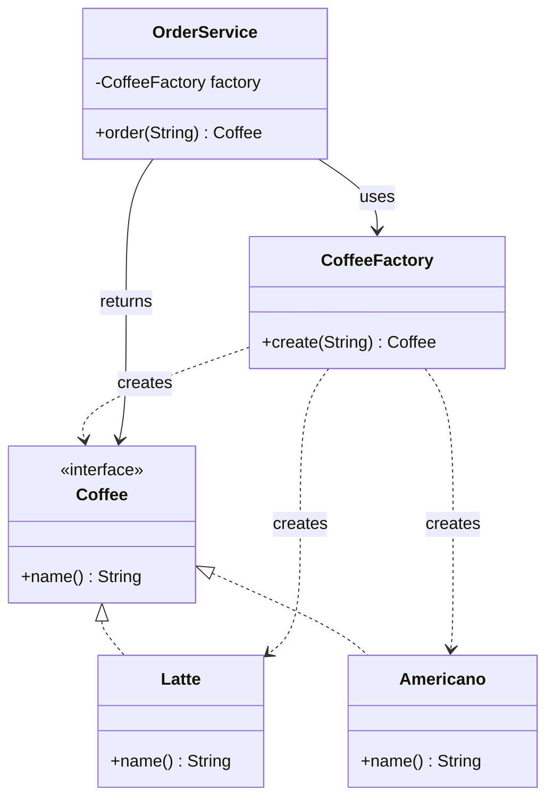
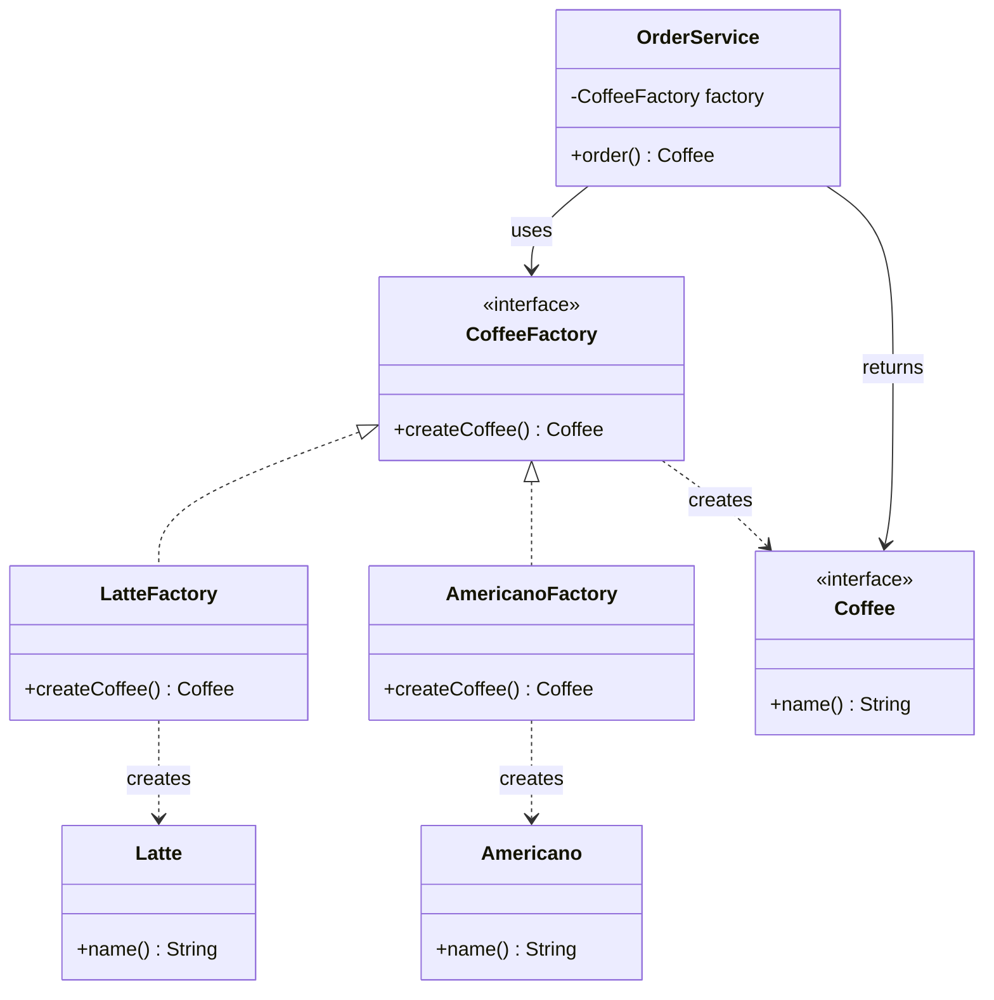
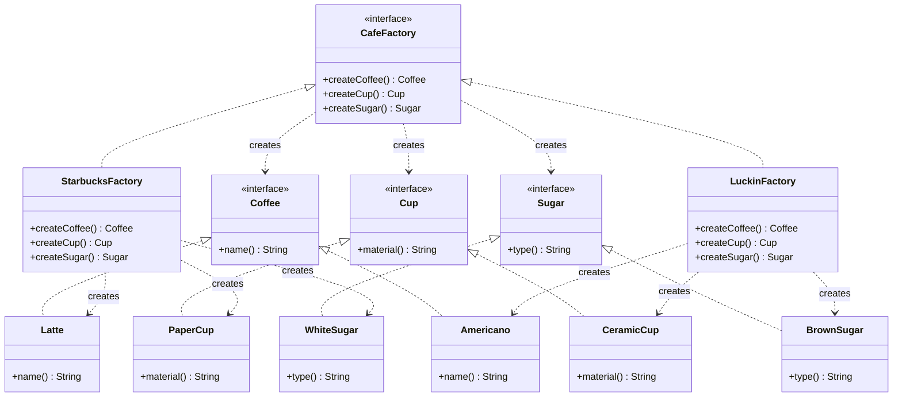
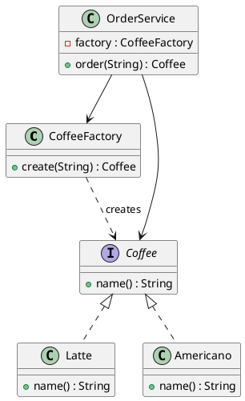
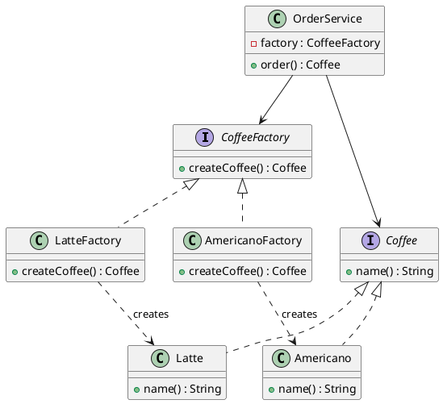
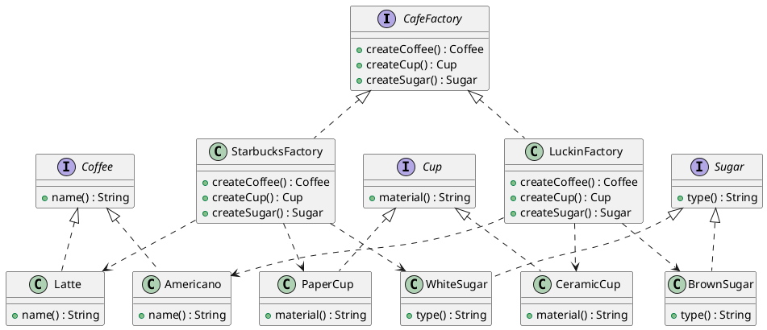

# 工厂模式（Factory Pattern）—— Coffee 示例完整整理

> 目标：将对象的创建与使用分离，通过工厂来创建对象，而不是直接使用 `new`。  
> 你会在：需要创建多种类型的对象、创建逻辑复杂、需要解耦创建和使用、需要统一管理对象创建的场景中遇到它。

本文通过 Coffee（咖啡） 示例，按“问题驱动”的方式，递进讲解以下模式：

**不使用工厂 → 简单工厂 → 静态工厂 → 工厂方法 → 抽象工厂**

重点回答两个问题：

1. 为什么要引入下一种模式
2. 它解决了什么问题，又引入了什么代价

---

## 1 不使用工厂：直接 new（最原始方式）

### 1.1 示例代码

```java
public interface Coffee {
    String name();
}

public class Latte implements Coffee {
    public String name() { return "Latte"; }
}

public class Americano implements Coffee {
    public String name() { return "Americano"; }
}

public class OrderService {

    public Coffee order(String type) {
        if ("latte".equalsIgnoreCase(type)) {
            return new Latte();
        } else if ("americano".equalsIgnoreCase(type)) {
            return new Americano();
        }
        throw new IllegalArgumentException("unknown coffee type");
    }
}
```

### 1.2 问题分析

- ❌ 违反开闭原则：新增一种 Coffee 必须修改业务代码
- ❌ 创建逻辑与业务逻辑耦合
- ❌ if / else 会在多个地方重复出现
- ❌ 业务代码强依赖具体实现类

👉 结论：

当对象创建逻辑开始变化时，new 就不该再散落在业务代码中。

---

## 2 简单工厂（Simple Factory / 普通工厂）

核心思想：
👉 把“对象创建”集中到一个工厂类中

---

### 2.1 示例代码

```java
public class CoffeeFactory {

    public Coffee create(String type) {
        if ("latte".equalsIgnoreCase(type)) {
            return new Latte();
        } else if ("americano".equalsIgnoreCase(type)) {
            return new Americano();
        }
        throw new IllegalArgumentException("unknown coffee type");
    }
}

public class OrderService {

    private final CoffeeFactory factory = new CoffeeFactory();

    public Coffee order(String type) {
        return factory.create(type);
    }
}
```

### 2.2 为什么要这样做

- ✅ 创建逻辑集中管理
- ✅ 业务类职责更单一
- ✅ 减少重复 new

### 2.3 仍然存在的问题

- ❌ 工厂类会越来越大
- ❌ 新增产品仍然需要修改工厂（if / else）
- ❌ 违反开闭原则（只是“集中修改”）

👉 结论：

简单工厂解决了“散乱创建”，但没有解决“变化扩展”。

---

## 3 静态工厂（Static Factory）

核心思想：
👉 如果工厂无状态，就不必实例化

---

### 3.1 示例代码

```java
public class CoffeeStaticFactory {

    private CoffeeStaticFactory() {}

    public static Coffee create(String type) {
        if ("latte".equalsIgnoreCase(type)) {
            return new Latte();
        } else if ("americano".equalsIgnoreCase(type)) {
            return new Americano();
        }
        throw new IllegalArgumentException("unknown coffee type");
    }
}

public class OrderService {

    public Coffee order(String type) {
        return CoffeeStaticFactory.create(type);
    }
}
```

### 3.2 为什么要这样做

- ✅ 使用简单、语义清晰
- ✅ 不需要维护工厂实例
- ✅ 适合作为“创建工具类”

### 3.3 静态工厂的代价

- ❌ 不利于扩展与替换
- ❌ 不方便测试（难 mock）
- ❌ 不适合 IoC / Spring 注入体系

👉 结论：

静态工厂适合工具化场景，不适合复杂系统。

---

## 4 工厂方法模式（Factory Method）

核心思想一句话：
👉 一个产品，对应一个工厂

---

### 4.1 为什么引入工厂方法

简单工厂的问题本质是：

所有变化集中在一个工厂类中

工厂方法通过 多态 把变化“分散”出去。

---

### 4.2 角色结构

角色 说明
Product 抽象产品（Coffee）
ConcreteProduct 具体产品（Latte / Americano）
Creator 抽象工厂
ConcreteCreator 具体工厂

| 角色            | 说明                          |
| --------------- | ----------------------------- |
| Product         | 抽象产品（Coffee）            |
| ConcreteProduct | 具体产品（Latte / Americano） |
| Creator         | 抽象工厂                      |
| ConcreteCreator | 具体工厂                      |

---

### 4.3 示例代码

抽象工厂

```java
public interface CoffeeFactory {
    Coffee createCoffee();
}

具体工厂

public class LatteFactory implements CoffeeFactory {
    public Coffee createCoffee() {
        return new Latte();
    }
}

public class AmericanoFactory implements CoffeeFactory {
    public Coffee createCoffee() {
        return new Americano();
    }
}
```

业务使用

```java
public class OrderService {

    private final CoffeeFactory factory;

    public OrderService(CoffeeFactory factory) {
        this.factory = factory;
    }

    public Coffee order() {
        return factory.createCoffee();
    }
}
```

---

### 4.4 为什么这样做

- ✅ 符合开闭原则
- ✅ 消灭 if / else
- ✅ 通过“新增类”完成扩展
- ✅ 非常适合 Spring / IoC

👉 代价：

- 类数量增加
- 结构更复杂

---

## 5 抽象工厂模式（Abstract Factory）

核心思想：
👉 创建“一整套产品族”

---

### 5.1 需求升级

不只卖 Coffee，还要配套：

- Cup
- Sugar

并且不同品牌需要风格一致。

---

### 5.2 抽象工厂定义

```java
public interface CafeFactory {

    Coffee createCoffee();
    Cup createCup();
    Sugar createSugar();
}
```

### 5.3 具体工厂

```java
public class StarbucksFactory implements CafeFactory {

    public Coffee createCoffee() { return new Latte(); }
    public Cup createCup() { return new PaperCup(); }
    public Sugar createSugar() { return new WhiteSugar(); }
}

public class LuckinFactory implements CafeFactory {

    public Coffee createCoffee() { return new Americano(); }
    public Cup createCup() { return new CeramicCup(); }
    public Sugar createSugar() { return new BrownSugar(); }
}
```

---

### 5.4 为什么要用抽象工厂

- ✅ 保证产品族一致性
- ✅ 一次切换整套风格
- ✅ 业务层完全解耦具体实现

### 5.5 抽象工厂的代价

- ❌ 新增“产品维度”成本高
- ❌ 所有工厂都要修改接口

👉 适用前提：

产品族稳定，系列可扩展

---

## 6 整体对比总结（面试高频）

| 模式     | 解决的问题 | 扩展方式 | 适用场景 |
| -------- | ---------- | -------- | -------- |
| 不用工厂 | 简单直接   | 改代码   | Demo     |
| 简单工厂 | 集中创建   | 改工厂   | 产品少   |
| 静态工厂 | 轻量工具   | 改代码   | 工具类   |
| 工厂方法 | 消灭分支   | 新增工厂 | 产品多   |
| 抽象工厂 | 产品族一致 | 新增系列 | 多维产品 |

---

## 7. 代码结构

本示例包含以下目录结构：

```
factory/
├── direct/          # 不使用工厂（直接 new）
├── simple/          # 简单工厂
├── staticfactory/   # 静态工厂
├── method/          # 工厂方法
├── abstractfactory/ # 抽象工厂
└── configfactory/   # 配置工厂（扩展）
```

每个子目录都包含：
- 产品接口和实现类（`Coffee`、`Latte`、`Americano` 等）
- 工厂类或接口
- 业务服务类（`OrderService`）
- 演示类（`*Demo.java`）

---

## 8. UML 类图

### 8.1 简单工厂模式



### 8.2 工厂方法模式



### 8.3 抽象工厂模式



### 8.4 PlantUML 类图

#### 简单工厂



#### 工厂方法



#### 抽象工厂



---

## 9. 使用场景

### 9.1 简单工厂适用场景

- ✅ **产品类型较少**：只有几种固定的产品类型
- ✅ **创建逻辑简单**：不需要复杂的创建过程
- ✅ **不需要扩展**：产品类型相对固定，很少变化
- ✅ **快速开发**：适合小型项目或原型开发

**常见应用：**
- JDK 中的 `Calendar.getInstance()`
- `NumberFormat.getInstance()`
- 日志框架中的 Logger 创建

### 9.2 静态工厂适用场景

- ✅ **无状态的工具类**：工厂本身不需要维护状态
- ✅ **简单场景**：适合作为工具方法使用
- ✅ **不需要依赖注入**：不需要 Spring 等框架管理

**常见应用：**
- Java 标准库中的 `Collections.emptyList()`、`Collections.singletonList()`
- `Optional.of()`、`Optional.empty()`
- `Stream.of()`

### 9.3 工厂方法适用场景

- ✅ **产品类型较多**：需要创建多种不同类型的产品
- ✅ **需要扩展**：经常需要添加新的产品类型
- ✅ **需要依赖注入**：适合 Spring 等 IoC 框架
- ✅ **需要解耦**：希望创建逻辑与使用逻辑分离

**常见应用：**
- Spring 的 `BeanFactory`
- Java 的 `Collection.iterator()`（每个集合类有自己的迭代器工厂）
- 日志框架（SLF4J、Log4j2）

### 9.4 抽象工厂适用场景

- ✅ **产品族**：需要创建多个相关的产品系列
- ✅ **产品族一致性**：需要保证同一系列产品的兼容性
- ✅ **系统切换**：需要在运行时切换整个产品系列
- ✅ **复杂对象创建**：创建过程涉及多个对象的组合

**常见应用：**
- GUI 框架（不同操作系统的 UI 组件）
- 数据库访问层（不同数据库的连接、语句、结果集）
- 跨平台应用（Android、iOS 的原生组件）

---

## 10. 优缺点分析

### 10.1 简单工厂

**优点：**
- ✅ 集中管理对象创建逻辑
- ✅ 客户端与具体产品解耦
- ✅ 实现简单，易于理解

**缺点：**
- ❌ 违反开闭原则（新增产品需要修改工厂）
- ❌ 工厂类职责过重，难以维护
- ❌ 难以扩展

### 10.2 静态工厂

**优点：**
- ✅ 使用简单，语义清晰
- ✅ 不需要维护工厂实例
- ✅ 适合工具类场景

**缺点：**
- ❌ 不利于扩展和替换
- ❌ 不方便测试（难 mock）
- ❌ 不适合 IoC 框架

### 10.3 工厂方法

**优点：**
- ✅ 符合开闭原则
- ✅ 职责单一，易于扩展
- ✅ 适合依赖注入
- ✅ 符合单一职责原则

**缺点：**
- ❌ 类数量增加
- ❌ 结构更复杂
- ❌ 需要为每个产品创建工厂类

### 10.4 抽象工厂

**优点：**
- ✅ 保证产品族一致性
- ✅ 一次切换整个产品系列
- ✅ 完全解耦具体实现

**缺点：**
- ❌ 新增产品维度成本高
- ❌ 所有工厂都要修改接口
- ❌ 接口会变得很庞大
- ❌ 实现复杂

---

## 11. 与其他模式的关系

### 11.1 与单例模式的关系

- **单例模式**：保证只有一个实例
- **工厂模式**：创建对象的工厂可以是单例

**结合使用：**
- 工厂类可以设计为单例，避免重复创建工厂对象

### 11.2 与建造者模式的关系

- **工厂模式**：关注创建什么对象
- **建造者模式**：关注如何构建对象

**区别：**
- 工厂模式直接返回完整对象
- 建造者模式逐步构建复杂对象

### 11.3 与原型模式的关系

- **工厂模式**：通过工厂创建新对象
- **原型模式**：通过克隆复制已有对象

**结合使用：**
- 工厂方法可以返回克隆的原型对象，实现对象的快速创建

### 11.4 与策略模式的关系

- **工厂模式**：负责对象的创建
- **策略模式**：负责算法的选择

**区别：**
- 工厂模式关注“创建什么”
- 策略模式关注“如何执行”

---

## 12. 面试要点

### 12.1 基础问题

- **工厂模式解决什么问题？**
  - 要点：将对象创建与使用分离，解耦创建逻辑，提高灵活性

- **简单工厂、工厂方法、抽象工厂的区别？**
  - 要点：简单工厂集中创建；工厂方法一个产品一个工厂；抽象工厂创建产品族

- **工厂方法的优势？**
  - 要点：符合开闭原则、易于扩展、适合依赖注入

- **抽象工厂适用什么场景？**
  - 要点：需要创建产品族、保证产品一致性、需要系统切换

### 12.2 实践问题

- **什么时候使用简单工厂？什么时候使用工厂方法？**
  - 要点：产品少且固定用简单工厂；产品多且需要扩展用工厂方法

- **静态工厂和实例工厂的区别？**
  - 要点：静态工厂使用静态方法，不需要实例；实例工厂需要创建工厂对象

- **如何避免工厂模式导致类爆炸？**
  - 要点：合理设计工厂层次、使用配置工厂、考虑使用反射

- **工厂模式和依赖注入的关系？**
  - 要点：工厂方法模式非常适合依赖注入框架（如 Spring）

### 12.3 设计问题

- **工厂模式如何保证开闭原则？**
  - 要点：通过新增类而不是修改代码来扩展（工厂方法、抽象工厂）

- **抽象工厂如何应对新增产品维度的问题？**
  - 要点：这是抽象工厂的固有缺点，可以通过接口隔离、组合等方式缓解

---

## 13. 一句话设计动机总结

```text
new 太散 → 简单工厂（集中创建）
工厂太胖 → 工厂方法（分散变化）
出现成套对象 → 抽象工厂（产品族）
```

---

## 14. 总结

工厂模式是一个**最常用的设计模式**，它解决了对象创建的核心问题：

**核心价值：**

1. **解耦**：将对象创建与使用分离
2. **灵活**：易于扩展和替换
3. **统一**：集中管理对象创建逻辑
4. **规范**：通过接口和抽象类规范创建过程

**模式演进：**

```
直接 new
  ↓ (问题：创建逻辑散乱)
简单工厂
  ↓ (问题：违反开闭原则)
工厂方法
  ↓ (需求：产品族一致性)
抽象工厂
```

**最佳实践：**

- 小型项目：简单工厂或静态工厂
- 中型项目：工厂方法模式
- 大型项目：抽象工厂模式 + 依赖注入
- 框架开发：灵活组合多种工厂模式

**一句话总结：**

> 当对象创建变得复杂时，用工厂模式将创建过程封装起来，让代码更清晰、更灵活、更易扩展。
