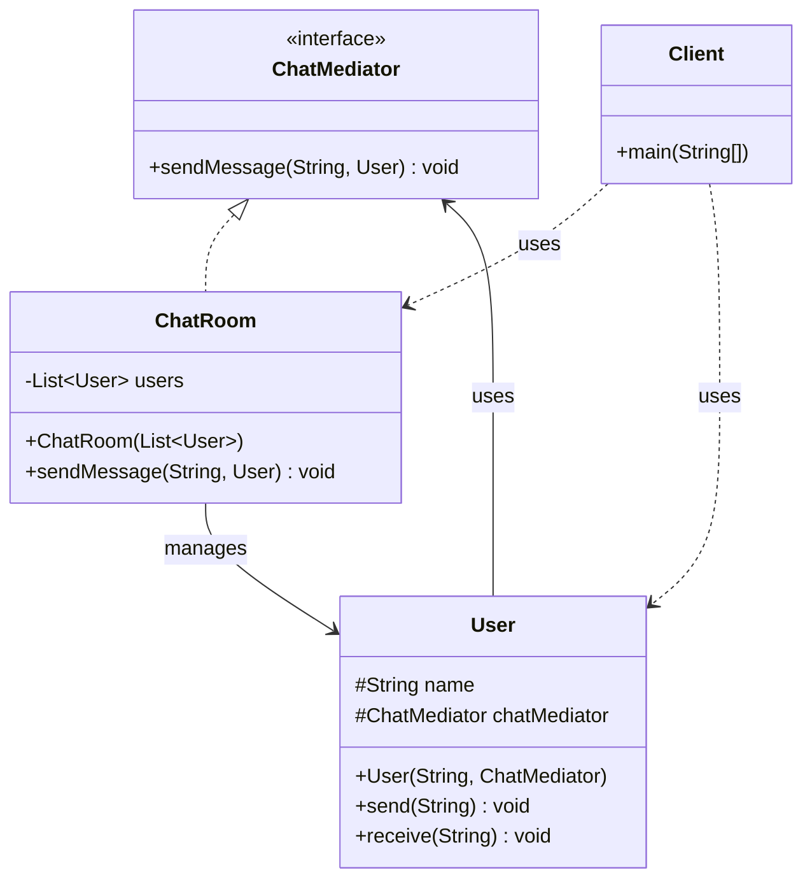
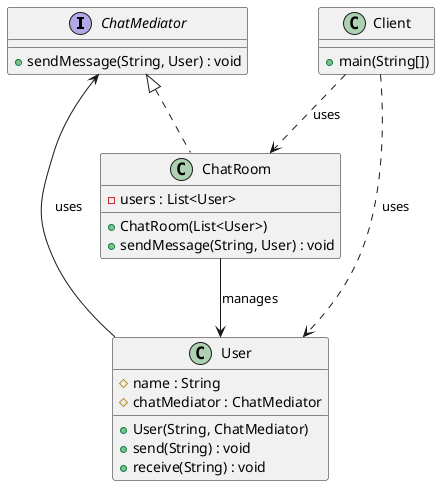

# 中介者模式（Mediator Pattern）—— 聊天室示例完整整理

> 目标：用一个中介对象来封装一系列对象之间的交互，使各对象不需要显式地相互引用，从而使其耦合松散，而且可以独立地改变它们之间的交互。  
> 你会在：多个对象之间存在复杂的相互引用关系、需要降低对象间耦合度、需要集中控制对象间交互的场景中遇到它。

本文通过聊天室（ChatRoom）示例，讲解中介者模式的实现：

**中介者接口 → 具体中介者 → 同事类**

重点回答两个问题：

1. 中介者模式如何实现对象间的解耦和集中控制
2. 它解决了什么问题，又引入了什么代价

---

## 1. 为什么需要中介者模式

### 1.1 典型场景

- **复杂交互**：多个对象之间存在复杂的相互引用关系，对象之间直接通信导致耦合度高
- **降低耦合**：需要降低对象间的耦合度，使对象之间不需要显式地相互引用
- **集中控制**：需要集中控制对象间的交互，统一管理对象之间的通信
- **避免网状结构**：需要避免对象之间形成复杂的网状结构，提高系统的可维护性
- **动态交互**：需要动态地改变对象之间的交互方式，而不影响对象本身

### 1.2 中介者模式的核心思想

```
同事类（Colleague）
  ├─ 同事类A（User）
  │   └─ 通过中介者发送消息
  ├─ 同事类B（User）
  │   └─ 通过中介者发送消息
  └─ 同事类C（User）
      └─ 通过中介者发送消息
          ↓
中介者（Mediator）
  └─ 具体中介者（ChatRoom）
      ├─ 管理所有同事类
      └─ 协调同事类之间的交互
```

中介者模式通过引入中介者对象，将对象之间的复杂交互封装在中介者中，使对象之间不需要直接引用，从而降低耦合度。

---

## 2. 中介者模式结构总览

| 角色           | 说明                           | 示例                    |
| -------------- | ------------------------------ | ----------------------- |
| Mediator       | 中介者接口，定义同事类之间的通信方法 | `ChatMediator`         |
| ConcreteMediator | 具体中介者，实现中介者接口，管理同事类 | `ChatRoom`             |
| Colleague      | 同事类抽象类或接口，定义同事类的通用行为 | `User`（本示例中直接实现） |
| ConcreteColleague | 具体同事类，实现同事类接口 | `User`                 |
| Client         | 客户端，使用中介者和同事类            | `Client`               |

---

## 3. 核心组件

### 3.1 中介者接口（Mediator）

**接口定义：**

```java
/**
 * 聊天室中介者接口
 */
public interface ChatMediator {

    /**
     * 发送消息
     * @param message 消息内容
     * @param user 发送者
     */
    void sendMessage(String message, User user);
}
```

**关键点：**
- 定义中介者的统一接口
- `sendMessage()` 方法用于协调同事类之间的通信
- 中介者负责管理所有同事类之间的交互

---

### 3.2 具体中介者（ConcreteMediator）

**具体中介者实现：**

```java
/**
 * 聊天室中介者，具体实现
 */
public class ChatRoom implements ChatMediator {

    private List<User> users;

    public ChatRoom(List<User> users) {
        this.users = users;
    }

    @Override
    public void sendMessage(String message, User user) {
        // 打印发送者信息（只打印一次）
        System.out.println(user.name + "发送消息: " + message);
        // 通知其他用户
        for (User u : users) {
            if (u != user) { // 排除发送者自己
                u.receive(message);
            }
        }
    }
}
```

**关键点：**
- 维护所有同事类的列表
- 实现中介者接口，协调同事类之间的交互
- 当某个同事类发送消息时，中介者负责通知其他同事类
- 中介者可以控制消息的传递方式（如排除发送者自己）

---

### 3.3 同事类（Colleague）

**同事类实现：**

```java
/**
 * 用户类
 */
public class User {

    protected String name;
    protected ChatMediator chatMediator; // 聊天室中介者

    public User(String name, ChatMediator chatMediator) {
        this.name = name;
        this.chatMediator = chatMediator;
    }

    /**
     * 发送消息
     * @param message 消息内容
     */
    public void send(String message) {
        chatMediator.sendMessage(message, this);
    }

    /**
     * 收到消息
     * @param message 消息内容
     */
    public void receive(String message) {
        System.out.println(name + "收到消息: " + message);
    }
}
```

**关键点：**
- 持有中介者的引用，通过中介者与其他同事类通信
- `send()` 方法通过中介者发送消息，而不是直接调用其他同事类
- `receive()` 方法用于接收来自中介者的消息
- 同事类之间不直接引用，降低了耦合度

---

## 4. 使用示例

### 4.1 基本使用

```java
public class Client {

    public static void main(String[] args) {
        List<User> users = new ArrayList<>();
        ChatMediator chatMediator = new ChatRoom(users);
        
        User user1 = new User("用户1", chatMediator);
        User user2 = new User("用户2", chatMediator);
        User user3 = new User("用户3", chatMediator);
        
        // 将用户添加到聊天室
        users.add(user1);
        users.add(user2);
        users.add(user3);
        
        user1.send("大家好，我是用户1");
        user2.send("大家好，我是用户2");
        user3.send("大家好，我是用户3");
    }
}
```

**输出：**

```
用户1发送消息: 大家好，我是用户1
用户2收到消息: 大家好，我是用户1
用户3收到消息: 大家好，我是用户1
用户2发送消息: 大家好，我是用户2
用户1收到消息: 大家好，我是用户2
用户3收到消息: 大家好，我是用户2
用户3发送消息: 大家好，我是用户3
用户1收到消息: 大家好，我是用户3
用户2收到消息: 大家好，我是用户3
```

**关键点：**
- 客户端创建中介者和同事类对象
- 将同事类添加到中介者管理的列表中
- 同事类通过中介者发送消息，而不是直接调用其他同事类
- 中介者负责协调消息的传递

### 4.2 工作流程

```
1. 创建中介者对象（ChatRoom）
   ↓
2. 创建同事类对象（User）
   ↓
3. 将同事类添加到中介者管理的列表中
   ↓
4. 同事类通过中介者发送消息（send）
   ↓
5. 中介者接收消息，协调传递给其他同事类
   ↓
6. 其他同事类收到消息（receive）
```

### 4.3 交互图

```
[User1] --send--> [ChatRoom] --receive--> [User2]
[User1] --send--> [ChatRoom] --receive--> [User3]
[User2] --send--> [ChatRoom] --receive--> [User1]
[User2] --send--> [ChatRoom] --receive--> [User3]
```

---

## 5. 代码结构

本示例包含以下目录结构：

```
mediator/
├── ChatMediator.java      # 中介者接口
├── ChatRoom.java          # 具体中介者实现
├── User.java              # 同事类（用户）
└── Client.java            # 客户端
```

---

## 6. UML 类图

### 6.1 Mermaid 类图



### 6.2 PlantUML 类图



---

## 7. 中介者模式 vs 其他模式

### 7.1 中介者模式 vs 观察者模式

| 对比项 | 中介者模式 | 观察者模式 |
|--------|-----------|-----------|
| **目的** | 封装对象间的复杂交互 | 实现对象间的通知机制 |
| **关系** | 多对多关系，通过中介者协调 | 一对多关系，主题通知观察者 |
| **交互方式** | 双向交互，中介者协调 | 单向通知，主题通知观察者 |
| **耦合度** | 同事类之间解耦，都依赖中介者 | 主题和观察者直接耦合 |
| **使用场景** | 对象间复杂交互、需要集中控制 | 事件通知、发布-订阅 |

**区别：**
- 中介者模式：多对多关系，通过中介者协调对象间的复杂交互
- 观察者模式：一对多关系，主题通知观察者，观察者之间不直接交互

### 7.2 中介者模式 vs 外观模式

| 对比项 | 中介者模式 | 外观模式 |
|--------|-----------|---------|
| **目的** | 封装对象间的交互 | 为子系统提供统一接口 |
| **关系** | 同事类之间相互交互 | 客户端和子系统之间交互 |
| **交互方式** | 双向交互，中介者协调 | 单向调用，外观简化接口 |
| **关注点** | 对象间的协调和通信 | 简化子系统接口 |

**区别：**
- 中介者模式：关注对象间的协调和通信，同事类之间相互交互
- 外观模式：关注简化子系统接口，为客户端提供统一入口

### 7.3 中介者模式 vs 命令模式

| 对比项 | 中介者模式 | 命令模式 |
|--------|-----------|---------|
| **目的** | 封装对象间的交互 | 封装请求，支持撤销、排队 |
| **关系** | 多对多关系，通过中介者协调 | 请求者和接收者之间解耦 |
| **交互方式** | 双向交互，中介者协调 | 通过命令对象传递请求 |
| **关注点** | 对象间的协调和通信 | 请求的封装和处理 |

**区别：**
- 中介者模式：关注对象间的协调和通信
- 命令模式：关注请求的封装和处理

---

## 8. 中介者模式的特点

### 8.1 优点

- ✅ **降低耦合度**：同事类之间不需要直接引用，通过中介者通信，降低了耦合度
- ✅ **集中控制**：对象间的交互集中在中介者中，便于统一管理和控制
- ✅ **易于扩展**：添加新的同事类或改变交互方式，只需修改中介者
- ✅ **符合开闭原则**：对扩展开放，对修改关闭
- ✅ **简化交互**：将复杂的网状结构简化为星形结构

### 8.2 缺点

- ❌ **中介者复杂**：如果对象间交互复杂，中介者会变得非常复杂
- ❌ **中介者臃肿**：中介者需要知道所有同事类，可能导致中介者臃肿
- ❌ **性能问题**：所有交互都通过中介者，可能影响性能
- ❌ **难以维护**：中介者集中了所有交互逻辑，修改时可能影响多个对象

---

## 9. 使用场景

### 9.1 适用场景

- ✅ **复杂交互**：多个对象之间存在复杂的相互引用关系
- ✅ **降低耦合**：需要降低对象间的耦合度，使对象之间不需要显式地相互引用
- ✅ **集中控制**：需要集中控制对象间的交互，统一管理对象之间的通信
- ✅ **避免网状结构**：需要避免对象之间形成复杂的网状结构
- ✅ **动态交互**：需要动态地改变对象之间的交互方式

### 9.2 常见应用

- **GUI 框架**：对话框、窗口管理器等
- **聊天系统**：聊天室、群组聊天等
- **工作流系统**：任务协调、流程控制等
- **游戏开发**：游戏对象之间的交互、事件系统等
- **分布式系统**：服务协调、消息路由等

---

## 10. 实际应用示例

### 10.1 GUI 对话框

```java
// GUI 对话框中的中介者模式
public interface DialogMediator {
    void notify(Component component, String event);
}

public class LoginDialog implements DialogMediator {
    private TextField usernameField;
    private TextField passwordField;
    private Button loginButton;
    private Button cancelButton;
    
    @Override
    public void notify(Component component, String event) {
        if (component == loginButton && event.equals("click")) {
            // 验证用户名和密码
            String username = usernameField.getText();
            String password = passwordField.getText();
            // 处理登录逻辑
        } else if (component == cancelButton && event.equals("click")) {
            // 关闭对话框
        }
    }
}
```

### 10.2 工作流系统

```java
// 工作流系统中的中介者模式
public interface WorkflowMediator {
    void notify(Task task, String event);
}

public class WorkflowEngine implements WorkflowMediator {
    private List<Task> tasks;
    
    @Override
    public void notify(Task task, String event) {
        if (event.equals("completed")) {
            // 查找下一个任务
            Task nextTask = findNextTask(task);
            if (nextTask != null) {
                nextTask.start();
            }
        }
    }
}
```

### 10.3 游戏对象交互

```java
// 游戏对象交互中的中介者模式
public interface GameMediator {
    void notify(GameObject object, String event);
}

public class GameWorld implements GameMediator {
    private List<GameObject> objects;
    
    @Override
    public void notify(GameObject object, String event) {
        if (event.equals("collision")) {
            // 处理碰撞事件
            handleCollision(object);
        } else if (event.equals("death")) {
            // 处理死亡事件
            handleDeath(object);
        }
    }
}
```

---

## 11. 中介者模式的变体

### 11.1 简单中介者（当前实现）

**特点：**
- 中介者直接管理所有同事类
- 同事类通过中介者发送消息

**示例：**
```java
public class ChatRoom implements ChatMediator {
    private List<User> users;
    
    @Override
    public void sendMessage(String message, User user) {
        for (User u : users) {
            if (u != user) {
                u.receive(message);
            }
        }
    }
}
```

### 11.2 事件驱动中介者

**特点：**
- 使用事件对象封装消息
- 支持不同类型的事件

**示例：**
```java
public interface Mediator {
    void notify(Colleague colleague, Event event);
}

public class ChatRoom implements Mediator {
    @Override
    public void notify(Colleague colleague, Event event) {
        if (event.getType().equals("message")) {
            // 处理消息事件
        } else if (event.getType().equals("join")) {
            // 处理加入事件
        }
    }
}
```

### 11.3 分层中介者

**特点：**
- 多个中介者分层管理
- 不同层级处理不同类型的交互

**示例：**
```java
public class LocalMediator implements Mediator {
    private Mediator parentMediator;
    
    @Override
    public void notify(Colleague colleague, Event event) {
        if (canHandle(event)) {
            // 本地处理
        } else {
            // 传递给上级中介者
            parentMediator.notify(colleague, event);
        }
    }
}
```

---

## 12. 面试要点

### 12.1 基础问题

- **中介者模式解决什么问题？**
  - 要点：解决多个对象之间存在复杂的相互引用关系，降低对象间的耦合度

- **中介者模式的核心是什么？**
  - 要点：引入中介者对象，封装对象之间的复杂交互，使对象之间不需要直接引用

- **中介者模式如何实现？**
  - 要点：定义中介者接口，实现具体中介者，同事类通过中介者通信，中介者协调对象间的交互

### 12.2 实现细节

- **中介者模式和观察者模式的区别？**
  - 要点：中介者模式是多对多关系，通过中介者协调；观察者模式是一对多关系，主题通知观察者

- **为什么中介者模式要引入中介者？**
  - 要点：降低对象间的耦合度，集中控制对象间的交互，简化复杂的网状结构

- **中介者模式如何处理对象间的交互？**
  - 要点：同事类通过中介者发送消息，中介者负责协调消息的传递，同事类之间不直接引用

### 12.3 实践问题

- **什么时候使用中介者模式？**
  - 要点：多个对象之间存在复杂的相互引用关系，需要降低耦合度，需要集中控制交互

- **中介者模式在哪些框架中有应用？**
  - 要点：GUI 框架、聊天系统、工作流系统、游戏开发等

- **如何优化中介者模式的性能？**
  - 要点：使用异步处理、事件队列、缓存机制等

---

## 13. 总结

中介者模式是一个**非常重要的行为型设计模式**，它解决了对象间复杂交互的问题：

**核心价值：**

1. **降低耦合度**：同事类之间不需要直接引用，通过中介者通信，降低了耦合度
2. **集中控制**：对象间的交互集中在中介者中，便于统一管理和控制
3. **易于扩展**：添加新的同事类或改变交互方式，只需修改中介者
4. **符合开闭原则**：对扩展开放，对修改关闭
5. **简化交互**：将复杂的网状结构简化为星形结构

**模式特点：**

```
中介者接口（ChatMediator）
  └─ 具体中介者（ChatRoom）
      ├─ 管理所有同事类
      └─ 协调同事类之间的交互
          ↓
同事类（User）
  ├─ 持有中介者引用
  ├─ 通过中介者发送消息
  └─ 接收来自中介者的消息
```

**最佳实践：**

- 中介者封装对象间的复杂交互，集中控制对象间的通信
- 同事类通过中介者通信，不直接引用其他同事类
- 中介者可以控制消息的传递方式，实现复杂的交互逻辑
- 注意中介者的复杂度，避免中介者变得臃肿
- 合理使用中介者模式，避免过度设计

**一句话总结：**

> 当多个对象之间存在复杂的相互引用关系，需要降低对象间的耦合度，集中控制对象间的交互时，使用中介者模式。

---

## 14. 参考资源

- [设计模式：可复用面向对象软件的基础](https://book.douban.com/subject/1052241/)
- [Head First 设计模式](https://book.douban.com/subject/2243615/)
- [中介者模式](https://en.wikipedia.org/wiki/Mediator_pattern)
