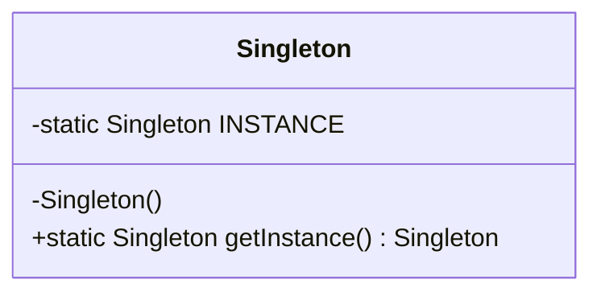
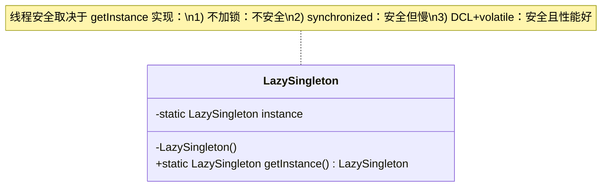
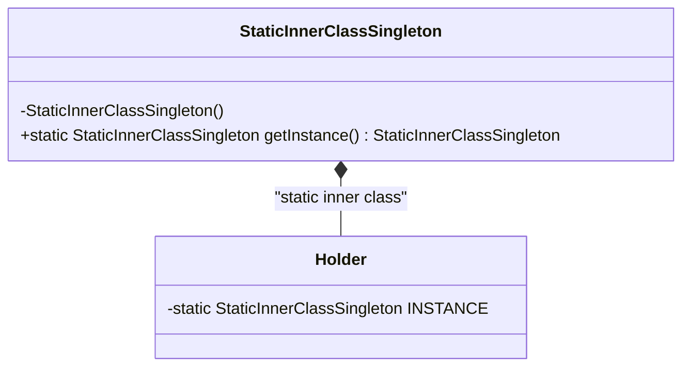
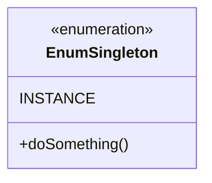
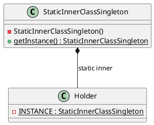
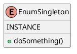

# 单例模式（Singleton Pattern）— 从写法到工程避坑与面试题

> 目标：保证一个类在 JVM 中**只有一个实例**，并提供**全局访问点**。  
> 你会在：配置中心、线程池、连接池、缓存管理器、日志组件、注册表/工厂、框架核心上下文中频繁遇到它。

---

## 1. 为什么需要单例

### 1.1 典型场景

- **全局唯一资源**：线程池、连接池、ID 生成器
- **全局协调者**：配置管理、注册中心 client、缓存管理
- **无状态工具（慎用）**：部分工具类可用静态方法替代

### 1.2 单例的“坑”主要来自哪里

- 并发：懒加载线程不安全
- 反射：绕过私有构造器，强行 new
- 序列化：反序列化绕过 getInstance 造新对象
- 生命周期：类加载/初始化时机导致启动副作用

---

## 2. 单例实现总览（先看结论）

| 实现方式                    | 线程安全 | 懒加载 | 防反射 | 防序列化 | 推荐场景           |
| --------------------------- | -------- | ------ | ------ | -------- | ------------------ |
| 饿汉式（静态变量）          | ✅       | ❌     | ❌     | ❌       | 轻量对象、启动必用 |
| 饿汉式（静态代码块）        | ✅       | ❌     | ❌     | ❌       | 初始化需要复杂逻辑 |
| 饿汉式 枚举单例（终极安全） | ✅       | ❌     | ✅     | ✅       | 安全性优先         |
| 懒汉式（不加锁）            | ❌       | ✅     | ❌     | ❌       | 教学反例           |
| 懒汉式（synchronized）      | ✅       | ✅     | ❌     | ❌       | 低并发/简单场景    |
| 懒汉式 DCL + volatile       | ✅       | ✅     | ❌     | ❌       | 需要懒加载 + 性能  |
| 懒汉式 静态内部类（推荐）   | ✅       | ✅     | ❌     | ❌       | 工程首选           |

---

## 3. 饿汉式（Eager Initialization）

### 3.1 静态成员变量（最常见）

```java
public class EagerStaticSingleton {
    private static final EagerStaticSingleton INSTANCE = new EagerStaticSingleton();
    private EagerStaticSingleton() {}
    public static EagerStaticSingleton getInstance() { return INSTANCE; }
}
```

特点

- 类加载时初始化，JVM 保证线程安全
- 简单稳定，但不能懒加载，可能浪费资源

---

### 3.2 静态代码块（可写复杂初始化）

```java
public class EagerStaticBlockSingleton {
    private static EagerStaticBlockSingleton instance;
    static { instance = new EagerStaticBlockSingleton(); }
    private EagerStaticBlockSingleton() {}
    public static EagerStaticBlockSingleton getInstance() { return instance; }
}
```

和 3.1 的区别

- 3.1 更简洁，语义更集中
- 3.2 适合：需要 try/catch、日志、读取配置、多步构造等

---

## 4. 懒汉式（Lazy Initialization）

### 4.1 线程不安全（教学反例）

```java
public class LazyUnsafeSingleton {
    private static LazyUnsafeSingleton instance;
    private LazyUnsafeSingleton() {}
    public static LazyUnsafeSingleton getInstance() {
        if (instance == null) instance = new LazyUnsafeSingleton();
        return instance;
    }
}
```

问题

- 多线程下可能创建多个实例，单例失效

---

### 4.2 synchronized（安全但性能一般）

```java
public class LazySynchronizedSingleton {
    private static LazySynchronizedSingleton instance;
    private LazySynchronizedSingleton() {}
    public static synchronized LazySynchronizedSingleton getInstance() {
        if (instance == null) instance = new LazySynchronizedSingleton();
        return instance;
    }
}
```

---

### 4.3 DCL + volatile（面试高频）

```java
public class LazyDclSingleton {
    private static volatile LazyDclSingleton instance;
    private LazyDclSingleton() {}

    public static LazyDclSingleton getInstance() {
        if (instance == null) {
            synchronized (LazyDclSingleton.class) {
                if (instance == null) {
                    instance = new LazyDclSingleton();
                }
            }
        }
        return instance;
    }

}
```

为什么必须 volatile

- 防止指令重排导致“引用已赋值但对象未初始化完成”
- 保障可见性 + 有序性

---

### 4.4 静态内部类（工程首选）

```java
public class StaticInnerClassSingleton {
    private StaticInnerClassSingleton() {}

    private static class Holder {
        private static final StaticInnerClassSingleton INSTANCE = new StaticInnerClassSingleton();
    }

    public static StaticInnerClassSingleton getInstance() {
        return Holder.INSTANCE;
    }

}
```

优点

- 懒加载（只有首次调用 getInstance 才触发 Holder 加载）
- JVM 类初始化保证线程安全
- 无锁，性能好、实现干净

---

## 5. 枚举单例（最安全实现）

```java
public enum EnumSingleton {
    INSTANCE;

    public void doSomething() {}

}
```

为什么说它“最强”

- JVM 禁止反射创建枚举实例（天然防反射）
- 枚举序列化由 JVM 保证（天然防反序列化造新对象）
- 线程安全由 JVM 类初始化保障

不足

- 非懒加载
- 不能继承（扩展性不如静态内部类）

---

## 6. 如何破坏单例：反射 & 序列化

### 6.1 反射破坏（对普通单例通用）

```java
import java.lang.reflect.Constructor;

public class ReflectionBreakDemo {
    static class Singleton {
        private static final Singleton INSTANCE = new Singleton();
        private Singleton() {}
        public static Singleton getInstance() { return INSTANCE; }
    }

    public static void main(String[] args) throws Exception {
        Singleton s1 = Singleton.getInstance();

        Constructor<Singleton> c = Singleton.class.getDeclaredConstructor();
        c.setAccessible(true);
        Singleton s2 = c.newInstance();

        System.out.println(s1 == s2); // false
    }

}
```

常见防守（普通类单例）

```java
public class ReflectionSafeSingleton {
    private static final ReflectionSafeSingleton INSTANCE = new ReflectionSafeSingleton();
    private static boolean initialized = false;

    private ReflectionSafeSingleton() {
        if (initialized) throw new RuntimeException("No reflection allowed");
        initialized = true;
    }

    public static ReflectionSafeSingleton getInstance() { return INSTANCE; }

}
```

最强防反射方案：枚举单例

---

### 6.2 序列化破坏（前提：实现 Serializable）

```java
import java.io.*;

public class SerializationBreakDemo {
    static class S implements Serializable {
        private static final long serialVersionUID = 1L;
        private static final S INSTANCE = new S();
        private S() {}
        public static S getInstance() { return INSTANCE; }
    }

    public static void main(String[] args) throws Exception {
        S s1 = S.getInstance();

        ByteArrayOutputStream bos = new ByteArrayOutputStream();
        new ObjectOutputStream(bos).writeObject(s1);

        ObjectInputStream ois = new ObjectInputStream(new ByteArrayInputStream(bos.toByteArray()));
        S s2 = (S) ois.readObject();

        System.out.println(s1 == s2); // false
    }

}
```

修复：readResolve

```java
private Object readResolve() {
    return INSTANCE;
}
```

更优策略：根本不需要序列化就别实现 Serializable

- 不实现 Serializable => 直接抛 NotSerializableException => 攻击面不存在
  可再加“防御式声明”（可选）：

```java
private void writeObject(ObjectOutputStream oos) throws NotSerializableException {
    throw new NotSerializableException();
}
```

---

## 7. UML 类图（覆盖你实现的关键版本）

说明：为了“能在 GitHub/Markdown 中渲染”，这里用 Mermaid classDiagram。
如果你用 PlantUML，我也给了 PlantUML 版本（见 7.2）。

### 7.1 Mermaid（推荐直接放 README/文档）

#### 7.1.1 饿汉式（静态变量/静态代码块）— 结构一致



#### 7.1.2 懒汉式（线程不安全 / synchronized / DCL）— 结构一致，关注 getInstance 内部逻辑



#### 7.1.3 静态内部类



#### 7.1.4 枚举单例



---

### 7.2 PlantUML（如果你项目用 PlantUML 渲染）

#### 7.2.1 静态内部类



#### 7.2.2 枚举单例



---

## 8. 面试 Checklist（按“问法 + 答法要点”整理）

### 8.1 基础定义（必会）

- 单例模式解决什么问题？
- 要点：唯一实例 + 全局访问点，控制资源、统一行为
- 饿汉式 vs 懒汉式区别？
- 要点：创建时机（类加载 vs 首次调用）、线程安全（JVM vs 自己处理）、资源浪费/延迟加载

---

### 8.2 并发与 JVM（高频）

- 为什么饿汉式线程安全？
- 要点：JVM 类初始化 <clinit> 只执行一次，有初始化锁
- 懒汉式为什么线程不安全？举例说明并发创建多个实例
- 要点：两个线程同时通过 if (instance == null)
- DCL 为什么必须加 volatile？
- 要点：防止指令重排 + 可见性；避免拿到“未初始化完成”的对象
- 静态内部类为什么既懒加载又线程安全？
- 要点：Holder 只有首次使用才加载；类初始化线程安全由 JVM 保证

---

### 8.3 反射 / 序列化（加分项）

- 如何用反射破坏单例？
- 要点：getDeclaredConstructor + setAccessible(true) + newInstance()
- 如何防反射？
- 要点：构造器内做“二次创建检测”；终极方案：枚举
- 如何用序列化破坏单例？
- 要点：实现 Serializable 后 readObject() 会造新对象
- 如何防序列化？
- 要点：readResolve()；或者根本不实现 Serializable（更优）
- 为什么枚举单例天然防反射和序列化？
- 要点：JVM 禁止反射创建枚举；枚举反序列化由 JVM 返回同一实例

---

### 8.4 工程实践（面试官很爱问）

- 你在项目里一般选哪种？为什么？
- 推荐回答：
- 工程首选：静态内部类（懒加载、无锁、实现干净）
- 安全性最强：枚举（防反射/序列化）
- 饿汉式适合轻量、启动必用组件
- 单例会不会带来隐患？
- 要点：全局状态、可测试性差、隐藏依赖、初始化副作用、类加载顺序问题

---

## 9. 结论与推荐

- 只要不强制“绝对安全”，工程里静态内部类通常是综合最优解
- 需要“绝对安全”（反射/序列化都挡住），直接用枚举单例
- 不需要序列化就别实现 Serializable（攻击面从根上消失）
