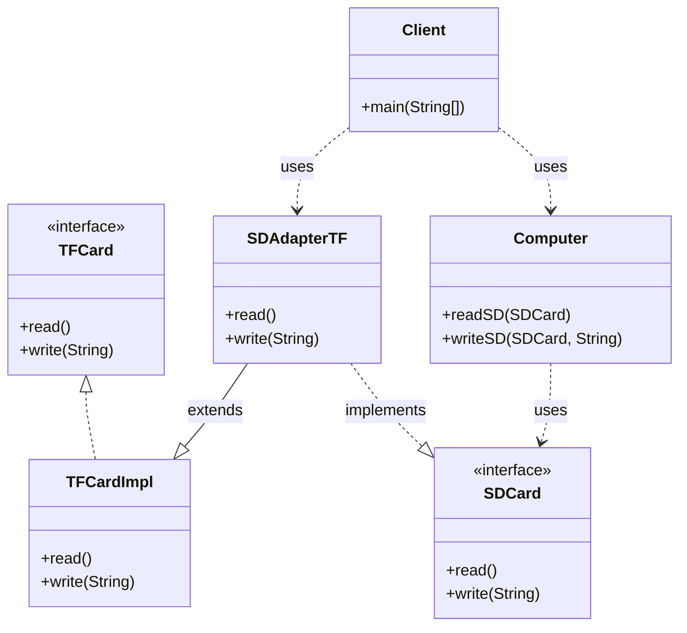
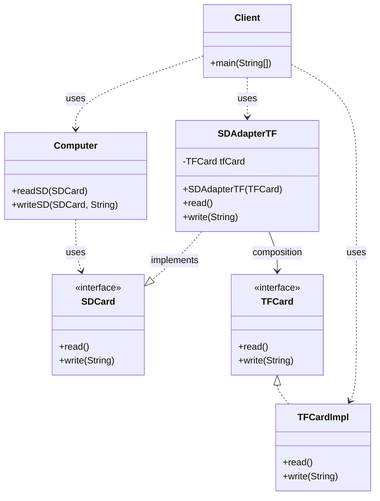
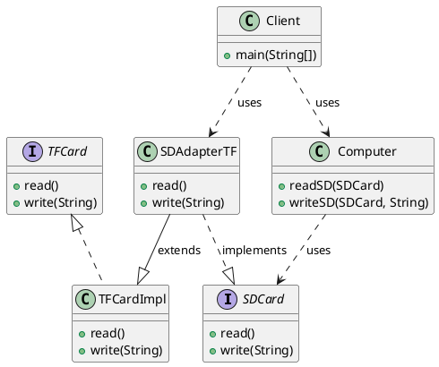
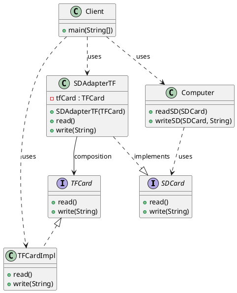

# 适配器模式（Adapter Pattern）—— Computer 示例完整整理

> 目标：将一个类的接口转换成客户希望的另一个接口，使原本接口不兼容的类可以一起工作。  
> 你会在：需要让不兼容的接口协同工作、集成第三方库、系统升级时保持向后兼容、需要复用现有类但接口不匹配的场景中遇到它。

本文通过 Computer（计算机读取存储卡）示例，讲解两种适配器实现方式：

**类适配器 → 对象适配器**

重点回答两个问题：

1. 为什么要引入对象适配器
2. 它解决了什么问题，又引入了什么代价

---

## 1. 为什么需要适配器模式

### 1.1 典型场景

- **接口不兼容**：现有系统的接口与需要集成的类接口不匹配
- **第三方库集成**：需要使用第三方库，但其接口与系统接口不一致
- **系统升级**：新版本接口与旧版本不兼容，需要保持向后兼容
- **复用现有类**：需要复用现有类，但其接口不符合当前需求

### 1.2 适配器模式的核心思想

```
客户端 → 适配器 → 被适配者
```

适配器在客户端和被适配者之间起到转换作用，将不兼容的接口转换为兼容的接口。

---

## 2. 适配器模式实现方式总览

| 实现方式     | 优点                           | 缺点                           | 适用场景                     |
| ------------ | ------------------------------ | ------------------------------ | ---------------------------- |
| 类适配器     | 实现简单、代码量少             | 违反合成复用原则、耦合度高     | 适配器需要访问被适配者的多个方法 |
| 对象适配器   | 符合合成复用原则、灵活、解耦   | 代码量稍多                     | 推荐使用，适合大多数场景     |

---

## 3. 类适配器（Class Adapter）

### 3.1 核心思想

👉 通过**继承**被适配者类，同时实现目标接口，在适配器类中调用父类方法。

### 3.2 示例代码

**目标接口（SDCard）：**

```java
public interface SDCard {
    void read();
    void write(String data);
}
```

**被适配者接口（TFCard）：**

```java
public interface TFCard {
    void read();
    void write(String data);
}
```

**被适配者实现类：**

```java
public class TFCardImpl implements TFCard {
    @Override
    public void read() {
        System.out.println("TFCard read");
    }

    @Override
    public void write(String data) {
        System.out.println("TFCard write: " + data);
    }
}
```

**适配器类：**

```java
/**
 * 类适配器，通过继承的方式实现适配器模式
 * 适配 TF 卡
 * 让计算机和读取 SD 卡一样的读取 TF 卡
 * 违反合成复用原则
 */
public class SDAdapterTF extends TFCardImpl implements SDCard {
    @Override
    public void read() {
        super.read();
    }

    @Override
    public void write(String data) {
        super.write(data);
    }
}
```

**客户端使用：**

```java
public class Client {
    public static void main(String[] args) {
        Computer computer = new Computer();
        computer.readSD(new SDCardImpl());
        computer.writeSD(new SDCardImpl(), "Hello, World!");

        System.out.println("=====================");

        // 通过适配器使用 TF 卡
        computer.readSD(new SDAdapterTF());
        computer.writeSD(new SDAdapterTF(), "Hello, World!");
    }
}
```

### 3.3 类适配器的特点

**优点：**
- ✅ 实现简单，代码量少
- ✅ 可以直接访问被适配者的方法

**缺点：**
- ❌ **违反合成复用原则**：使用继承而不是组合
- ❌ 耦合度高：适配器与被适配者类紧耦合
- ❌ 灵活性差：只能适配一个被适配者类
- ❌ Java 不支持多继承，如果被适配者是类而不是接口，会有问题

### 3.4 适用场景

- 适配器需要访问被适配者的多个方法
- 被适配者是接口或抽象类
- 简单场景，不需要高度解耦

---

## 4. 对象适配器（Object Adapter）

### 4.1 为什么引入对象适配器

类适配器的问题本质是：
- 使用继承，违反合成复用原则
- 耦合度高，不够灵活

对象适配器通过**组合**的方式，将适配器与被适配者解耦。

### 4.2 核心机制

**关键点：**
- 适配器类持有被适配者的引用（组合关系）
- 适配器实现目标接口
- 在适配器方法中调用被适配者的方法

### 4.3 示例代码

**适配器类：**

```java
/**
 * 对象适配器，通过组合的方式实现适配器模式
 * 适配 TF 卡
 * 让计算机和读取 SD 卡一样的读取 TF 卡
 */
public class SDAdapterTF implements SDCard {
    private TFCard tfCard;

    /**
     * 构造函数，只提供有参构造
     * @param tfCard 被适配的对象
     */
    public SDAdapterTF(TFCard tfCard) {
        this.tfCard = tfCard;
    }

    @Override
    public void read() {
        tfCard.read();
    }

    @Override
    public void write(String data) {
        tfCard.write(data);
    }
}
```

**客户端使用：**

```java
public class Client {
    public static void main(String[] args) {
        Computer computer = new Computer();
        computer.readSD(new SDCardImpl());
        computer.writeSD(new SDCardImpl(), "Hello, World!");

        System.out.println("=====================");

        // 通过适配器使用 TF 卡
        SDAdapterTF sdAdapterTF = new SDAdapterTF(new TFCardImpl());
        computer.readSD(sdAdapterTF);
        computer.writeSD(sdAdapterTF, "Hello, World!");
    }
}
```

### 4.4 对象适配器的特点

**优点：**
- ✅ **符合合成复用原则**：使用组合而不是继承
- ✅ 耦合度低：适配器与被适配者解耦
- ✅ 灵活性高：可以适配多个被适配者对象
- ✅ 符合开闭原则：易于扩展

**缺点：**
- ❌ 代码量稍多：需要维护被适配者的引用

### 4.5 适用场景

- **推荐使用**：适合大多数场景
- 需要高度解耦
- 需要适配多个被适配者对象
- 符合面向对象设计原则

---

## 5. 代码结构

本示例包含以下目录结构：

```
adapter/
├── class_adapter/    # 类适配器
│   ├── SDCard.java        # 目标接口
│   ├── TFCard.java        # 被适配者接口
│   ├── Computer.java      # 客户端类
│   ├── SDAdapterTF.java   # 适配器类（继承方式）
│   ├── Client.java        # 客户端
│   └── impl/
│       ├── SDCardImpl.java    # SDCard 实现类
│       └── TFCardImpl.java    # TFCard 实现类
└── object_adapter/  # 对象适配器
    ├── SDCard.java        # 目标接口
    ├── TFCard.java        # 被适配者接口
    ├── Computer.java      # 客户端类
    ├── SDAdapterTF.java   # 适配器类（组合方式）
    ├── Client.java        # 客户端
    └── impl/
        ├── SDCardImpl.java    # SDCard 实现类
        └── TFCardImpl.java    # TFCard 实现类
```

---

## 6. UML 类图

### 6.1 类适配器



### 6.2 对象适配器



### 6.3 PlantUML 类图

#### 类适配器



#### 对象适配器



---

## 7. 两种适配器方式对比

### 7.1 实现方式对比

| 特性           | 类适配器 | 对象适配器 |
| -------------- | -------- | ---------- |
| 实现方式       | 继承     | 组合       |
| 耦合度         | 高       | 低         |
| 灵活性         | 低       | 高         |
| 代码量         | 少       | 稍多       |
| 符合设计原则   | ❌       | ✅         |
| 可扩展性       | 差       | 好         |

### 7.2 使用场景对比

**类适配器：**
- 适配器需要访问被适配者的多个方法
- 简单场景，不需要高度解耦
- 被适配者是接口或抽象类

**对象适配器：**
- **推荐使用**：适合大多数场景
- 需要高度解耦
- 需要适配多个被适配者对象
- 符合面向对象设计原则

---

## 8. 使用场景

### 8.1 适用场景

- ✅ **接口不兼容**：现有系统的接口与需要集成的类接口不匹配
- ✅ **第三方库集成**：需要使用第三方库，但其接口与系统接口不一致
- ✅ **系统升级**：新版本接口与旧版本不兼容，需要保持向后兼容
- ✅ **复用现有类**：需要复用现有类，但其接口不符合当前需求
- ✅ **统一接口**：需要将多个不同的接口统一为一个接口

### 8.2 常见应用

- **Java I/O 流**：`InputStreamReader` 和 `OutputStreamWriter` 是适配器
- **Spring MVC**：`HandlerAdapter` 适配不同的处理器
- **JDBC**：数据库驱动适配器
- **日志框架**：SLF4J 适配不同的日志实现
- **GUI 框架**：适配不同操作系统的 UI 组件

---

## 9. 优缺点分析

### 9.1 适配器模式的优点

- ✅ **解耦**：将客户端与被适配者解耦
- ✅ **复用**：可以复用现有的类，无需修改
- ✅ **灵活**：可以适配多个被适配者
- ✅ **透明**：客户端无需知道适配器的存在

### 9.2 适配器模式的缺点

- ❌ **复杂度增加**：引入适配器层，增加系统复杂度
- ❌ **性能开销**：多一层调用，有轻微性能开销（通常可忽略）
- ❌ **调试困难**：适配器层可能增加调试难度

---

## 10. 与其他模式的关系

### 10.1 与装饰器模式的区别

- **适配器模式**：转换接口，使不兼容的接口可以协同工作
- **装饰器模式**：增强功能，在不改变接口的情况下添加功能

**区别：**
- 适配器模式：接口不同，转换接口
- 装饰器模式：接口相同，增强功能

### 10.2 与代理模式的区别

- **适配器模式**：转换接口，使不兼容的接口可以协同工作
- **代理模式**：控制访问，代理对象和被代理对象是同一个接口

**区别：**
- 适配器模式：接口不同，转换接口
- 代理模式：接口相同，控制访问

### 10.3 与外观模式的区别

- **适配器模式**：转换单个接口，一对一的关系
- **外观模式**：为多个子系统提供统一的接口，一对多的关系

**区别：**
- 适配器模式：适配一个接口
- 外观模式：封装多个接口

---

## 11. 面试要点

### 11.1 基础问题

- **适配器模式解决什么问题？**
  - 要点：解决接口不兼容的问题，使不兼容的接口可以协同工作

- **类适配器和对象适配器的区别？**
  - 要点：类适配器使用继承，对象适配器使用组合；对象适配器更灵活，符合设计原则

- **为什么推荐使用对象适配器？**
  - 要点：符合合成复用原则，耦合度低，灵活性高

### 11.2 实现细节

- **类适配器如何实现？**
  - 要点：继承被适配者类，实现目标接口，调用父类方法

- **对象适配器如何实现？**
  - 要点：持有被适配者的引用，实现目标接口，调用被适配者的方法

- **适配器模式与装饰器模式的区别？**
  - 要点：适配器转换接口，装饰器增强功能

### 11.3 实践问题

- **什么时候使用适配器模式？**
  - 要点：接口不兼容、集成第三方库、系统升级保持兼容

- **适配器模式在哪些框架中有应用？**
  - 要点：Spring MVC、JDBC、日志框架、Java I/O 流

- **如何选择类适配器还是对象适配器？**
  - 要点：推荐使用对象适配器，除非有特殊需求

---

## 12. 总结

适配器模式是一个**非常实用**的设计模式，它解决了接口不兼容的核心问题：

**核心价值：**

1. **解耦**：将客户端与被适配者解耦
2. **复用**：可以复用现有的类，无需修改
3. **灵活**：可以适配多个被适配者
4. **透明**：客户端无需知道适配器的存在

**模式演进：**

```
类适配器（继承方式）
  ↓ (问题：违反合成复用原则、耦合度高)
对象适配器（组合方式）
```

**最佳实践：**

- **推荐使用对象适配器**：符合设计原则，更灵活
- 类适配器：仅在简单场景或特殊需求时使用
- 保持适配器简单：只负责接口转换，不要添加额外逻辑

**一句话总结：**

> 当接口不兼容时，用适配器模式在客户端和被适配者之间添加一个转换层，让不兼容的接口可以协同工作。
