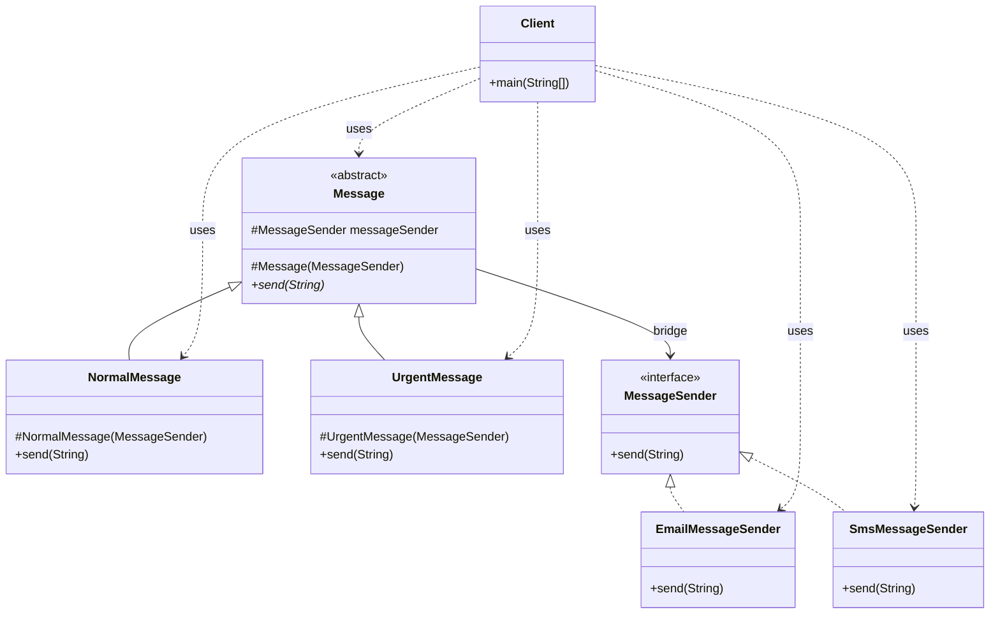
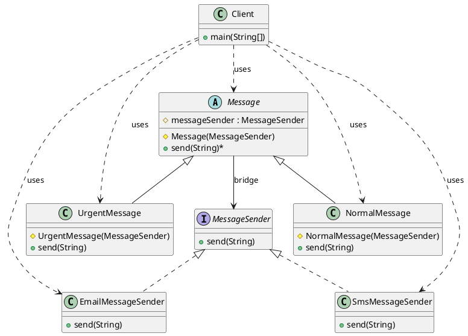

# 桥接模式（Bridge Pattern）—— Message 示例完整整理

> 目标：将抽象与实现分离，使它们可以独立变化。桥接模式通过组合的方式，让抽象和实现可以独立扩展，而不影响对方。  
> 你会在：需要将抽象和实现解耦、需要在多个维度上扩展类、需要避免类爆炸的场景中遇到它。

本文通过 Message（消息发送）示例，讲解桥接模式的实现：

**抽象化 → 扩展抽象化 → 实现化 → 具体实现化**

重点回答两个问题：

1. 桥接模式如何实现抽象与实现的分离
2. 它解决了什么问题，又引入了什么代价

---

## 1. 为什么需要桥接模式

### 1.1 典型场景

- **多维度变化**：一个类需要在多个维度上变化（如：消息类型 × 发送方式）
- **避免类爆炸**：如果使用继承，会产生大量子类（如：普通邮件消息、紧急邮件消息、普通短信消息、紧急短信消息...）
- **解耦抽象与实现**：需要将抽象和实现分离，使它们可以独立变化
- **运行时切换**：需要在运行时切换不同的实现

### 1.2 桥接模式的核心思想

```
抽象化（Abstraction） ←→ 桥接（Bridge） ←→ 实现化（Implementation）
```

桥接模式通过组合的方式，将抽象和实现分离：
- 抽象化持有实现化的引用（组合关系）
- 抽象和实现可以独立变化
- 可以在运行时动态切换实现

---

## 2. 桥接模式结构总览

| 角色               | 说明                           | 示例                    |
| ------------------ | ------------------------------ | ----------------------- |
| Abstraction        | 抽象化，定义抽象接口            | `Message`               |
| RefinedAbstraction | 扩展抽象化，扩展抽象接口        | `NormalMessage`、`UrgentMessage` |
| Implementor        | 实现化，定义实现接口            | `MessageSender`         |
| ConcreteImplementor | 具体实现化，实现具体功能        | `EmailMessageSender`、`SmsMessageSender` |

---

## 3. 核心组件

### 3.1 抽象化（Abstraction）

**抽象类定义：**

```java
/**
 * 消息
 */
public abstract class Message {
    protected MessageSender messageSender; // 消息发送者

    protected Message(MessageSender messageSender) {
        this.messageSender = messageSender;
    }

    public abstract void send(String message);  // 抽象方法
}
```

**说明：**
- 定义抽象接口
- 持有实现化（`MessageSender`）的引用（组合关系）
- 这是桥接模式的核心：通过组合而不是继承来连接抽象和实现

### 3.2 扩展抽象化（RefinedAbstraction）

**普通消息：**

```java
/**
 * 普通消息
 */
public class NormalMessage extends Message {
    protected NormalMessage(MessageSender messageSender) {
        super(messageSender);
    }

    @Override
    public void send(String message) {
        messageSender.send("[普通]" + message);
    }
}
```

**紧急消息：**

```java
/**
 * 紧急消息
 */
public class UrgentMessage extends Message {
    protected UrgentMessage(MessageSender messageSender) {
        super(messageSender);
    }

    @Override
    public void send(String message) {
        messageSender.send("[紧急] " + message);
    }
}
```

**说明：**
- 继承抽象化类
- 扩展抽象接口的功能
- 在方法中调用实现化的方法

---

## 4. 实现化组件

### 4.1 实现化（Implementor）

**接口定义：**

```java
public interface MessageSender {
    void send(String message);
}
```

**说明：**
- 定义实现接口
- 与抽象化接口分离，可以独立变化

### 4.2 具体实现化（ConcreteImplementor）

**邮件发送器：**

```java
public class EmailMessageSender implements MessageSender {
    @Override
    public void send(String message) {
        System.out.println("邮件发送: " + message);
    }
}
```

**短信发送器：**

```java
public class SmsMessageSender implements MessageSender {
    @Override
    public void send(String message) {
        System.out.println("短信发送: " + message);
    }
}
```

**说明：**
- 实现实现化接口
- 提供具体的实现逻辑
- 可以独立扩展，不影响抽象化

---

## 5. 使用示例

### 5.1 基本使用

```java
public class Client {
    public static void main(String[] args) {
        // 使用邮件发送普通消息
        MessageSender emailSender = new EmailMessageSender();
        Message normalMessage = new NormalMessage(emailSender);
        normalMessage.send("普通消息");
        // 输出: 邮件发送: [普通]普通消息

        // 使用邮件发送紧急消息
        Message urgentMessage = new UrgentMessage(emailSender);
        urgentMessage.send("紧急消息");
        // 输出: 邮件发送: [紧急] 紧急消息

        // 使用短信发送普通消息
        MessageSender smsSender = new SmsMessageSender();
        normalMessage = new NormalMessage(smsSender);
        normalMessage.send("普通消息");
        // 输出: 短信发送: [普通]普通消息

        // 使用短信发送紧急消息
        urgentMessage = new UrgentMessage(smsSender);
        urgentMessage.send("紧急消息");
        // 输出: 短信发送: [紧急] 紧急消息
    }
}
```

### 5.2 灵活组合

```java
// 可以任意组合抽象化和实现化
Message message1 = new NormalMessage(new EmailMessageSender());   // 普通 + 邮件
Message message2 = new UrgentMessage(new EmailMessageSender());   // 紧急 + 邮件
Message message3 = new NormalMessage(new SmsMessageSender());     // 普通 + 短信
Message message4 = new UrgentMessage(new SmsMessageSender());    // 紧急 + 短信

// 运行时切换实现
MessageSender sender = new EmailMessageSender();
Message msg = new NormalMessage(sender);
msg.send("消息1");

sender = new SmsMessageSender();  // 切换实现
msg = new NormalMessage(sender);
msg.send("消息2");
```

---

## 6. 代码结构

本示例包含以下目录结构：

```
bridge/
├── Message.java              # 抽象化（抽象类）
├── NormalMessage.java        # 扩展抽象化（普通消息）
├── UrgentMessage.java        # 扩展抽象化（紧急消息）
├── MessageSender.java        # 实现化（接口）
├── EmailMessageSender.java   # 具体实现化（邮件发送）
├── SmsMessageSender.java     # 具体实现化（短信发送）
└── Client.java               # 客户端
```

---

## 7. UML 类图

### 7.1 Mermaid 类图



### 7.2 PlantUML 类图



---

## 8. 桥接模式的特点

### 8.1 优点

- ✅ **解耦抽象与实现**：抽象和实现可以独立变化，互不影响
- ✅ **避免类爆炸**：不需要为每种组合创建子类
- ✅ **灵活扩展**：可以独立扩展抽象化和实现化
- ✅ **运行时切换**：可以在运行时动态切换实现
- ✅ **符合开闭原则**：对扩展开放，对修改关闭

### 8.2 缺点

- ❌ **复杂度增加**：引入桥接层，增加系统复杂度
- ❌ **理解难度**：需要理解抽象和实现的分离概念
- ❌ **设计难度**：需要正确识别抽象和实现的维度

---

## 9. 使用场景

### 9.1 适用场景

- ✅ **多维度变化**：一个类需要在多个维度上变化
- ✅ **避免类爆炸**：如果使用继承会产生大量子类
- ✅ **解耦抽象与实现**：需要将抽象和实现分离
- ✅ **运行时切换**：需要在运行时切换不同的实现
- ✅ **独立扩展**：抽象和实现需要独立扩展

### 9.2 常见应用

- **GUI 框架**：窗口类型（抽象）和窗口实现（实现）的分离
- **数据库驱动**：SQL 类型（抽象）和数据库实现（实现）的分离
- **消息系统**：消息类型（抽象）和发送方式（实现）的分离
- **图形绘制**：图形类型（抽象）和绘制引擎（实现）的分离

---

## 10. 与其他模式的关系

### 10.1 与适配器模式的区别

- **桥接模式**：分离抽象和实现，使它们可以独立变化
- **适配器模式**：转换接口，使不兼容的接口可以协同工作

**区别：**
- 桥接模式：设计时使用，分离抽象和实现
- 适配器模式：运行时使用，转换不兼容的接口

### 10.2 与策略模式的区别

- **桥接模式**：分离抽象和实现，关注结构
- **策略模式**：封装算法，关注行为

**区别：**
- 桥接模式：结构型模式，分离抽象和实现
- 策略模式：行为型模式，封装算法

### 10.3 与继承的区别

**使用继承的问题：**
- 会产生大量子类（如：普通邮件消息、紧急邮件消息、普通短信消息、紧急短信消息...）
- 抽象和实现耦合，难以独立变化
- 难以在运行时切换实现

**桥接模式的优势：**
- 不需要创建大量子类
- 抽象和实现解耦，可以独立变化
- 可以在运行时动态切换实现

---

## 11. 面试要点

### 11.1 基础问题

- **桥接模式解决什么问题？**
  - 要点：将抽象与实现分离，使它们可以独立变化，避免类爆炸

- **桥接模式如何实现？**
  - 要点：抽象化持有实现化的引用（组合关系），通过组合而不是继承来连接抽象和实现

- **桥接模式和继承的区别？**
  - 要点：桥接模式使用组合，避免类爆炸；继承会产生大量子类

### 11.2 实现细节

- **桥接模式的核心是什么？**
  - 要点：抽象化持有实现化的引用，通过组合关系连接抽象和实现

- **为什么桥接模式可以避免类爆炸？**
  - 要点：通过组合的方式，可以灵活组合抽象化和实现化，不需要为每种组合创建子类

- **桥接模式和适配器模式的区别？**
  - 要点：桥接模式是设计时使用，分离抽象和实现；适配器模式是运行时使用，转换接口

### 11.3 实践问题

- **什么时候使用桥接模式？**
  - 要点：多维度变化、避免类爆炸、需要解耦抽象与实现

- **桥接模式在哪些框架中有应用？**
  - 要点：GUI 框架、数据库驱动、消息系统、图形绘制

- **如何识别桥接模式的应用场景？**
  - 要点：识别多个变化的维度，将抽象和实现分离

---

## 12. 总结

桥接模式是一个**非常重要的结构型设计模式**，它解决了抽象与实现分离的核心问题：

**核心价值：**

1. **解耦**：将抽象与实现分离，使它们可以独立变化
2. **灵活**：可以灵活组合抽象化和实现化
3. **避免类爆炸**：不需要为每种组合创建子类
4. **运行时切换**：可以在运行时动态切换实现

**模式特点：**

```
抽象化（Message）
  ↓ (持有引用)
实现化（MessageSender）
  ↓
扩展抽象化（NormalMessage、UrgentMessage）
  ↓
具体实现化（EmailMessageSender、SmsMessageSender）
```

**最佳实践：**

- 识别多个变化的维度
- 将抽象和实现分离
- 使用组合而不是继承
- 保持抽象化和实现化的独立性

**一句话总结：**

> 当需要在多个维度上变化时，用桥接模式将抽象与实现分离，通过组合的方式连接它们，让代码更灵活、更易扩展。
