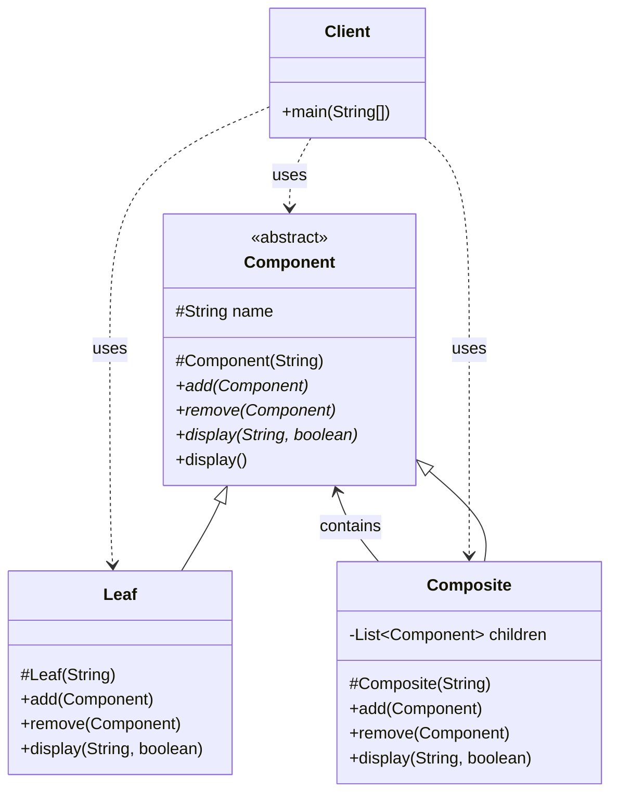
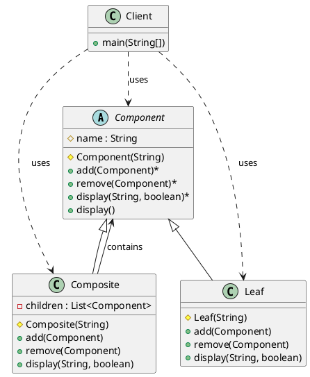

# 组合模式（Composite Pattern）—— Component 示例完整整理

> 目标：将对象组合成树形结构以表示"部分-整体"的层次结构。组合模式使得用户对单个对象和组合对象的使用具有一致性。  
> 你会在：需要表示树形结构、需要统一处理单个对象和组合对象、需要递归处理对象的场景中遇到它。

本文通过 Component（树形结构）示例，讲解组合模式的实现：

**抽象组件 → 叶子节点 → 容器节点**

重点回答两个问题：

1. 组合模式如何实现部分-整体的层次结构
2. 它解决了什么问题，又引入了什么代价

---

## 1. 为什么需要组合模式

### 1.1 典型场景

- **树形结构**：需要表示具有层次关系的对象结构（如文件系统、组织架构、菜单树）
- **统一处理**：需要统一处理单个对象和组合对象，客户端无需区分
- **递归操作**：需要对整个树形结构进行递归操作（如遍历、搜索、统计）
- **动态组合**：需要在运行时动态组合对象

### 1.2 组合模式的核心思想

```
抽象组件（Component）
  ├─ 叶子节点（Leaf）- 没有子节点
  └─ 容器节点（Composite）- 包含子节点
```

组合模式通过统一的接口，让客户端可以一致地处理单个对象和组合对象。

### 1.3 组合模式 vs 直接定义 TreeNode

**直接定义 TreeNode 的方式：**

```java
// 简单但不够灵活的方式
public class TreeNode {
    private String name;
    private List<TreeNode> children;
    
    public TreeNode(String name) {
        this.name = name;
        this.children = new ArrayList<>();
    }
    
    public void add(TreeNode node) {
        children.add(node);
    }
    
    public void display() {
        System.out.println(name);
        for (TreeNode child : children) {
            child.display();
        }
    }
}
```

**组合模式 vs TreeNode 的区别：**

| 特性           | 组合模式（Component/Leaf/Composite） | 直接定义 TreeNode |
| -------------- | ------------------------------------ | ----------------- |
| **类型区分**   | ✅ 区分叶子节点和容器节点             | ❌ 所有节点类型相同 |
| **行为差异**   | ✅ 叶子节点和容器节点可以有不同的行为 | ❌ 所有节点行为相同 |
| **类型安全**   | ✅ 编译时类型检查                     | ❌ 运行时才能发现错误 |
| **扩展性**     | ✅ 易于扩展新的节点类型               | ❌ 难以扩展新类型 |
| **语义清晰**   | ✅ 明确区分叶子节点和容器节点         | ❌ 语义不够清晰 |
| **实现复杂度** | ❌ 需要多个类                         | ✅ 只需要一个类 |
| **适用场景**   | ✅ 需要区分叶子节点和容器节点         | ✅ 简单的树形结构 |

**组合模式的优势场景：**

1. **需要区分叶子节点和容器节点**：
   - 文件系统中，文件（叶子）和文件夹（容器）的行为不同
   - 组织架构中，员工（叶子）和部门（容器）的行为不同

2. **需要不同的行为**：
   - 叶子节点不支持添加子节点
   - 容器节点支持添加、删除子节点

3. **需要类型安全**：
   - 编译时就能发现类型错误
   - 避免运行时错误

**TreeNode 的适用场景：**

- 简单的树形结构，所有节点行为相同
- 不需要区分叶子节点和容器节点
- 快速原型开发

**示例对比：**

```java
// 使用 TreeNode（所有节点类型相同）
TreeNode node1 = new TreeNode("Node1");
TreeNode node2 = new TreeNode("Node2");
node1.add(node2);  // 可以添加，但语义不清晰

// 使用组合模式（区分叶子节点和容器节点）
Component leaf = new Leaf("Leaf");
Component composite = new Composite("Composite");
composite.add(leaf);  // 语义清晰：容器添加叶子节点
leaf.add(composite);  // 编译通过，但运行时会抛出异常（类型安全）
```

---

## 2. 组合模式结构总览

| 角色           | 说明                           | 示例                    |
| -------------- | ------------------------------ | ----------------------- |
| Component      | 抽象组件，定义统一接口          | `Component`            |
| Leaf           | 叶子节点，没有子节点            | `Leaf`                  |
| Composite      | 容器节点，包含子节点            | `Composite`            |
| Client         | 客户端，使用组件                | `Client`                |

---

## 3. 核心组件

### 3.1 抽象组件（Component）

**抽象类定义：**

```java
/**
 * 抽象构建
 */
public abstract class Component {
    protected String name;

    protected Component(String name) {
        this.name = name;
    }

    // 透明模式：定义一系列方法，子类必须实现这些方法，但是对于某些子类来说，这些方法是不适用的，比如叶子节点
    // 安全模式：不定义方法，子类可以选择实现自己要实现哪些方法，但是每个子类的方法可能不同
    public abstract void add(Component composite);
    public abstract void remove(Component composite);

    /**
     * 显示节点名称，并递归显示子节点
     * @param prefix 前缀字符串（用于树形结构显示）
     * @param isLast 是否为最后一个子节点
     */
    public abstract void display(String prefix, boolean isLast);
    
    /**
     * 显示节点（默认方法，从根节点开始）
     */
    public void display() {
        display("", true);
    }
}
```

**说明：**
- 定义统一的接口，包括添加、删除、显示等方法
- 采用**透明模式**：在抽象类中定义所有方法，子类必须实现
- 叶子节点对于不适用的方法会抛出异常

---

## 4. 叶子节点（Leaf）

### 4.1 叶子节点实现

```java
/**
 * 叶子节点
 */
public class Leaf extends Component {
    protected Leaf(String name) {
        super(name);
    }

    @Override
    public void add(Component component) {
        throw new UnsupportedOperationException("叶子节点不能添加子节点");
    }

    @Override
    public void remove(Component component) {
        throw new UnsupportedOperationException("叶子节点不能删除子节点");
    }

    @Override
    public void display(String prefix, boolean isLast) {
        // 打印叶子节点
        System.out.println(prefix + (isLast ? "└─ " : "├─ ") + name + " (Leaf)");
    }
}
```

**关键点：**
- 叶子节点没有子节点
- `add()` 和 `remove()` 方法抛出异常，因为叶子节点不支持这些操作
- `display()` 方法只显示自身，不递归

---

## 5. 容器节点（Composite）

### 5.1 容器节点实现

```java
/**
 * 容器节点
 */
public class Composite extends Component {
    private List<Component> children = new ArrayList<>();

    protected Composite(String name) {
        super(name);
    }

    @Override
    public void add(Component component) {
        children.add(component);
    }

    @Override
    public void remove(Component component) {
        children.remove(component);
    }

    @Override
    public void display(String prefix, boolean isLast) {
        // 打印当前节点
        System.out.println(prefix + (isLast ? "└─ " : "├─ ") + name + " (Composite)");
        
        // 递归打印子节点
        String childPrefix = prefix + (isLast ? "   " : "│  ");
        for (int i = 0; i < children.size(); i++) {
            boolean isLastChild = (i == children.size() - 1);
            children.get(i).display(childPrefix, isLastChild);
        }
    }
}
```

**关键点：**
- 容器节点包含子节点列表
- `add()` 和 `remove()` 方法操作子节点列表
- `display()` 方法递归显示所有子节点
- 使用树形结构符号（`├─`、`└─`、`│`）美化输出

---

## 6. 使用示例

### 6.1 基本使用

```java
public class Client {
    public static void main(String[] args) {
        Composite root = new Composite("Root");
        root.add(new Leaf("Leaf A"));
        root.add(new Leaf("Leaf B"));

        Composite composite = new Composite("X");
        composite.add(new Leaf("Leaf XA"));
        composite.add(new Leaf("Leaf XB"));
        composite.add(new Composite("Composite XC"));
        
        root.add(composite);

        Composite composite2 = new Composite("XY");
        composite2.add(new Leaf("Leaf XYA"));
        composite2.add(new Leaf("Leaf XYB"));

        composite.add(composite2);
        root.display();
    }
}
```

**输出：**

```
└─ Root (Composite)
   ├─ Leaf A (Leaf)
   ├─ Leaf B (Leaf)
   └─ X (Composite)
      ├─ Leaf XA (Leaf)
      ├─ Leaf XB (Leaf)
      ├─ Composite XC (Composite)
      └─ XY (Composite)
         ├─ Leaf XYA (Leaf)
         └─ Leaf XYB (Leaf)
```

### 6.2 统一处理

```java
// 客户端无需区分叶子节点和容器节点
Component component1 = new Leaf("Leaf");
Component component2 = new Composite("Composite");

// 统一接口调用
component1.display();
component2.display();

// 容器节点可以添加子节点
component2.add(component1);
```

---

## 7. 代码结构

本示例包含以下目录结构：

```
composite/
├── Component.java    # 抽象组件（抽象类）
├── Leaf.java        # 叶子节点
├── Composite.java   # 容器节点
└── Client.java      # 客户端
```

---

## 8. UML 类图

### 8.1 Mermaid 类图



### 8.2 PlantUML 类图



---

## 9. 组合模式的特点

### 9.1 优点

- ✅ **统一处理**：客户端可以一致地处理单个对象和组合对象
- ✅ **灵活扩展**：可以轻松添加新的组件类型
- ✅ **树形结构**：自然地表示树形结构
- ✅ **递归操作**：方便对整个树形结构进行递归操作
- ✅ **符合开闭原则**：对扩展开放，对修改关闭

### 9.2 缺点

- ❌ **设计复杂**：需要区分叶子节点和容器节点
- ❌ **透明模式问题**：叶子节点需要实现不适用的方法（抛出异常）
- ❌ **类型检查**：在某些场景下可能需要类型检查

---

## 10. 透明模式 vs 安全模式

### 10.1 透明模式（本示例采用）

**特点：**
- 在抽象类中定义所有方法
- 子类必须实现所有方法
- 叶子节点对不适用的方法抛出异常

**优点：**
- 客户端无需类型检查
- 接口统一，使用简单

**缺点：**
- 叶子节点需要实现不适用的方法
- 运行时才能发现错误

### 10.2 安全模式

**特点：**
- 不在抽象类中定义管理子节点的方法
- 只在 `Composite` 中定义 `add()`、`remove()` 等方法
- 客户端需要类型检查

**优点：**
- 编译时就能发现错误
- 叶子节点不需要实现不适用的方法

**缺点：**
- 客户端需要类型检查
- 接口不统一，使用复杂

---

## 11. 使用场景

### 11.1 适用场景

- ✅ **树形结构**：需要表示具有层次关系的对象结构
- ✅ **统一处理**：需要统一处理单个对象和组合对象
- ✅ **递归操作**：需要对整个树形结构进行递归操作
- ✅ **动态组合**：需要在运行时动态组合对象

### 11.2 常见应用

- **文件系统**：文件和文件夹的统一处理
- **组织架构**：员工和部门的层次结构
- **菜单系统**：菜单项和子菜单的统一处理
- **图形界面**：窗口和控件的层次结构
- **XML/JSON 解析**：元素和节点的树形结构

---

## 12. 与其他模式的关系

### 12.1 与装饰器模式的区别

- **组合模式**：表示部分-整体的层次结构
- **装饰器模式**：动态添加功能，可以叠加

**区别：**
- 组合模式：树形结构，部分-整体关系
- 装饰器模式：链式结构，功能叠加

### 12.2 与迭代器模式的关系

- **组合模式**：定义树形结构
- **迭代器模式**：遍历树形结构

**结合使用：**
- 组合模式定义结构，迭代器模式遍历结构

### 12.3 与访问者模式的关系

- **组合模式**：定义树形结构
- **访问者模式**：对树形结构进行操作

**结合使用：**
- 组合模式定义结构，访问者模式定义操作

---

## 13. 面试要点

### 13.1 基础问题

- **组合模式解决什么问题？**
  - 要点：表示部分-整体的层次结构，统一处理单个对象和组合对象

- **透明模式和安全模式的区别？**
  - 要点：透明模式在抽象类中定义所有方法，安全模式只在容器节点中定义管理方法

- **组合模式如何实现？**
  - 要点：抽象组件定义统一接口，叶子节点和容器节点实现接口，容器节点包含子节点列表

### 13.2 实现细节

- **组合模式的核心是什么？**
  - 要点：统一的接口，让客户端可以一致地处理单个对象和组合对象

- **为什么叶子节点的 add/remove 方法抛出异常？**
  - 要点：透明模式的要求，叶子节点不支持这些操作，但必须实现接口

- **组合模式和装饰器模式的区别？**
  - 要点：组合模式是树形结构，装饰器模式是链式结构

### 13.3 实践问题

- **什么时候使用组合模式？**
  - 要点：需要表示树形结构、需要统一处理单个对象和组合对象

- **组合模式在哪些框架中有应用？**
  - 要点：文件系统、组织架构、菜单系统、图形界面、XML/JSON 解析

- **如何优化组合模式的性能？**
  - 要点：缓存计算结果、延迟加载、使用迭代器模式遍历

---

## 14. 总结

组合模式是一个**非常重要的结构型设计模式**，它解决了表示部分-整体层次结构的核心问题：

**核心价值：**

1. **统一处理**：客户端可以一致地处理单个对象和组合对象
2. **树形结构**：自然地表示树形结构
3. **递归操作**：方便对整个树形结构进行递归操作
4. **灵活扩展**：可以轻松添加新的组件类型

**模式特点：**

```
抽象组件（Component）
  ├─ 叶子节点（Leaf）- 没有子节点
  └─ 容器节点（Composite）- 包含子节点列表
```

**最佳实践：**

- 需要表示树形结构时使用组合模式
- 需要统一处理单个对象和组合对象时使用组合模式
- 根据需求选择透明模式或安全模式
- 保持接口简洁，避免过度设计

**一句话总结：**

> 当需要表示部分-整体的层次结构时，用组合模式通过统一的接口处理单个对象和组合对象，让代码更灵活、更易扩展。
