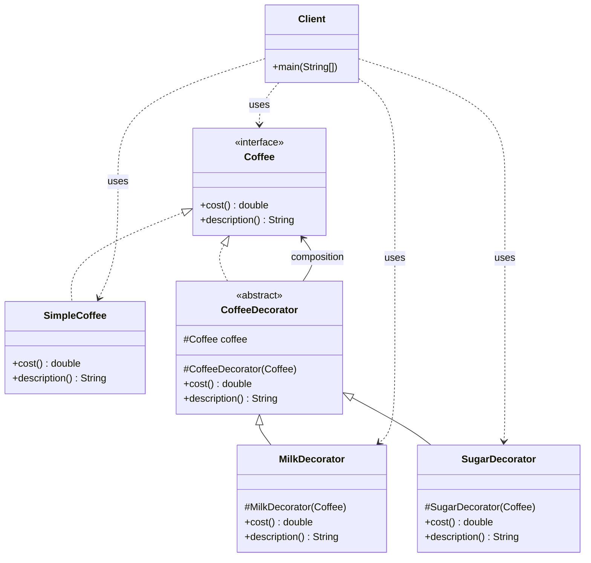
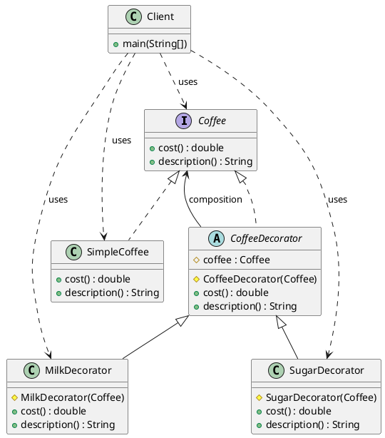

# 装饰器模式（Decorator Pattern）—— Coffee 示例完整整理

> 目标：动态地给一个对象添加一些额外的职责，就增加功能来说，装饰器模式比生成子类更为灵活。  
> 你会在：需要在不修改原有类的情况下动态扩展功能、需要为对象添加多个可选功能、需要灵活组合功能的场景中遇到它。

本文通过 Coffee（咖啡加料）示例，讲解装饰器模式的实现：

**核心组件 → 抽象装饰器 → 具体装饰器**

重点回答两个问题：

1. 装饰器模式如何实现动态扩展功能
2. 它解决了什么问题，又引入了什么代价

---

## 1. 为什么需要装饰器模式

### 1.1 典型场景

- **动态扩展功能**：需要在不修改原有类的情况下动态添加功能
- **功能组合**：需要为对象添加多个可选功能，并且可以灵活组合
- **避免类爆炸**：如果使用继承，会产生大量子类（如：咖啡、加牛奶咖啡、加糖咖啡、加牛奶加糖咖啡...）
- **运行时扩展**：需要在运行时决定添加哪些功能

### 1.2 装饰器模式的核心思想

```
客户端 → 装饰器 → 被装饰对象
```

装饰器在客户端和被装饰对象之间起到增强作用，可以：
- 在不修改原有类的情况下添加新功能
- 可以叠加多个装饰器，实现功能的组合
- 装饰器和被装饰对象实现相同的接口，可以透明地替换

---

## 2. 装饰器模式结构总览

| 角色           | 说明                           | 示例                    |
| -------------- | ------------------------------ | ----------------------- |
| Component      | 抽象组件，定义对象的接口        | `Coffee`                |
| ConcreteComponent | 具体组件，实现抽象组件          | `SimpleCoffee`          |
| Decorator      | 抽象装饰器，持有组件的引用      | `CoffeeDecorator`       |
| ConcreteDecorator | 具体装饰器，实现具体的装饰功能  | `MilkDecorator`、`SugarDecorator` |

---

## 3. 核心组件

### 3.1 抽象组件（Component）

**接口定义：**

```java
public interface Coffee {
    double cost();        // 价格
    String description(); // 描述
}
```

**说明：**
- 定义了被装饰对象和装饰器的共同接口
- 所有装饰器和被装饰对象都实现这个接口

### 3.2 具体组件（ConcreteComponent）

**实现类：**

```java
public class SimpleCoffee implements Coffee {
    @Override
    public double cost() {
        return 10.0;
    }

    @Override
    public String description() {
        return "原味咖啡";
    }
}
```

**说明：**
- 实现抽象组件接口
- 是被装饰的基础对象

---

## 4. 装饰器实现

### 4.1 抽象装饰器（Decorator）

**抽象装饰器类：**

```java
/**
 * 咖啡装饰器
 */
public abstract class CoffeeDecorator implements Coffee {
    protected Coffee coffee;

    protected CoffeeDecorator(Coffee coffee) {
        this.coffee = coffee;
    }

    @Override
    public double cost() {
        return coffee.cost();
    }

    @Override
    public String description() {
        return coffee.description();
    }
}
```

**关键点：**
- 实现 `Coffee` 接口
- 持有 `Coffee` 的引用（组合关系）
- 默认实现直接委托给被装饰对象
- 子类可以重写方法来添加新功能

### 4.2 具体装饰器（ConcreteDecorator）

**牛奶装饰器：**

```java
public class MilkDecorator extends CoffeeDecorator {
    protected MilkDecorator(Coffee coffee) {
        super(coffee);
    }

    @Override
    public double cost() {
        return super.cost() + 2.0;  // 增加 2 元
    }

    @Override
    public String description() {
        return super.description() + " + 牛奶";  // 添加描述
    }
}
```

**糖装饰器：**

```java
public class SugarDecorator extends CoffeeDecorator {
    protected SugarDecorator(Coffee coffee) {
        super(coffee);
    }

    @Override
    public double cost() {
        return super.cost() + 1.0;  // 增加 1 元
    }

    @Override
    public String description() {
        return super.description() + " + 糖";  // 添加描述
    }
}
```

**关键点：**
- 继承抽象装饰器
- 重写方法，在原有功能基础上添加新功能
- 可以叠加多个装饰器

---

## 5. 使用示例

### 5.1 基本使用

```java
public class Client {
    public static void main(String[] args) {
        // 原味咖啡
        Coffee coffee = new SimpleCoffee();
        System.out.println(coffee.cost());        // 输出: 10.0
        System.out.println(coffee.description()); // 输出: 原味咖啡

        System.out.println("=====================");

        // 加牛奶
        coffee = new MilkDecorator(coffee);
        System.out.println(coffee.cost());        // 输出: 12.0
        System.out.println(coffee.description()); // 输出: 原味咖啡 + 牛奶

        System.out.println("=====================");

        // 再加糖
        coffee = new SugarDecorator(coffee);
        System.out.println(coffee.cost());        // 输出: 13.0
        System.out.println(coffee.description()); // 输出: 原味咖啡 + 牛奶 + 糖
    }
}
```

### 5.2 灵活组合

```java
// 可以任意组合装饰器
Coffee coffee1 = new SugarDecorator(new SimpleCoffee());           // 原味 + 糖
Coffee coffee2 = new MilkDecorator(new SimpleCoffee());            // 原味 + 牛奶
Coffee coffee3 = new SugarDecorator(new MilkDecorator(new SimpleCoffee())); // 原味 + 牛奶 + 糖
Coffee coffee4 = new MilkDecorator(new SugarDecorator(new SimpleCoffee())); // 原味 + 糖 + 牛奶
```

---

## 6. 代码结构

本示例包含以下目录结构：

```
decorator/
├── Coffee.java           # 抽象组件（接口）
├── SimpleCoffee.java    # 具体组件
├── CoffeeDecorator.java # 抽象装饰器
├── MilkDecorator.java   # 具体装饰器（牛奶）
├── SugarDecorator.java  # 具体装饰器（糖）
└── Client.java          # 客户端
```

---

## 7. UML 类图

### 7.1 Mermaid 类图



### 7.2 PlantUML 类图



---

## 8. 装饰器模式的特点

### 8.1 优点

- ✅ **动态扩展**：可以在运行时动态添加功能，无需修改原有类
- ✅ **灵活组合**：可以叠加多个装饰器，实现功能的灵活组合
- ✅ **避免类爆炸**：不需要为每种功能组合创建子类
- ✅ **符合开闭原则**：对扩展开放，对修改关闭
- ✅ **符合单一职责原则**：每个装饰器只负责一个功能

### 8.2 缺点

- ❌ **复杂度增加**：引入装饰器层，增加系统复杂度
- ❌ **调试困难**：多层装饰器可能增加调试难度
- ❌ **对象数量多**：每个装饰器都会创建一个新对象

---

## 9. 使用场景

### 9.1 适用场景

- ✅ **动态扩展功能**：需要在不修改原有类的情况下动态添加功能
- ✅ **功能组合**：需要为对象添加多个可选功能，并且可以灵活组合
- ✅ **避免类爆炸**：如果使用继承会产生大量子类
- ✅ **运行时扩展**：需要在运行时决定添加哪些功能

### 9.2 常见应用

- **Java I/O 流**：`BufferedReader`、`BufferedWriter` 等都是装饰器
- **Java Servlet**：`HttpServletRequestWrapper`、`HttpServletResponseWrapper` 是装饰器
- **GUI 框架**：为组件添加滚动、边框等功能
- **日志框架**：为日志添加格式化、过滤等功能
- **Spring**：`TransactionTemplate` 等使用装饰器模式

---

## 10. 与其他模式的关系

### 10.1 与适配器模式的区别

- **装饰器模式**：增强功能，接口相同，可以叠加多个装饰器
- **适配器模式**：转换接口，接口不同，一对一的关系

**区别：**
- 装饰器模式：接口相同，增强功能，可以叠加
- 适配器模式：接口不同，转换接口，一对一

### 10.2 与代理模式的区别

- **装饰器模式**：增强功能，可以叠加多个装饰器
- **代理模式**：控制访问，通常只有一个代理

**区别：**
- 装饰器模式：增强功能，可以叠加
- 代理模式：控制访问，通常只有一个

### 10.3 与继承的区别

**使用继承的问题：**
- 会产生大量子类（如：咖啡、加牛奶咖啡、加糖咖啡、加牛奶加糖咖啡...）
- 功能组合固定，不够灵活
- 难以在运行时动态组合功能

**装饰器模式的优势：**
- 不需要创建大量子类
- 可以灵活组合功能
- 可以在运行时动态组合

---

## 11. 面试要点

### 11.1 基础问题

- **装饰器模式解决什么问题？**
  - 要点：在不修改原有类的情况下动态扩展功能，避免类爆炸

- **装饰器模式和继承的区别？**
  - 要点：装饰器模式更灵活，可以动态组合功能，避免类爆炸

- **装饰器模式如何实现？**
  - 要点：抽象装饰器持有组件的引用，具体装饰器继承抽象装饰器并重写方法

### 11.2 实现细节

- **装饰器模式的核心是什么？**
  - 要点：装饰器持有被装饰对象的引用，实现相同的接口，可以叠加多个装饰器

- **为什么装饰器模式可以叠加？**
  - 要点：装饰器本身也实现组件接口，可以作为另一个装饰器的被装饰对象

- **装饰器模式和代理模式的区别？**
  - 要点：装饰器增强功能可以叠加，代理控制访问通常只有一个

### 11.3 实践问题

- **什么时候使用装饰器模式？**
  - 要点：需要动态扩展功能、需要灵活组合功能、避免类爆炸

- **装饰器模式在哪些框架中有应用？**
  - 要点：Java I/O 流、Java Servlet、GUI 框架、日志框架

- **如何优化装饰器模式的性能？**
  - 要点：减少装饰器层数、缓存计算结果、使用享元模式共享装饰器

---

## 12. 总结

装饰器模式是一个**非常实用**的设计模式，它解决了动态扩展功能的核心问题：

**核心价值：**

1. **动态扩展**：可以在运行时动态添加功能
2. **灵活组合**：可以叠加多个装饰器，实现功能的灵活组合
3. **避免类爆炸**：不需要为每种功能组合创建子类
4. **符合设计原则**：符合开闭原则和单一职责原则

**模式特点：**

```
组件接口（Coffee）
  ↓
具体组件（SimpleCoffee）
  ↓
抽象装饰器（CoffeeDecorator）- 持有组件引用
  ↓
具体装饰器（MilkDecorator、SugarDecorator）- 可以叠加
```

**最佳实践：**

- 需要动态扩展功能时使用装饰器模式
- 需要灵活组合功能时使用装饰器模式
- 避免使用继承产生大量子类时使用装饰器模式
- 保持装饰器简单，只负责单一功能

**一句话总结：**

> 当需要在不修改原有类的情况下动态扩展功能时，用装饰器模式通过组合的方式叠加功能，让代码更灵活、更易扩展。
