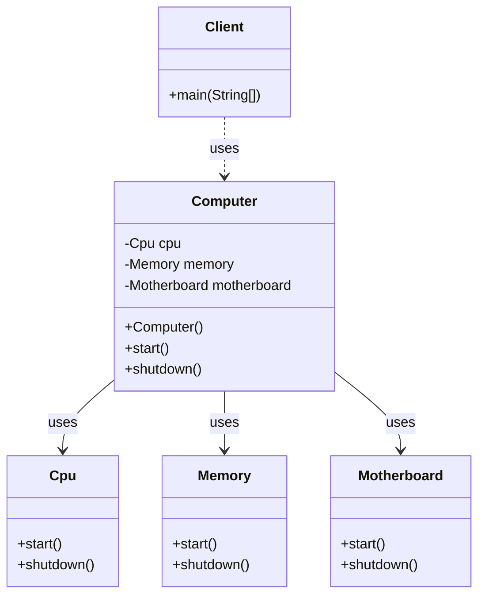
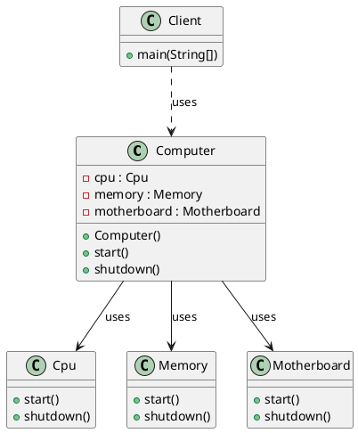

# 外观模式（Facade Pattern）—— Computer 示例完整整理

> 目标：为子系统中的一组接口提供一个统一的接口，外观模式定义了一个高层接口，这个接口使得这一子系统更加容易使用。  
> 你会在：需要简化复杂子系统的接口、需要为子系统提供统一入口、需要降低客户端与子系统的耦合度的场景中遇到它。

本文通过 Computer（计算机启动）示例，讲解外观模式的实现：

**子系统 → 外观类 → 客户端**

重点回答两个问题：

1. 外观模式如何简化复杂子系统的使用
2. 它解决了什么问题，又引入了什么代价

---

## 1. 为什么需要外观模式

### 1.1 典型场景

- **简化接口**：子系统接口复杂，客户端需要了解太多细节
- **降低耦合**：客户端直接依赖多个子系统类，耦合度高
- **统一入口**：需要为子系统提供统一的访问入口
- **隐藏复杂性**：隐藏子系统的复杂性，提供简单的接口

### 1.2 外观模式的核心思想

```
客户端 → 外观类 → 子系统1、子系统2、子系统3...
```

外观模式通过引入一个外观类：
- 封装子系统的复杂操作
- 为客户端提供简单的接口
- 降低客户端与子系统的耦合度

---

## 2. 外观模式结构总览

| 角色           | 说明                           | 示例                    |
| -------------- | ------------------------------ | ----------------------- |
| Facade         | 外观类，为子系统提供统一接口    | `Computer`              |
| Subsystem      | 子系统类，实现具体功能          | `Cpu`、`Memory`、`Motherboard` |
| Client         | 客户端，通过外观类访问子系统   | `Client`                |

---

## 3. 子系统类（Subsystem）

### 3.1 CPU 子系统

```java
public class Cpu {
    public void start() {
        System.out.println("CPU 启动");
    }

    public void shutdown() {
        System.out.println("CPU 关闭");
    }
}
```

### 3.2 内存子系统

```java
public class Memory {
    public void start() {
        System.out.println("内存 启动");
    }

    public void shutdown() {
        System.out.println("内存 关闭");
    }
}
```

### 3.3 主板子系统

```java
public class Motherboard {
    public void start() {
        System.out.println("主板 启动");
    }

    public void shutdown() {
        System.out.println("主板 关闭");
    }
}
```

**说明：**
- 这些是子系统类，实现具体的功能
- 客户端如果直接使用这些类，需要了解启动顺序、依赖关系等细节

---

## 4. 外观类（Facade）

### 4.1 外观类实现

```java
public class Computer {
    private Cpu cpu;
    private Memory memory;
    private Motherboard motherboard;

    public Computer() {
        this.cpu = new Cpu();
        this.memory = new Memory();
        this.motherboard = new Motherboard();
    }

    /**
     * 启动计算机
     * 封装了启动的复杂流程：按顺序启动各个组件
     */
    public void start() {
        System.out.println("计算机启动");
        cpu.start();
        memory.start();
        motherboard.start();
    }

    /**
     * 关闭计算机
     * 封装了关闭的复杂流程：按顺序关闭各个组件
     */
    public void shutdown() {
        cpu.shutdown();
        memory.shutdown();
        motherboard.shutdown();
        System.out.println("计算机关闭");
    }
}
```

**关键点：**
- 封装了子系统的复杂操作
- 为客户端提供简单的接口（`start()` 和 `shutdown()`）
- 隐藏了启动顺序、依赖关系等细节
- 客户端无需了解子系统的内部实现

---

## 5. 使用示例

### 5.1 使用外观模式（推荐）

```java
public class Client {
    public static void main(String[] args) {
        Computer computer = new Computer();
        computer.start();      // 简单的一行代码完成复杂的启动流程
        System.out.println("=====================");
        computer.shutdown();   // 简单的一行代码完成复杂的关闭流程
    }
}
```

**输出：**
```
计算机启动
CPU 启动
内存 启动
主板 启动
=====================
CPU 关闭
内存 关闭
主板 关闭
计算机关闭
```

### 5.2 不使用外观模式（不推荐）

如果不使用外观模式，客户端需要：

```java
// 客户端需要了解所有子系统
Cpu cpu = new Cpu();
Memory memory = new Memory();
Motherboard motherboard = new Motherboard();

// 客户端需要知道启动顺序
System.out.println("计算机启动");
cpu.start();
memory.start();
motherboard.start();

// 客户端需要知道关闭顺序
cpu.shutdown();
memory.shutdown();
motherboard.shutdown();
System.out.println("计算机关闭");
```

**问题：**
- 客户端需要了解所有子系统
- 客户端需要知道启动/关闭的顺序
- 客户端代码复杂，耦合度高
- 如果启动顺序改变，需要修改所有客户端代码

---

## 6. 代码结构

本示例包含以下目录结构：

```
facade/
├── Cpu.java          # 子系统类（CPU）
├── Memory.java       # 子系统类（内存）
├── Motherboard.java  # 子系统类（主板）
├── Computer.java     # 外观类
└── Client.java       # 客户端
```

---

## 7. UML 类图

### 7.1 Mermaid 类图



### 7.2 PlantUML 类图



---

## 8. 外观模式的特点

### 8.1 优点

- ✅ **简化接口**：为复杂的子系统提供简单的接口
- ✅ **降低耦合**：客户端与子系统解耦，只依赖外观类
- ✅ **隐藏复杂性**：隐藏子系统的复杂性，客户端无需了解细节
- ✅ **统一入口**：为子系统提供统一的访问入口
- ✅ **易于使用**：客户端使用简单，代码更清晰

### 8.2 缺点

- ❌ **违反开闭原则**：如果需要新增子系统，可能需要修改外观类
- ❌ **增加层次**：引入外观层，增加系统层次
- ❌ **可能过度封装**：如果封装过度，可能限制灵活性

---

## 9. 使用场景

### 9.1 适用场景

- ✅ **简化接口**：子系统接口复杂，需要简化
- ✅ **降低耦合**：需要降低客户端与子系统的耦合度
- ✅ **统一入口**：需要为子系统提供统一的访问入口
- ✅ **隐藏复杂性**：需要隐藏子系统的复杂性
- ✅ **分层设计**：需要为系统分层，外观层作为中间层

### 9.2 常见应用

- **框架设计**：为框架提供简单的 API
- **系统集成**：集成多个子系统，提供统一接口
- **API 封装**：封装复杂的 API，提供简单接口
- **服务网关**：微服务架构中的 API 网关
- **工具类**：封装常用操作的工具类

---

## 10. 与其他模式的关系

### 10.1 与适配器模式的区别

- **外观模式**：简化接口，为子系统提供统一入口
- **适配器模式**：转换接口，使不兼容的接口可以协同工作

**区别：**
- 外观模式：简化接口，一对多的关系
- 适配器模式：转换接口，一对一的关系

### 10.2 与代理模式的区别

- **外观模式**：简化接口，封装多个子系统
- **代理模式**：控制访问，代理一个对象

**区别：**
- 外观模式：一对多的关系，简化接口
- 代理模式：一对一的关系，控制访问

### 10.3 与中介者模式的区别

- **外观模式**：简化接口，封装子系统
- **中介者模式**：协调对象间的交互

**区别：**
- 外观模式：客户端通过外观访问子系统
- 中介者模式：对象通过中介者相互通信

---

## 11. 面试要点

### 11.1 基础问题

- **外观模式解决什么问题？**
  - 要点：简化复杂子系统的接口，降低客户端与子系统的耦合度

- **外观模式如何实现？**
  - 要点：引入外观类，封装子系统的复杂操作，为客户端提供简单接口

- **外观模式和适配器模式的区别？**
  - 要点：外观模式简化接口，一对多；适配器模式转换接口，一对一

### 11.2 实现细节

- **外观模式的核心是什么？**
  - 要点：封装子系统的复杂操作，为客户端提供简单的统一接口

- **为什么外观模式可以降低耦合？**
  - 要点：客户端只依赖外观类，不直接依赖子系统，降低了耦合度

- **外观模式可能违反什么原则？**
  - 要点：可能违反开闭原则，新增子系统可能需要修改外观类

### 11.3 实践问题

- **什么时候使用外观模式？**
  - 要点：子系统接口复杂、需要简化接口、需要降低耦合度

- **外观模式在哪些框架中有应用？**
  - 要点：框架设计、系统集成、API 封装、服务网关

- **如何优化外观模式？**
  - 要点：使用依赖注入、支持可配置、提供多个外观类

---

## 12. 总结

外观模式是一个**非常实用**的结构型设计模式，它解决了简化复杂子系统接口的核心问题：

**核心价值：**

1. **简化接口**：为复杂的子系统提供简单的接口
2. **降低耦合**：客户端与子系统解耦，只依赖外观类
3. **隐藏复杂性**：隐藏子系统的复杂性，客户端无需了解细节
4. **统一入口**：为子系统提供统一的访问入口

**模式特点：**

```
客户端
  ↓
外观类（Computer）
  ↓
子系统1（Cpu）
子系统2（Memory）
子系统3（Motherboard）
```

**最佳实践：**

- 识别复杂的子系统
- 设计简单的外观接口
- 封装子系统的复杂操作
- 保持外观类的简洁性

**一句话总结：**

> 当子系统接口复杂时，用外观模式封装子系统的复杂操作，为客户端提供简单的统一接口，让代码更易使用、更易维护。
