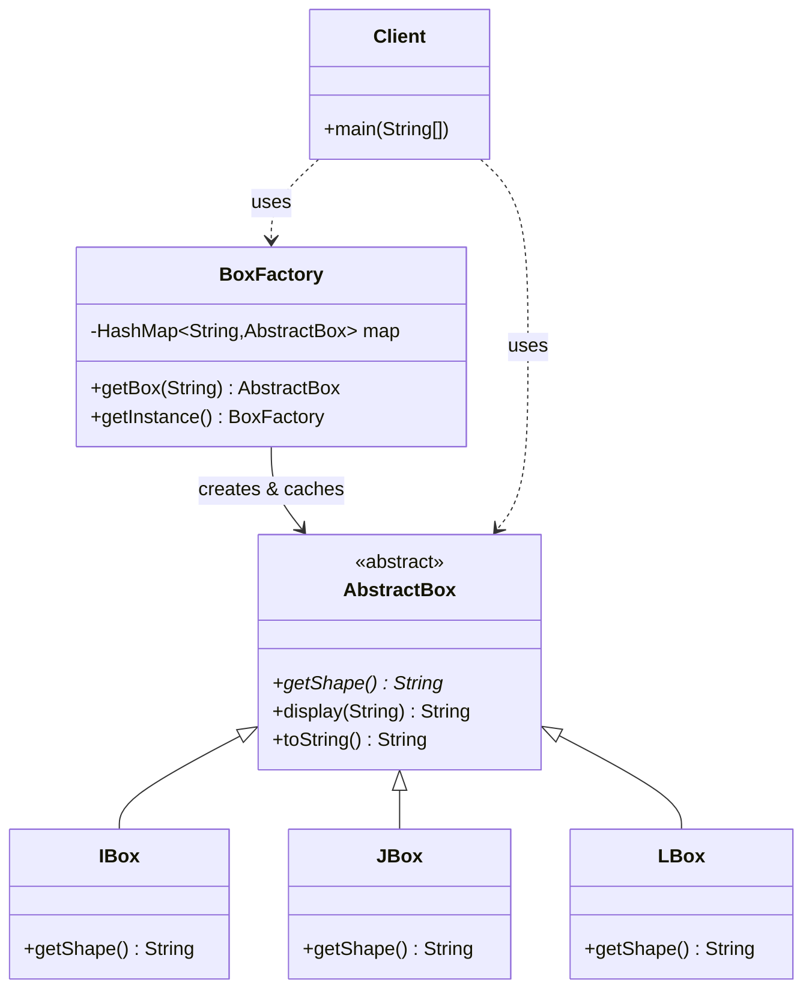
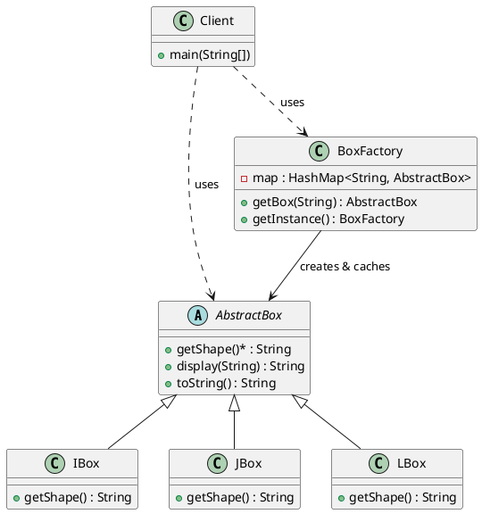

# 享元模式（Flyweight Pattern）—— Box 示例完整整理

> 目标：运用共享技术有效地支持大量细粒度的对象。享元模式通过共享相同的内在状态来减少内存使用，提高性能。  
> 你会在：需要创建大量相似对象、对象的大部分状态可以共享、需要减少内存占用的场景中遇到它。

本文通过 Box（俄罗斯方块）示例，讲解享元模式的实现：

**抽象享元 → 具体享元 → 享元工厂**

重点回答两个问题：

1. 享元模式如何通过共享减少内存占用
2. 它解决了什么问题，又引入了什么代价

---

## 1. 为什么需要享元模式

### 1.1 典型场景

- **大量相似对象**：需要创建大量相似对象，造成内存浪费
- **对象状态分离**：对象的状态可以分为内部状态（可共享）和外部状态（不可共享）
- **内存优化**：需要减少内存占用，提高性能
- **对象复用**：相同的内在状态可以共享，避免重复创建

### 1.2 享元模式的核心思想

```
享元对象（内部状态：可共享）
  ↓
享元工厂（缓存和复用）
  ↓
客户端（外部状态：不可共享）
```

享元模式通过分离内部状态和外部状态：
- **内部状态**：可以共享的状态，存储在享元对象内部
- **外部状态**：不能共享的状态，由客户端传入

---

## 2. 享元模式结构总览

| 角色           | 说明                           | 示例                    |
| -------------- | ------------------------------ | ----------------------- |
| Flyweight      | 抽象享元，定义享元接口          | `AbstractBox`           |
| ConcreteFlyweight | 具体享元，实现享元接口          | `IBox`、`JBox`、`LBox` |
| FlyweightFactory | 享元工厂，创建和管理享元对象   | `BoxFactory`            |
| Client         | 客户端，使用享元对象            | `Client`                |

---

## 3. 核心组件

### 3.1 抽象享元（Flyweight）

**抽象类定义：**

```java
/**
 * 俄罗斯方块游戏中的方块抽象类
 * 抽象享元类
 */
public abstract class AbstractBox {
    /**
     * 获取形状（内部状态，可共享）
     * @return 形状
     */
    public abstract String getShape();

    /**
     * 显示方块信息（颜色作为外部状态传入）
     * @param color 颜色（外部状态，不可共享）
     * @return 方块信息字符串
     */
    public String display(String color) {
        return "AbstractBox{" +
                "color='" + color + '\'' +
                ", shape='" + getShape() + '\'' +
                '}';
    }

    /**
     * toString 方法（不包含外部状态）
     */
    @Override
    public String toString() {
        return "AbstractBox{shape='" + getShape() + "'}";
    }
}
```

**说明：**
- 定义享元接口
- `shape` 是内部状态（可共享），由子类实现
- `color` 作为外部状态，通过 `display()` 方法参数传入
- 享元对象不存储外部状态，保证对象可以安全共享

---

## 4. 具体享元（ConcreteFlyweight）

### 4.1 I 型方块

```java
public class IBox extends AbstractBox {
    @Override
    public String getShape() {
        return "I";
    }
}
```

### 4.2 J 型方块

```java
public class JBox extends AbstractBox {
    @Override
    public String getShape() {
        return "J";
    }
}
```

### 4.3 L 型方块

```java
public class LBox extends AbstractBox {
    @Override
    public String getShape() {
        return "L";
    }
}
```

**关键点：**
- 实现抽象享元接口
- `getShape()` 返回固定的形状（内部状态）
- 每个形状类型只需要一个实例

---

## 5. 享元工厂（FlyweightFactory）

### 5.1 工厂实现

```java
/**
 * 俄罗斯方块游戏中的方块工厂类
 */
public class BoxFactory {
    private static HashMap<String, AbstractBox> map = new HashMap<>();
    
    static {
        map.put("I", new IBox());
        map.put("J", new JBox());
        map.put("L", new LBox());
    }

    public static AbstractBox getBox(String key) {
        return map.get(key);
    }

    private static final BoxFactory instance = new BoxFactory();
    
    private BoxFactory() {
    }
    
    public static BoxFactory getInstance() {
        return instance;
    }
}
```

**关键点：**
- 使用 `HashMap` 缓存享元对象
- 静态初始化块中创建所有享元对象
- `getBox()` 方法返回缓存的享元对象
- 相同 key 返回同一个对象实例（共享）

---

## 6. 使用示例

### 6.1 基本使用

```java
public class Client {
    public static void main(String[] args) {
        // 获取 I 型方块（共享同一个对象）
        AbstractBox box1 = BoxFactory.getBox("I");
        AbstractBox box2 = BoxFactory.getBox("I");
        
        // 颜色作为外部状态传入，不影响共享对象
        System.out.println(box1.display("红色"));  // AbstractBox{color='红色', shape='I'}
        System.out.println(box2.display("绿色"));  // AbstractBox{color='绿色', shape='I'}
        System.out.println(box1 == box2);  // true（同一个对象）
        
        System.out.println("=====================");
        
        // 获取 J 型方块
        AbstractBox box3 = BoxFactory.getBox("J");
        System.out.println(box3.display("蓝色"));
        System.out.println(box1 == box3);  // false（不同对象）
        
        System.out.println("=====================");
        
        // 获取 L 型方块
        AbstractBox box4 = BoxFactory.getBox("L");
        System.out.println(box4.display("黄色"));
        
        System.out.println("=====================");
        
        // 同一个对象可以有不同的外部状态
        System.out.println("box1 红色: " + box1.display("红色"));
        System.out.println("box1 蓝色: " + box1.display("蓝色"));
        System.out.println("box1 == box2: " + (box1 == box2));  // 仍然是同一个对象
    }
}
```

**输出：**

```
AbstractBox{color='红色', shape='I'}
AbstractBox{color='绿色', shape='I'}
true
=====================
AbstractBox{color='蓝色', shape='J'}
false
=====================
AbstractBox{color='黄色', shape='L'}
=====================
box1 红色: AbstractBox{color='红色', shape='I'}
box1 蓝色: AbstractBox{color='蓝色', shape='I'}
box1 == box2: true
```

**关键点：**
- `box1` 和 `box2` 是同一个对象（`true`），符合享元模式
- 颜色作为外部状态传入，互不影响
- 同一个对象可以有不同的外部状态（如 `box1.display("红色")` 和 `box1.display("蓝色")`）
- 这说明了享元模式的核心：共享对象实例，外部状态由客户端管理

### 6.2 内存优化效果

**不使用享元模式：**

```java
// 创建 1000 个 I 型方块
for (int i = 0; i < 1000; i++) {
    AbstractBox box = new IBox();  // 创建 1000 个对象
}
```

**使用享元模式：**

```java
// 创建 1000 个 I 型方块
for (int i = 0; i < 1000; i++) {
    AbstractBox box = BoxFactory.getBox("I");  // 只创建 1 个对象，复用 1000 次
}
```

**内存节省：**
- 不使用享元：1000 个对象
- 使用享元：1 个对象
- **节省 99.9% 的内存**

---

## 7. 代码结构

本示例包含以下目录结构：

```
flyweight/
├── AbstractBox.java    # 抽象享元（抽象类）
├── IBox.java          # 具体享元（I 型方块）
├── JBox.java          # 具体享元（J 型方块）
├── LBox.java          # 具体享元（L 型方块）
├── BoxFactory.java    # 享元工厂
└── Client.java        # 客户端
```

---

## 8. UML 类图

### 8.1 Mermaid 类图



### 8.2 PlantUML 类图



---

## 9. 内部状态 vs 外部状态

### 9.1 内部状态（Intrinsic State）

**定义：**
- 可以共享的状态
- 存储在享元对象内部
- 不随环境变化而变化

**示例：**
- 方块的形状（I、J、L）
- 字符的字体
- 棋子的类型

### 9.2 外部状态（Extrinsic State）

**定义：**
- 不能共享的状态
- 由客户端传入
- 随环境变化而变化

**示例：**
- 方块的颜色（本示例中）
- 方块的位置（x, y）
- 字符的位置
- 棋子的位置

### 9.3 当前实现（已优化）

**当前设计（颜色作为外部状态）：**

```java
// 抽象享元（只包含内部状态）
public abstract class AbstractBox {
    public abstract String getShape();  // 内部状态
    
    // 颜色作为外部状态通过参数传入
    public String display(String color) {
        return "AbstractBox{color='" + color + "', shape='" + getShape() + "'}";
    }
}

// 使用方式
AbstractBox box1 = BoxFactory.getBox("I");
AbstractBox box2 = BoxFactory.getBox("I");  // 同一个对象

System.out.println(box1.display("红色"));  // 外部状态：红色
System.out.println(box2.display("绿色"));  // 外部状态：绿色（互不影响）
System.out.println(box1 == box2);  // true（共享同一个对象）
```

**进一步优化（使用上下文类）：**

如果需要多个外部状态，可以使用上下文类：

```java
// 外部状态类
public class BoxContext {
    private String color;
    private int x, y;
    
    public BoxContext(String color, int x, int y) {
        this.color = color;
        this.x = x;
        this.y = y;
    }
    // getters...
}

// 抽象享元
public abstract class AbstractBox {
    public abstract String getShape();
    public abstract void display(BoxContext context);  // 传入外部状态
}

// 使用方式
AbstractBox box = BoxFactory.getBox("I");
BoxContext context1 = new BoxContext("红色", 10, 20);
BoxContext context2 = new BoxContext("绿色", 30, 40);
box.display(context1);  // 显示红色方块
box.display(context2);  // 显示绿色方块（同一个对象，不同状态）
```

---

## 10. 享元模式的特点

### 10.1 优点

- ✅ **减少内存占用**：通过共享对象，大幅减少内存使用
- ✅ **提高性能**：减少对象创建和销毁的开销
- ✅ **支持大量对象**：可以支持大量细粒度对象
- ✅ **灵活扩展**：可以轻松添加新的享元类型

### 10.2 缺点

- ❌ **复杂度增加**：需要区分内部状态和外部状态
- ❌ **线程安全**：如果享元对象有可变状态，需要考虑线程安全
- ❌ **查找开销**：享元工厂的查找可能有性能开销（通常可忽略）
- ❌ **设计难度**：需要正确识别内部状态和外部状态

---

## 11. 使用场景

### 11.1 适用场景

- ✅ **大量相似对象**：需要创建大量相似对象
- ✅ **内存敏感**：内存占用是主要考虑因素
- ✅ **对象状态分离**：对象状态可以明确分为内部状态和外部状态
- ✅ **对象复用**：相同的内在状态可以共享

### 11.2 常见应用

- **文本编辑器**：字符对象（字体、大小是内部状态，位置是外部状态）
- **游戏开发**：粒子系统、子弹对象、敌人对象
- **图形系统**：图形对象（形状是内部状态，位置是外部状态）
- **数据库连接池**：连接对象（配置是内部状态，使用状态是外部状态）
- **Java String**：字符串常量池就是享元模式的应用

---

## 12. 与其他模式的关系

### 12.1 与单例模式的区别

- **享元模式**：可以有多个享元对象（不同 key）
- **单例模式**：只有一个实例

**区别：**
- 享元模式：多个对象，但相同 key 共享同一个对象
- 单例模式：全局只有一个对象

### 12.2 与对象池模式的区别

- **享元模式**：关注对象的内在状态共享
- **对象池模式**：关注对象的复用和回收

**区别：**
- 享元模式：共享对象的内在状态
- 对象池模式：复用整个对象

### 12.3 与原型模式的区别

- **享元模式**：共享对象实例
- **原型模式**：克隆对象实例

**区别：**
- 享元模式：多个引用指向同一个对象
- 原型模式：创建对象的副本

---

## 13. 面试要点

### 13.1 基础问题

- **享元模式解决什么问题？**
  - 要点：减少内存占用，通过共享相同的内在状态来支持大量细粒度对象

- **内部状态和外部状态的区别？**
  - 要点：内部状态可共享，存储在享元对象内部；外部状态不可共享，由客户端传入

- **享元模式如何实现？**
  - 要点：享元工厂缓存享元对象，相同 key 返回同一个对象实例

### 13.2 实现细节

- **享元模式的核心是什么？**
  - 要点：分离内部状态和外部状态，通过共享内部状态减少内存占用

- **为什么享元对象应该是不可变的？**
  - 要点：如果享元对象可变，多个客户端共享同一个对象时会产生冲突

- **享元模式和单例模式的区别？**
  - 要点：享元模式可以有多个对象（不同 key），单例模式只有一个对象

### 13.3 实践问题

- **什么时候使用享元模式？**
  - 要点：需要创建大量相似对象、内存占用是主要考虑因素

- **享元模式在哪些框架中有应用？**
  - 要点：Java String 常量池、文本编辑器、游戏开发、图形系统

- **如何优化享元模式的性能？**
  - 要点：使用高效的缓存结构、考虑线程安全、合理设计内部状态和外部状态

---

## 14. 总结

享元模式是一个**非常重要的结构型设计模式**，它解决了大量相似对象造成内存浪费的核心问题：

**核心价值：**

1. **减少内存占用**：通过共享对象，大幅减少内存使用
2. **提高性能**：减少对象创建和销毁的开销
3. **支持大量对象**：可以支持大量细粒度对象
4. **灵活扩展**：可以轻松添加新的享元类型

**模式特点：**

```
抽象享元（AbstractBox）
  ↓
具体享元（IBox、JBox、LBox）- 内部状态
  ↓
享元工厂（BoxFactory）- 缓存和复用
  ↓
客户端（Client）- 外部状态
```

**最佳实践：**

- 正确识别内部状态和外部状态
- 享元对象应该是不可变的（内部状态）
- 外部状态由客户端传入
- 使用高效的缓存结构管理享元对象

**一句话总结：**

> 当需要创建大量相似对象时，用享元模式通过共享相同的内在状态来减少内存占用，让系统更高效、更节省资源。
