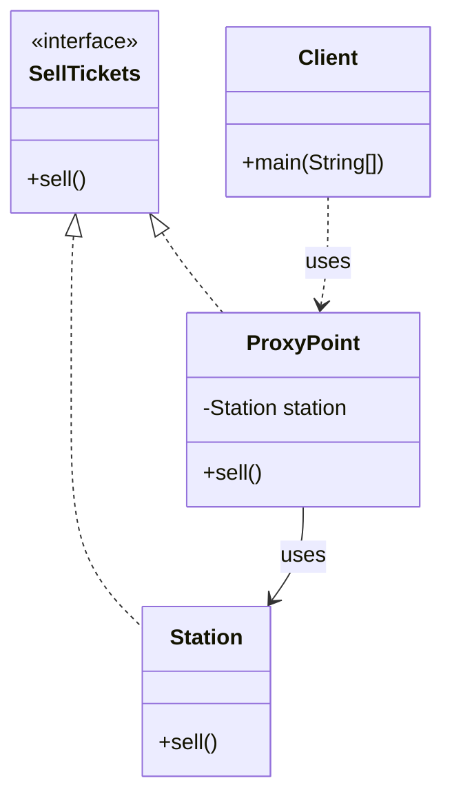
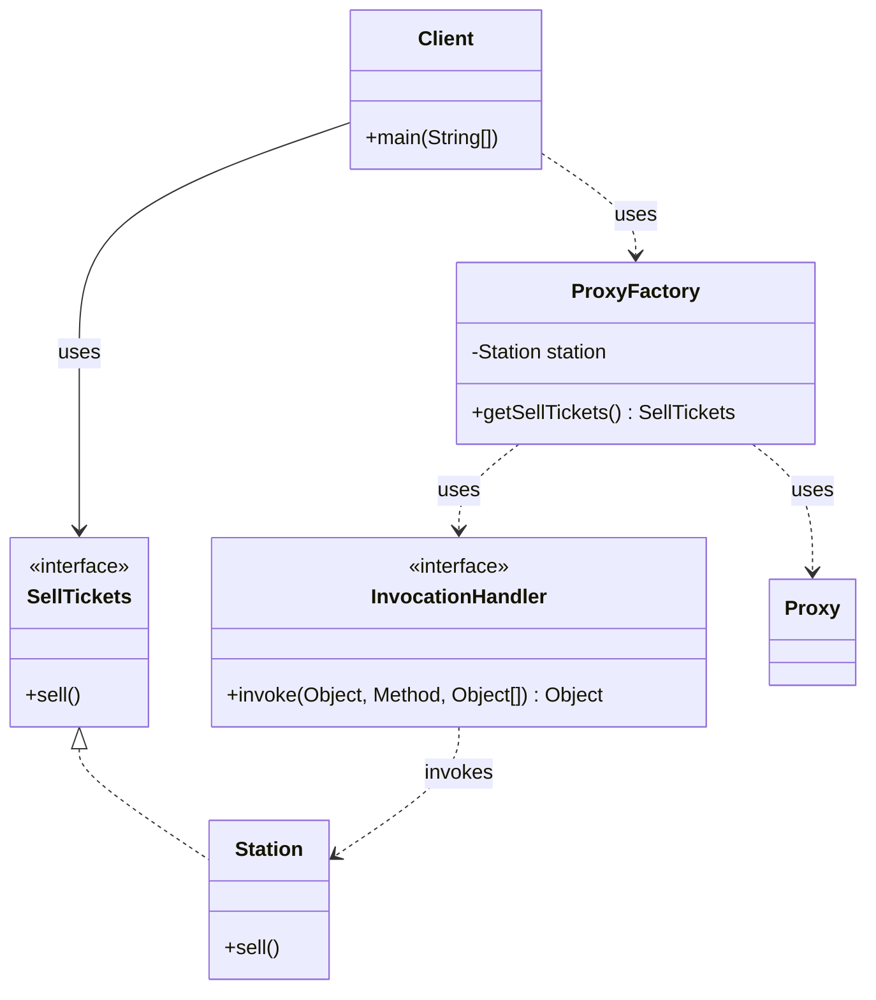
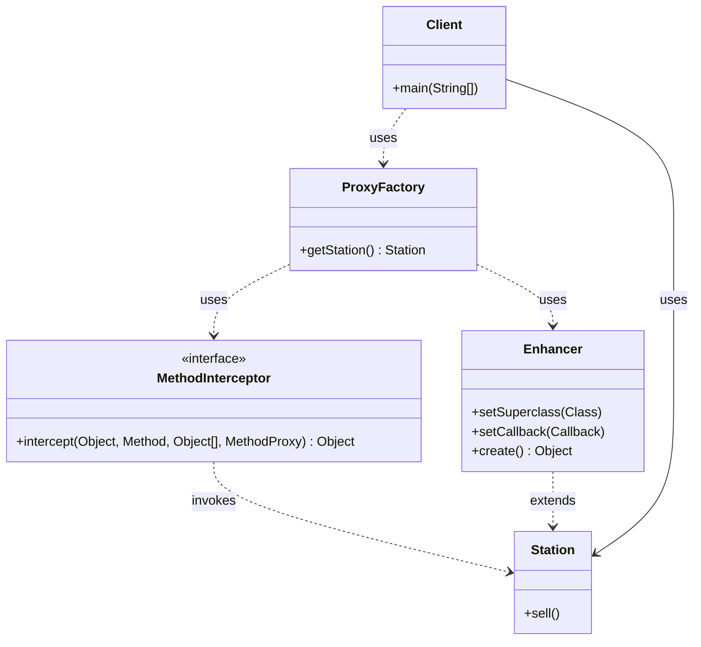
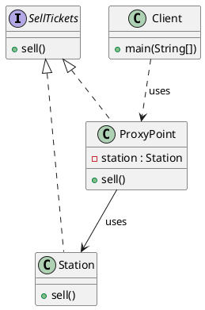
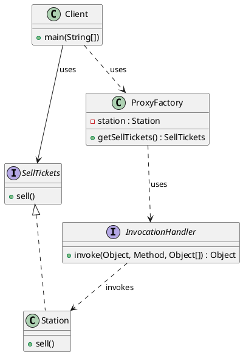
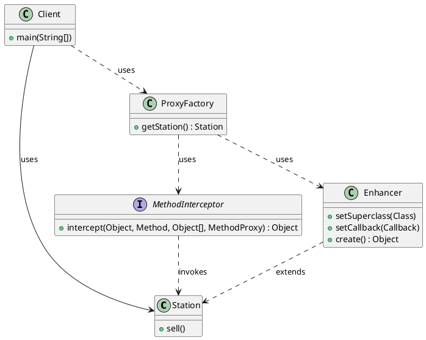

# 代理模式（Proxy Pattern）—— Station 示例完整整理

> 目标：为其他对象提供一种代理以控制对这个对象的访问。  
> 你会在：需要在不修改原始对象的情况下增强功能、控制访问、延迟加载、远程代理、虚拟代理等场景中遇到它。

本文通过 Station（火车站卖票）示例，讲解三种代理实现方式：

**静态代理 → JDK 动态代理 → CGLIB 动态代理**

重点回答两个问题：

1. 为什么要引入下一种代理方式
2. 它解决了什么问题，又引入了什么代价

---

## 1. 为什么需要代理模式

### 1.1 典型场景

- **功能增强**：在不修改原始类的情况下，添加日志、事务、权限检查等功能
- **访问控制**：控制对目标对象的访问，如权限验证、缓存等
- **延迟加载**：延迟创建昂贵的对象，直到真正需要时才创建
- **远程代理**：为远程对象提供本地代表，隐藏网络通信细节
- **虚拟代理**：为创建开销大的对象提供占位符

### 1.2 代理模式的核心思想

```
客户端 → 代理对象 → 真实对象
```

代理对象在客户端和真实对象之间起到中介作用，可以：
- 在调用真实对象的方法前后添加额外逻辑
- 控制对真实对象的访问
- 完全替代真实对象（客户端无需知道真实对象的存在）

---

## 2. 代理模式实现方式总览

| 实现方式     | 优点                           | 缺点                           | 适用场景                     |
| ------------ | ------------------------------ | ------------------------------ | ---------------------------- |
| 静态代理     | 简单直观、性能好               | 代理类多、维护成本高           | 代理类少、功能固定           |
| JDK 动态代理 | 无需手动创建代理类、灵活       | 只能代理接口、需要接口         | 有接口、需要运行时动态代理   |
| CGLIB 动态代理 | 可以代理类、无需接口           | 不能代理 final 类/方法、性能略低 | 无接口、需要代理类           |

---

## 3. 静态代理（Static Proxy）

### 3.1 核心思想

👉 手动创建一个代理类，实现与被代理对象相同的接口，在代理类中调用真实对象的方法。

### 3.2 示例代码

**接口定义：**

```java
public interface SellTickets {
    void sell();
}
```

**真实对象：**

```java
public class Station implements SellTickets {
    @Override
    public void sell() {
        System.out.println("火车站卖票");
    }
}
```

**代理类：**

```java
public class ProxyPoint implements SellTickets {
    private Station station;

    public ProxyPoint(Station station) {
        this.station = station;
    }

    @Override
    public void sell() {
        System.out.println("代理点收取服务费");
        station.sell();
    }
}
```

**使用示例：**

```java
public class Client {
    public static void main(String[] args) {
        ProxyPoint proxyPoint = new ProxyPoint(new Station());
        proxyPoint.sell();
    }
}
```

### 3.3 静态代理的特点

**优点：**
- ✅ 实现简单，易于理解
- ✅ 性能好，无反射开销
- ✅ 编译时确定，类型安全

**缺点：**
- ❌ 代理类数量多：每个被代理类都需要一个代理类
- ❌ 维护成本高：接口变化时，代理类也需要修改
- ❌ 代码重复：多个代理类可能有相似的增强逻辑

### 3.4 适用场景

- 代理类数量少
- 功能相对固定
- 对性能要求高

---

## 4. JDK 动态代理（JDK Dynamic Proxy）

### 4.1 为什么引入 JDK 动态代理

静态代理的问题本质是：
- 需要为每个被代理类手动创建代理类
- 代理类代码重复

JDK 动态代理通过**反射机制**在运行时动态生成代理类，无需手动编写代理类代码。

### 4.2 核心机制

**关键类：**
- `java.lang.reflect.Proxy`：用于创建动态代理类
- `java.lang.reflect.InvocationHandler`：调用处理器接口

**工作原理：**
1. 动态代理类在内存中生成，继承 `Proxy` 类，实现被代理对象的接口
2. 动态代理类的方法调用会转发到 `InvocationHandler.invoke()` 方法
3. 在 `invoke()` 方法中，通过反射调用真实对象的方法

### 4.3 示例代码

**代理工厂：**

```java
public class ProxyFactory {
    private Station station;

    public ProxyFactory(Station station) {
        this.station = station;
    }

    public SellTickets getSellTickets() {
        /*
         * Proxy.newProxyInstance 参数说明：
         * - ClassLoader loader: 类加载器，用于加载代理类
         * - Class<?>[] interfaces: 代理类实现的接口字节码对象
         * - InvocationHandler h: 代理对象的调用处理程序
         */
        SellTickets proxy = (SellTickets) Proxy.newProxyInstance(
            station.getClass().getClassLoader(),
            station.getClass().getInterfaces(),
            new InvocationHandler() {
                /**
                 * @param proxy 被代理的对象，等同于 newProxyInstance 返回的对象
                 * @param method 被调用的方法对象
                 * @param args 方法的执行参数
                 * @return 方法的返回值
                 */
                @Override
                public Object invoke(Object proxy, Method method, Object[] args) throws Throwable {
                    System.out.println("代理点收取服务费");
                    Object result = method.invoke(station, args);
                    return result;
                }
            }
        );
        return proxy;
    }
}
```

**使用示例：**

```java
public class Client {
    public static void main(String[] args) {
        ProxyFactory proxyFactory = new ProxyFactory(new Station());
        SellTickets sellTickets = proxyFactory.getSellTickets();
        sellTickets.sell();
    }
}
```

### 4.4 执行流程

1. 通过代理对象调用 `sell()` 方法
2. 由于 `sellTickets` 指向的是动态生成的代理对象，所以会执行代理类中的 `sell()` 方法
3. 代理类中的 `sell()` 方法会调用传入的 `InvocationHandler` 实现类（匿名内部类）的 `invoke()` 方法
4. `invoke()` 方法通过反射执行真实对象 `Station` 中的 `sell()` 方法

### 4.5 JDK 动态代理的特点

**优点：**
- ✅ 无需手动创建代理类，减少代码量
- ✅ 灵活，可以在运行时动态创建代理
- ✅ 统一处理多个方法，减少重复代码

**缺点：**
- ❌ 只能代理接口，不能代理类
- ❌ 需要被代理对象实现接口
- ❌ 反射调用有性能开销（通常可忽略）

### 4.6 适用场景

- 被代理对象实现了接口
- 需要运行时动态创建代理
- 需要统一处理多个方法

---

## 5. CGLIB 动态代理（CGLIB Dynamic Proxy）

### 5.1 为什么引入 CGLIB 动态代理

JDK 动态代理的限制：
- 只能代理接口
- 如果被代理对象没有实现接口，无法使用 JDK 动态代理

CGLIB 通过**字节码技术**在运行时生成被代理类的子类，因此可以代理没有接口的类。

### 5.2 核心机制

**关键类：**
- `net.sf.cglib.proxy.Enhancer`：用于创建动态代理类
- `net.sf.cglib.proxy.MethodInterceptor`：方法拦截器接口

**工作原理：**
1. CGLIB 在运行时生成被代理类的子类
2. 子类重写父类的方法，在方法中调用 `MethodInterceptor.intercept()`
3. 在 `intercept()` 方法中，通过 `MethodProxy.invokeSuper()` 调用父类方法

### 5.3 示例代码

**代理工厂：**

```java
public class ProxyFactory {
    public Station getStation() {
        Enhancer enhancer = new Enhancer(); // 创建增强器
        enhancer.setSuperclass(Station.class); // 设置父类
        enhancer.setCallback(new MethodInterceptor() {
            /**
             * @param obj 被代理的对象（代理对象本身）
             * @param method 被代理的方法
             * @param args 方法的参数
             * @param proxy 方法代理，用于调用父类方法
             * @return 方法的返回值
             */
            @Override
            public Object intercept(Object obj, Method method, Object[] args, MethodProxy proxy) throws Throwable {
                System.out.println("代理点收取服务费");
                return proxy.invokeSuper(obj, args); // 调用父类方法
            }
        });
        return (Station) enhancer.create(); // 创建代理对象并返回
    }
}
```

**使用示例：**

```java
public class Client {
    public static void main(String[] args) {
        ProxyFactory proxyFactory = new ProxyFactory();
        Station station = proxyFactory.getStation();
        station.sell();
    }
}
```

### 5.4 注意事项

**Java 9+ 运行配置：**

CGLIB 需要访问 Java 内部 API，在 Java 9+ 中需要添加 JVM 参数：

```
--add-opens java.base/java.lang=ALL-UNNAMED
```

**IDE 运行配置：**
- IntelliJ IDEA: `Run` → `Edit Configurations` → `VM options`: `--add-opens java.base/java.lang=ALL-UNNAMED`
- Eclipse: `Run` → `Run Configurations` → `Arguments` → `VM arguments`: `--add-opens java.base/java.lang=ALL-UNNAMED`

**命令行运行：**

```bash
MAVEN_OPTS="--add-opens java.base/java.lang=ALL-UNNAMED" mvn exec:java -Dexec.mainClass="com.example.structural.proxy.cglib.Client"
```

### 5.5 CGLIB 动态代理的特点

**优点：**
- ✅ 可以代理类，无需接口
- ✅ 性能比 JDK 动态代理略好（字节码技术）
- ✅ 功能强大，支持方法拦截、字段拦截等

**缺点：**
- ❌ 不能代理 `final` 类或 `final` 方法
- ❌ 不能代理 `private` 方法
- ❌ 需要额外的依赖（CGLIB 库）
- ❌ Java 9+ 需要额外的 JVM 参数

### 5.6 适用场景

- 被代理对象没有实现接口
- 需要代理类而不是接口
- 对性能有一定要求

---

## 6. 代码结构

本示例包含以下目录结构：

```
proxy/
├── staticproxy/    # 静态代理
│   ├── SellTickets.java    # 接口
│   ├── Station.java        # 真实对象
│   ├── ProxyPoint.java     # 代理类
│   └── Client.java         # 客户端
├── jdk/            # JDK 动态代理
│   ├── SellTickets.java    # 接口
│   ├── Station.java        # 真实对象（实现接口）
│   ├── ProxyFactory.java   # 代理工厂
│   └── Client.java         # 客户端
└── cglib/          # CGLIB 动态代理
    ├── Station.java        # 真实对象（无需接口）
    ├── ProxyFactory.java   # 代理工厂
    └── Client.java         # 客户端
```

---

## 7. UML 类图

### 7.1 静态代理



### 7.2 JDK 动态代理



### 7.3 CGLIB 动态代理



### 7.4 PlantUML 类图

#### 静态代理



#### JDK 动态代理



#### CGLIB 动态代理



---

## 8. 三种代理方式对比

### 8.1 功能对比

| 特性           | 静态代理 | JDK 动态代理 | CGLIB 动态代理 |
| -------------- | -------- | ------------ | ------------- |
| 代理接口       | ✅       | ✅           | ❌            |
| 代理类         | ✅       | ❌           | ✅            |
| 编译时确定     | ✅       | ❌           | ❌            |
| 运行时生成     | ❌       | ✅           | ✅            |
| 需要接口       | ✅       | ✅           | ❌            |
| 代理 final 类  | ✅       | ❌           | ❌            |
| 性能           | 最好     | 中等         | 较好          |
| 代码量         | 多       | 少           | 少            |

### 8.2 使用场景对比

**静态代理：**
- 代理类数量少
- 功能相对固定
- 对性能要求高

**JDK 动态代理：**
- 被代理对象实现了接口
- 需要运行时动态创建代理
- 需要统一处理多个方法

**CGLIB 动态代理：**
- 被代理对象没有实现接口
- 需要代理类而不是接口
- 对性能有一定要求

---

## 9. 使用场景

### 9.1 适用场景

- ✅ **功能增强**：日志记录、性能监控、事务管理
- ✅ **访问控制**：权限验证、缓存、限流
- ✅ **延迟加载**：延迟创建昂贵的对象
- ✅ **远程代理**：RPC 框架、分布式系统
- ✅ **虚拟代理**：图片懒加载、大对象代理

### 9.2 常见应用

- **Spring AOP**：使用 JDK 动态代理和 CGLIB 实现面向切面编程
- **MyBatis**：使用 JDK 动态代理实现 Mapper 接口代理
- **Hibernate**：使用 CGLIB 实现延迟加载
- **RPC 框架**：使用动态代理实现远程调用
- **日志框架**：使用代理实现日志记录

---

## 10. 优缺点分析

### 10.1 代理模式的优点

- ✅ **解耦**：客户端与真实对象解耦，通过代理对象访问
- ✅ **增强功能**：在不修改原始类的情况下添加功能
- ✅ **控制访问**：可以控制对真实对象的访问
- ✅ **灵活**：可以动态创建代理，适应不同场景

### 10.2 代理模式的缺点

- ❌ **复杂度增加**：引入代理层，增加系统复杂度
- ❌ **性能开销**：动态代理有反射或字节码生成的开销
- ❌ **调试困难**：动态生成的代理类难以调试

---

## 11. 与其他模式的关系

### 11.1 与装饰器模式的区别

- **代理模式**：控制对对象的访问，代理对象和被代理对象是同一个接口
- **装饰器模式**：增强对象的功能，可以动态添加多个装饰器

**区别：**
- 代理模式：代理对象控制访问，通常只有一个代理
- 装饰器模式：可以叠加多个装饰器，功能叠加

### 11.2 与适配器模式的区别

- **代理模式**：代理对象和被代理对象实现相同的接口
- **适配器模式**：适配器对象将不兼容的接口转换为兼容的接口

**区别：**
- 代理模式：接口相同，控制访问
- 适配器模式：接口不同，转换接口

### 11.3 与外观模式的区别

- **代理模式**：代理一个对象，控制对单个对象的访问
- **外观模式**：为多个子系统提供统一的接口

**区别：**
- 代理模式：一对一的关系
- 外观模式：一对多的关系

---

## 12. 面试要点

### 12.1 基础问题

- **代理模式解决什么问题？**
  - 要点：控制对对象的访问，在不修改原始类的情况下增强功能

- **静态代理、JDK 动态代理、CGLIB 动态代理的区别？**
  - 要点：静态代理手动创建；JDK 动态代理基于接口；CGLIB 动态代理基于继承

- **JDK 动态代理和 CGLIB 动态代理的区别？**
  - 要点：JDK 动态代理只能代理接口，CGLIB 可以代理类；JDK 使用反射，CGLIB 使用字节码技术

### 12.2 实现细节

- **JDK 动态代理的工作原理？**
  - 要点：运行时生成代理类，继承 Proxy 类，实现被代理对象的接口，方法调用转发到 InvocationHandler

- **CGLIB 动态代理的工作原理？**
  - 要点：运行时生成被代理类的子类，重写方法，方法调用转发到 MethodInterceptor

- **为什么 CGLIB 不能代理 final 类？**
  - 要点：CGLIB 通过生成子类实现代理，final 类不能被继承

### 12.3 实践问题

- **Spring AOP 如何选择使用 JDK 动态代理还是 CGLIB？**
  - 要点：如果被代理对象实现了接口，优先使用 JDK 动态代理；否则使用 CGLIB

- **如何优化动态代理的性能？**
  - 要点：缓存代理类、减少反射调用、使用 CGLIB 替代 JDK 动态代理（如果不需要接口）

- **代理模式在哪些框架中有应用？**
  - 要点：Spring AOP、MyBatis、Hibernate、RPC 框架等

---

## 13. 总结

代理模式是一个**非常实用**的设计模式，它解决了对象访问控制的核心问题：

**核心价值：**

1. **解耦**：客户端与真实对象解耦
2. **增强**：在不修改原始类的情况下增强功能
3. **控制**：控制对真实对象的访问
4. **灵活**：可以动态创建代理，适应不同场景

**模式演进：**

```
静态代理（手动创建代理类）
  ↓ (问题：代理类多、维护成本高)
JDK 动态代理（运行时生成代理类，基于接口）
  ↓ (问题：只能代理接口)
CGLIB 动态代理（运行时生成子类，基于继承）
```

**最佳实践：**

- 代理类少且固定：使用静态代理
- 有接口且需要动态代理：使用 JDK 动态代理
- 无接口且需要动态代理：使用 CGLIB 动态代理
- 框架开发：根据场景灵活选择

**一句话总结：**

> 当需要在访问对象时添加额外功能或控制访问时，用代理模式在客户端和真实对象之间添加一个中介层，让代码更灵活、更易维护。
